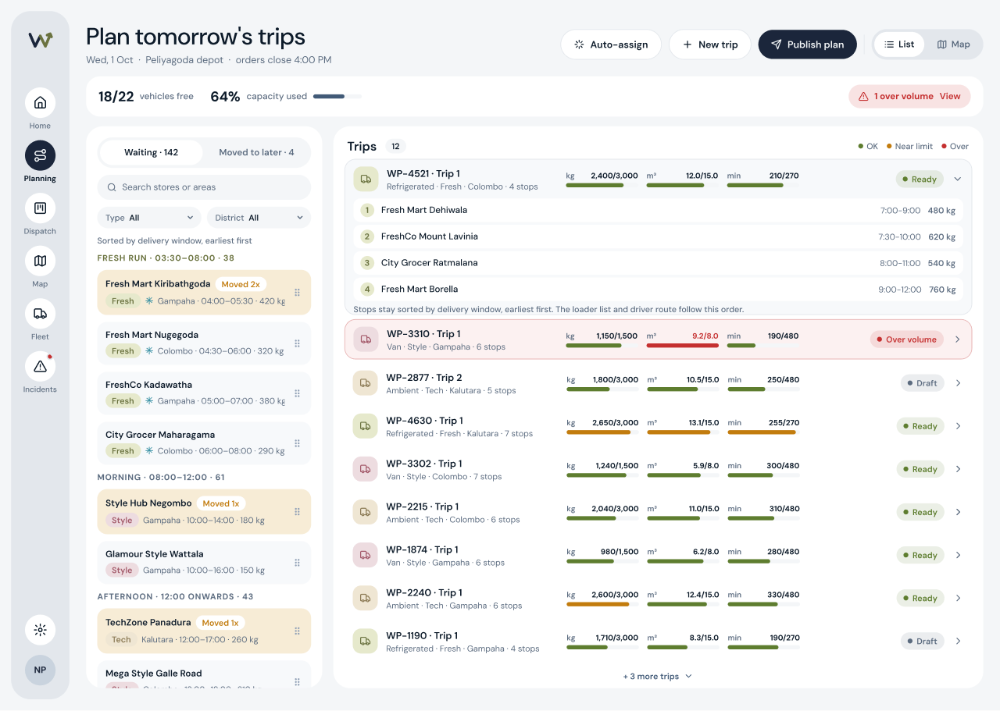
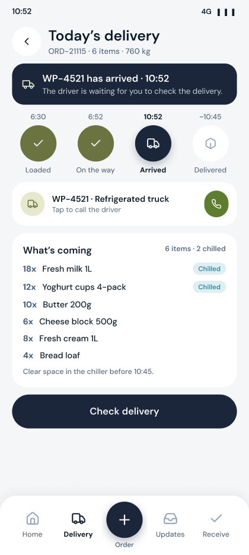
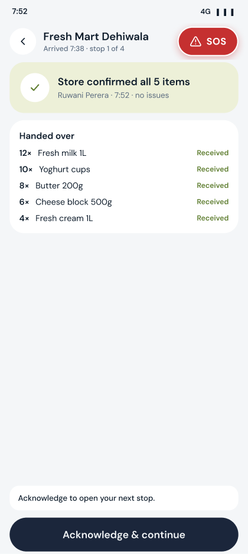
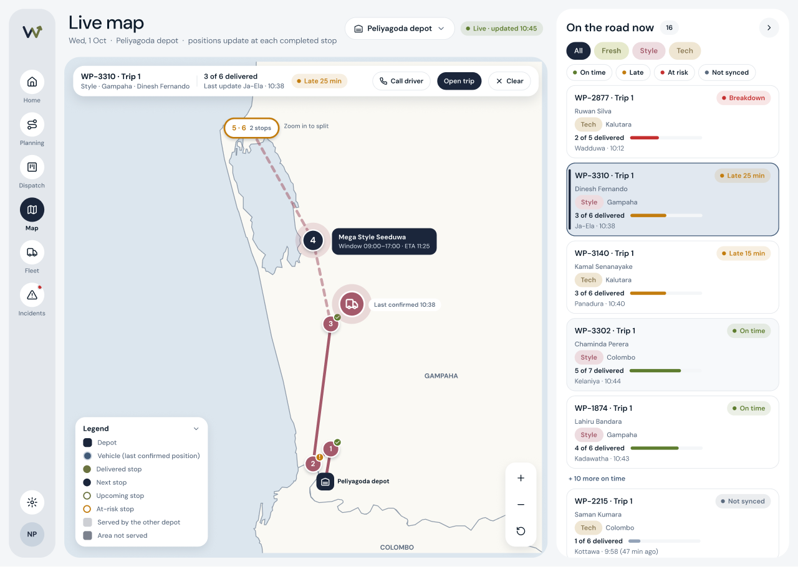
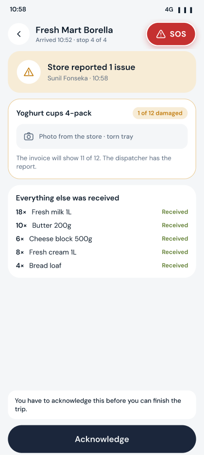
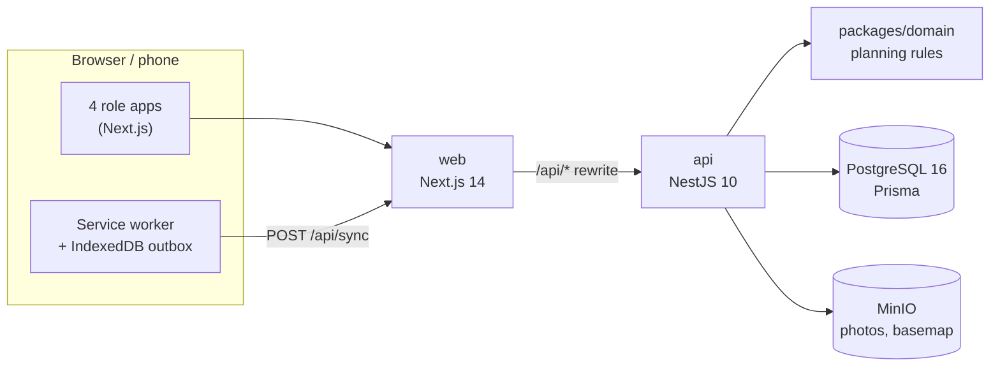

<div align="center">


# Waypoint Sync

**One app for the whole delivery day: order, plan, load, deliver and confirm, across four roles.**

Built by team **AiSleep** for Rootcode's Tech-Triathlon 2026 Hackathon.

[](https://github.com/Hirukadeven07/AiSleep_WaypointSync/actions/workflows/ci.yml)


**[Live demo](https://waypoint-sync.vercel.app)** · **[Judge walkthrough](#judge-walkthrough)** · **[Seeded logins](#seeded-logins)** · **[Architecture](docs/architecture.md)** · **[Data model](docs/data-model.md)** · **[AI disclosure](docs/ai-disclosure.md)**

</div>

---

## Contents

- [The problem](#the-problem)
- [What it does](#what-it-does)
- [Highlights](#highlights)
- [Architecture at a glance](#architecture-at-a-glance)
- [Live demo](#live-demo) · [Seeded logins](#seeded-logins) · [Quick start](#quick-start)
- [Judge walkthrough](#judge-walkthrough)
- [Departures from the Designathon design](#departures-from-the-designathon-design)
- [Project structure and team](#project-structure)
- [Local development](#local-development) · [Public deployment](#public-deployment) · [Database backups](#database-backups)
- [Docs](#docs) · [Setup notes](#setup-notes)

## The problem

Waypoint Group runs three brands out of one distribution network: **Fresh** (80 supermarkets that need goods before they open at 8 AM, much of it chilled), **Style** (25 stores of bulky garments, half of them in malls with fixed delivery windows) and **Tech** (15 stores of heavy, fragile, high-value goods). They share 60 vehicles from depots in Peliyagoda and Kandy, and only 16 of those can carry chilled goods.

Today that day runs on phone calls. Stores don't know whether an order was received or when it will arrive, dispatch can't see what fits where, loaders load without a stop sequence, and drivers lose signal in the hill country. When demand exceeds capacity, nobody records which orders were pushed back, or why.

## What it does

One responsive web app, with a purpose-built layout for each role:

| Role | App | Device | What they do |
| --- | --- | --- | --- |
| Store manager | **Sync Store** (`/store`) | Phone, desktop | Order before the 16:00 cutoff, see the expected arrival and any deferral with its reason, check the goods and report issues |
| Dispatcher | **Sync Console** (`/dispatch`) | Desktop | Bring orders into one queue, auto-assign or drag them onto trips, defer with a reason, publish through a rules gate, follow trips live |
| Loader | **Sync Dock** (`/dock`) | Dock tablet, phone | Unlock the dock, load in reverse stop order, flag missing or damaged lines, send the truck off |
| Driver | **Sync Driver** (`/drive`) | Phone, installable PWA | Follow the route, mark arrivals, report road issues or SOS, keep working offline |

Stack: TypeScript, pnpm workspaces, Next.js (App Router) + Tailwind, NestJS, PostgreSQL 16 + Prisma, MinIO, polling for live updates.

<table>
  <tr>
    <td width="62%"><br /><sub><b>Plan board:</b> the order queue, trips per vehicle and the rule checks.</sub></td>
    <td width="19%"><br /><sub><b>Store:</b> the truck has arrived.</sub></td>
    <td width="19%"><br /><sub><b>Driver:</b> receipt confirmed.</sub></td>
  </tr>
  <tr>
    <td><br /><sub><b>Live map:</b> truck positions from the drivers' phones, on an offline Sri Lanka basemap.</sub></td>
    <td colspan="2"><br /><sub><b>Driver:</b> report a road issue.</sub></td>
  </tr>
</table>

## Highlights

**Planning and allocation engine** (`packages/domain`, pure TypeScript with unit tests)
- **Hard rules block a plan:** weight *and* volume capacity, chilled goods only on refrigerated vehicles, van-only outlets, depot and brand, a large time-budget overrun, and at most two trips per vehicle per day.
- **Soft rules warn but let you publish:** delivery-window and mall-window risk, and each vehicle's weekly fuel quota, with the litres a trip uses against its allowance.
- **Overbooked days:** auto-assign places what fits and proposes the rest for a later day with an inferred reason (chilled, van-only or window). The dispatcher can also **Move to later** with a recorded reason, and repeat skips are flagged.
- **Explainable:** every refusal on the board says which rule it broke.

**Offline first, where it matters**
- The driver app is a hand-written service-worker PWA with an **IndexedDB outbox**. Every action is saved on the phone first and synced in order when signal returns.
- Each action has a client-made UUID, so a retry is a **duplicate, never a second row**. Each also carries the plan version the driver saw, so an action against an outdated plan is applied but flagged **stale** and the phone refreshes.
- GPS pings queue through the same outbox, so a dead zone on the Kandy corridor fills in afterwards on the dispatcher's map.

**A plan that changes safely after it's sent**
- A published trip that hasn't left can still gain, lose or swap stops. Each change bumps the plan version, the loader's checklist locks until they accept it, and a departure on an old version is refused (409).

**Engineering quality**
- A pnpm monorepo with shared `contracts` and `domain` packages used by both Next.js and NestJS.
- CI on every PR runs lint, typecheck, unit tests, build, API end-to-end tests against a real migrated and seeded Postgres 16, and Docker image builds.
- `docker compose up` brings up the whole stack: Postgres, MinIO, the API (migrations and seed) and the web app.

## Architecture at a glance



The browser only talks to the web app, which proxies `/api/*` to the API, so cookies stay first-party. See [docs/architecture.md](docs/architecture.md) for containers, flows, state machines and design decisions, and [docs/data-model.md](docs/data-model.md) for the schema.

## Live demo

**https://waypoint-sync.vercel.app**: the web app runs on Vercel, and the API, Postgres and MinIO run on Railway ([docs/deploy-railway-vercel.md](docs/deploy-railway-vercel.md)). Sign in with the seeded logins below.

## Seeded logins

| Role | Login ID | Secret | Notes |
| --- | --- | --- | --- |
| Dispatcher | `nimal` | password `waypoint` | Depot Peliyagoda |
| Store manager | `sunil` | password `waypoint` | First Peliyagoda Fresh store (`OUT001`) |
| Loader | dock password `123456` (Peliyagoda) / `654321` (Kandy) | then loader ID + PIN at Start loading (`sampath` / `1234`) | Shared dock tablet |
| Driver | `kasun` | PIN `1234` | Depot Peliyagoda |

## Quick start

```bash
cp .env.example .env
docker compose up
```

Open http://localhost:3000. Postgres, MinIO, the API (migrations + seed) and the web app all start; no Cloudflare account is needed.

## Judge walkthrough

The seed prepares two days at the Peliyagoda depot so every role has something to do on a fresh install:

- **Tomorrow** is an overbooked planning day: more chilled orders than refrigerated space, a draft trip over volume, a van-only store and a store that was already moved once.
- **Today** has one published trip waiting at the dock, and driver `kasun` already on the road, arrived at store manager `sunil`'s store.

Sign in at `/login` (or the live demo) with the [seeded logins](#seeded-logins). Use a phone-sized window for the loader and driver. All times are Sri Lanka time.

**1. Store manager places an order** (`sunil` / `waypoint`)
1. On the store home, check the delivery window, the 16:00 order cutoff countdown and any deferral notice.
2. Open **Place order**, add lines and send it. The order shows as confirmed and waiting. After 16:00 ordering is closed for the next day.
3. Open **Updates** to see the deferral notice for an order that was moved to a later run, with its reason.

**2. Dispatcher plans tomorrow** (`nimal` / `waypoint`, desktop)
1. Open the plan board. It shows tomorrow's orders in one queue, with the trips for each vehicle.
2. Run **Auto-assign proposal**. Orders go to vehicles and trips within weight and volume, refrigeration, van-only access, the depot, delivery windows and the two-trips-per-day limit. Chilled orders that don't fit the refrigerated trucks are proposed for a later day.
3. Open the draft trip that is over volume. The publish check blocks it; drag a stop onto the free refrigerated truck to bring it within capacity.
4. Use **Move to later** on an order, pick a reason and confirm. The store that was already moved once is flagged as a repeat skip.
5. Run **Publish the plan**. Blocking issues (capacity, chilled on ambient, van-only, brand, depot, a large time overrun) stop the publish. Window risk and fuel quota show as warnings with the litres against the vehicle's weekly allowance.

**3. Loader loads today's trip** (shared dock tablet or phone)
1. Open `/login/loader` and enter the Peliyagoda dock password `123456`.
2. The load queue lists today's published trip. Start loading and identify as loader `sampath`, PIN `1234`.
3. Work through the checklist, which is in reverse stop order so the first stop's goods go on last. Flag a line as missing, damaged or the wrong quantity; the flag goes to dispatch.
4. Tap **Truck is loaded** to send the truck off.

**4. Driver delivers** (`kasun` / PIN `1234`, phone)
1. The driver app opens on today's trip, which is on the road and stopped at `sunil`'s store, waiting for the store to confirm.
2. To test offline: turn on airplane mode (or set the browser offline). The app keeps working from local data, shows an offline banner and queues its events, such as **I've arrived** at a stop or a road issue. Reconnect and the queue syncs; events made against an older plan come back marked stale.

**5. Store manager confirms receipt** (`sunil`)
1. Open the delivery that has arrived and check the goods line by line.
2. Confirm what arrived, and report an issue on any line that is short or damaged. The order becomes delivered or partial, and issues go to dispatch.

**6. Driver finishes the trip** (`kasun`)
1. The app shows that the store confirmed the receipt. Acknowledge it to see the next stop.
2. When no stops are left, tap **End trip** back at the depot. The trip is marked completed.

**7. Dispatcher follows up** (`nimal`)
1. The live board and map show trip progress. The loader's and store's flags, and any delays or SOS, appear on the Incidents page.
2. A sent trip can still change before it leaves. The loader's checklist then locks until they accept the new plan version, and a departure on an old version is refused.

## Departures from the Designathon design

The web app follows the Figma file "AI-Sleep_Designathon". Where it does not, the reason is here. Anything the Figma shows that the data does not have yet is left out rather than invented.

### Layout and breakpoints

- The Figma gives frame sizes (1440 desktop, 412 phone), not breakpoints. Desktop layouts start at 1024px; below that the phone layout is used. The Figma has no tablet design.
- The store app has no desktop design, so on a laptop it stays a centred phone column.
- The dispatcher console and the plan board are built for the 1440 desktop console. On narrow screens the console rail collapses to a scrolling strip and the plan board's trip rows truncate their titles instead of reflowing.

### Landing page and sign-in

- Signed-in visitors skip the landing page and go straight to their workspace. Every "Sign in" and workspace card goes to the role chooser, because the Figma has no role parameter.
- **Sync Dock sign-in (L1):** the tablet is unlocked with the depot's shared 6-digit dock password (stored hashed on the `Depot` row: seeded `depo1` = 123456, `depo2` = 654321; change it in Account settings). There is no loader ID on that screen. Each person who joins a load taps **Start loading** (or **+ Add a loader** once started), enters their own loader ID and PIN if they have one (seeded L001… have no PIN, so the box stays blank; `sampath` uses 1234), and is added to the trip's loader list only when the API confirms them. Delivery notes are attributed to those loaders, not to the shared tablet account.
- Depot cards show the depot name only; "12 trips today" has no data behind it yet.
- "Forgot password?" is drawn but not wired. "Keep me signed in" and "Remember this phone" only remember the login id on the device, because the API sets the session length.

### Shells

- **Dark mode** is not in the Figma. Every app's account menu has a Dark mode switch; the choice is kept on the device, and with no choice the app follows the phone or computer setting. Dark colours keep the Figma's roles (canvas, surface, text, status tints); navy fills, the SOS red and the signature pad stay as designed, and the maps keep their light style.
- The Figma has no sign-out, so it lives in an account menu: the rail avatar on the console, the account pill on the dock, and a slim avatar row at the top of phone screens (the Figma `Driver / Profile` frame should replace that row).
- The console's Settings button and the Incidents red dot are drawn but not wired.
- The driver sidebar card shows the name and depot, not "DRV-2031", because the session has no driver number.

### Driver app

- **Home:** the trip title has no district ("Trip 1 · Colombo"), and there are no departure times, item counts or vehicle temperature range, because the driver payload does not return them. The vehicle reads "Truck" or "Van", not "Refrigerated".
- **SOS:** shows "Dispatch · <depot>" instead of the dispatcher's name. There is no desktop frame, so the same red page is centred. Opening it sends one alert through the offline outbox; there is no confirm step.
- **Offline:** the banner counts "actions" because the outbox holds more than deliveries. When online with actions still waiting, the green line reads "Online · N waiting to sync" (the Figma only shows the all-synced state).
- Loading, wrong-account and "no signal and nothing saved" have no Figma frame, so they show a blank canvas, a redirect to `/no-access`, and only the offline banner.

### Plan board (dispatcher)

- **One district per trip is a warning, not a block.** The build plan lists "one brand, one district" as a hard rule. Brand still blocks, but a trip may take stores from more than one district (the dispatcher picks them when creating the trip, and a store from another district shows a warning). This came in with multi-district trips (PR #43).
- **Map view:** the List / Map switch shows every depot store on the offline Sri Lanka basemap. Stores with an order that day are in their brand colour and the rest are grey, alongside the day's trips.
- **Ready vs Draft** is derived: Draft means a trip has no stops yet or a domain warning other than fuel (fuel is judged per week, which the board does not total yet); Ready means clean. "Capacity used" is planned weight against the vehicles that have a trip. "Moved 2x" means a repeat-skip, because the data has no move counter. The Fresh run is assumed to leave at 03:30 and the other brands at 08:00 for the window-risk check.
- **Publishing:** the Figma shows "Publish anyway" for an over-volume trip, but capacity problems block publishing (build plan and domain rules): the button is disabled and a line says why. Other warnings, such as a window at risk, can be published through. A trip with no stops is skipped.
- **Refusals** (a rule broken on drop) have no Figma frame, so they reuse the drop-hint pill and toast in red. The drop hint sits on the bottom edge of the hovered trip rather than inside it.
- **Order drawer:** the warning says "Already moved twice (reason)"; the Figma's "about 30% stock left" has no data. Dropping a stop back on the queue takes it off its trip, which the Figma does not show.
- **Move to later:** the new date is a plain row (the next operating day, no date picker); the "3rd time" notice shows only for orders moved before; the store message says "first in line" where the Figma has "first in item". Undo on its toast brings the order back to the queue, not to its old trip.
- **Auto-assign:** no "1 problem fixed" card and no "Review on board". The domain proposal only places waiting orders and never moves stops between trips. Applying it moves orders that cannot be placed to a later day, with the reason inferred (chilled, van-only, otherwise window).
- The date line is computed, so it can read "Thu, 1 Oct" where the Figma sample says "Wed".
- **Changing a sent trip:** the Figma has no re-publish step. A sent trip that has not left the depot can still take, lose or swap stops on the board, and each change goes to the dock at once as a new plan version. Being over capacity blocks the drop on a sent trip, because a published plan must stay inside capacity. The loader's checklist pauses (the dock plan-change lock) until they accept the change.

### Data

- The shared competition CSVs are committed in `data/`, so a fresh `docker compose up` seeds all 120 outlets, 60 vehicles, the calendar and travel data, plus a ready demo delivery day.

## Project structure

Who built what, by folder:

```
apps/web            Next.js app (all four role layouts)      - shells + plan board: Methuli; trip drawer + dispatch: Sehara; dock + store: Hiruka; driver: Nithika
apps/api            NestJS API + Prisma schema and seed      - platform/infra: Yohan; data + seed: Sanaya
packages/domain     Pure business rules, Vitest tests        - Sithil
packages/contracts  Shared types                             - shared
data/               Competition CSVs                         - Sanaya
docs/               Architecture, data model, AI disclosure  - Chamodhi
```

## Local development

```bash
corepack enable
pnpm install
docker compose up db minio        # database + object storage
cp .env.example .env              # then set DATABASE_URL host to localhost for local runs
pnpm --filter @waypoint/api exec prisma migrate deploy
pnpm seed
pnpm dev                          # web on :3000, api on :3001
```

Useful commands: `pnpm test`, `pnpm typecheck`, `pnpm lint`, `pnpm seed:reset`, `pnpm db:studio`.
`packages/*` compile to `dist`; `pnpm dev`, `pnpm typecheck` and `pnpm test` build them first.

## Public deployment

The live demo runs on Railway (API, Postgres, MinIO) and Vercel (web), deployed with their CLIs. See [docs/deploy-railway-vercel.md](docs/deploy-railway-vercel.md).

To expose a self-hosted stack instead, use Cloudflare Tunnel: set `CLOUDFLARE_TUNNEL_TOKEN` in `.env`, then:

```bash
docker compose --profile public up -d
```

## Database backups

For the self-hosted VM: dumps stay on the VM in `backups/` (gitignored). The Railway deployment uses Railway Postgres backups instead (see [docs/deploy-railway-vercel.md](docs/deploy-railway-vercel.md)).

On the VM, from the repo root, with the Compose stack running:

```bash
chmod +x scripts/backup-db.sh scripts/restore-db.sh
./scripts/backup-db.sh
```

That writes `backups/waypoint-YYYYMMDD-HHMMSS.sql.gz` and deletes dumps older than `BACKUP_KEEP_DAYS` (default 14). Credentials come from `.env` (`POSTGRES_USER`, `POSTGRES_DB`).

Install the nightly job with `crontab -e` using [`scripts/crontab.example`](scripts/crontab.example) (Asia/Colombo, 00:15). Change `/opt/AiSleep_WaypointSync` to the clone path.

A backup is unproven until it has been restored once. This **replaces objects** in `POSTGRES_DB`:

```bash
./scripts/restore-db.sh backups/waypoint-YYYYMMDD-HHMMSS.sql.gz
```

Prefer restoring into a throwaway database or a staging clone, not blindly onto the live demo DB.

## Docs

- [Architecture](docs/architecture.md)
- [Data model](docs/data-model.md)
- [AI disclosure](docs/ai-disclosure.md)
- [Screen map](docs/screen-map.md)
- [Railway + Vercel deployment](docs/deploy-railway-vercel.md)
- [VM deployment runbook](docs/deploy-vm.md)

## Setup notes

- The Nest modules were generated by script with the same layout the Nest CLI produces.
- `packages/*` are built to CommonJS in `dist` so both Nest and Next can consume them.
- `pnpm test` runs unit tests only. The auth e2e test (`pnpm --filter @waypoint/api test:e2e`) needs a running, seeded database.
- CSV column names are matched loosely (case and separators ignored). Check `apps/api/prisma/seed/load-csv.ts` against the real files and adjust aliases if a column is missed.
