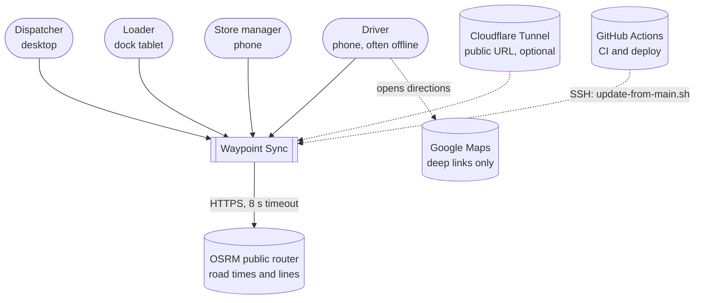
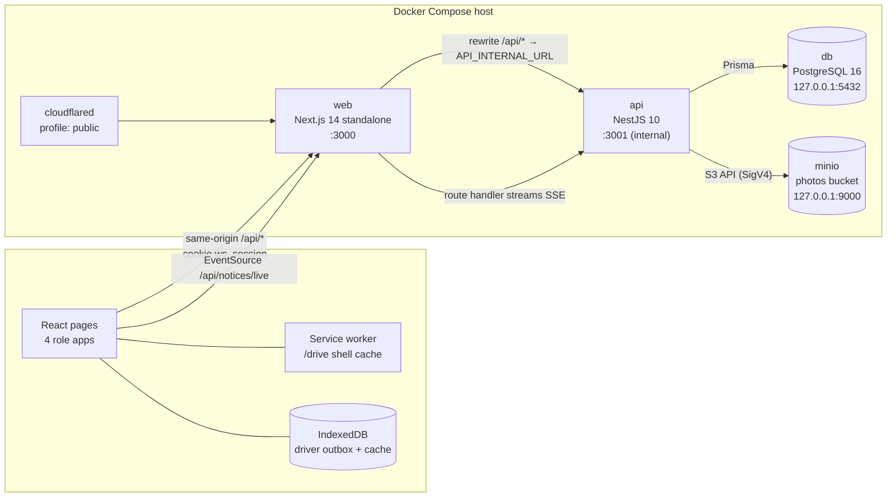
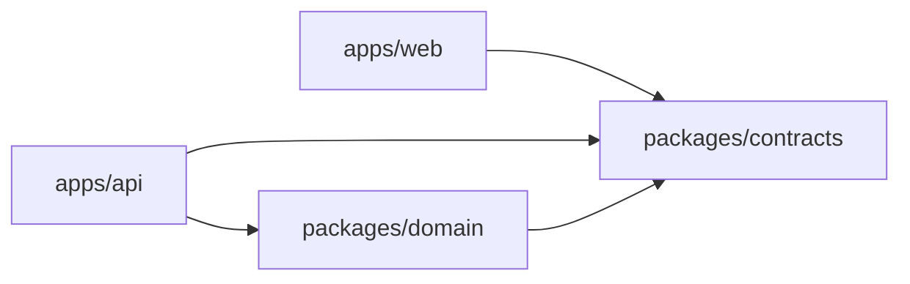
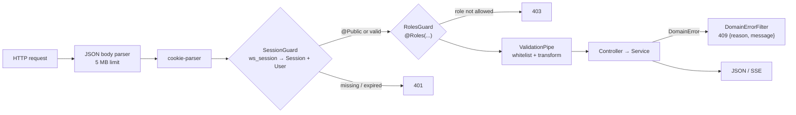
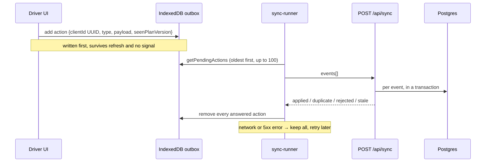
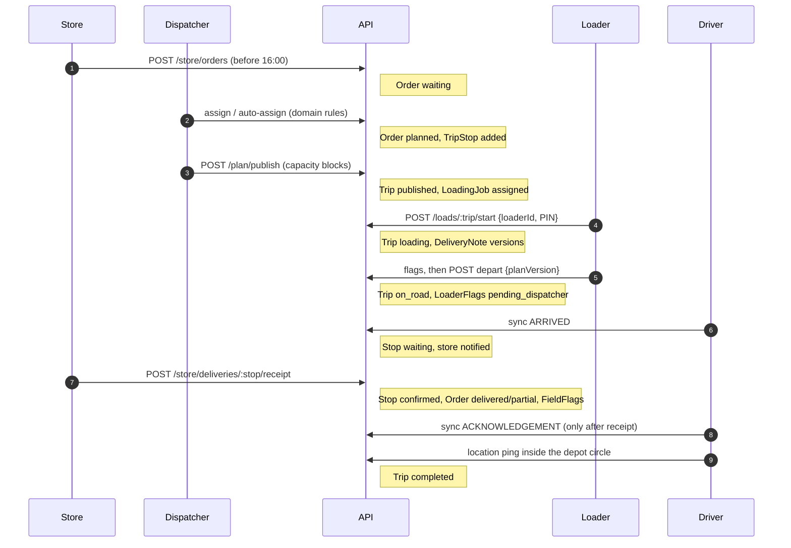
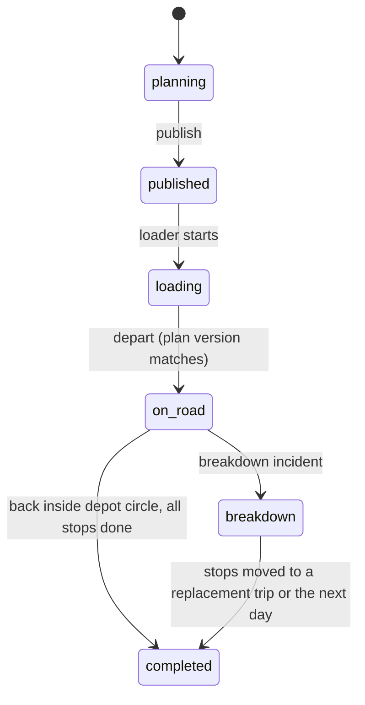
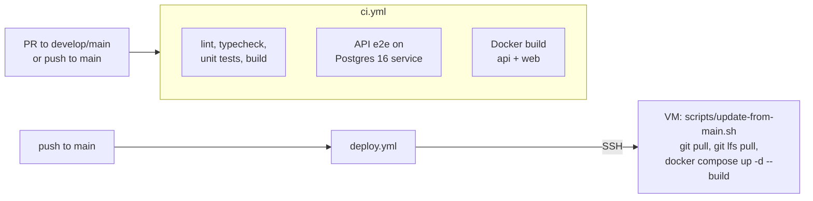

# System architecture

Waypoint Sync plans, loads, drives and receives store deliveries from two depots (Peliyagoda and Kandy). One web app serves four roles, backed by one API, one PostgreSQL database and one object store.

This page covers how the system is put together and why. Related pages:

- [database-structure.md](database-structure.md): every table, column and constraint
- [data-model.md](data-model.md): what the tables mean and which flow writes them
- [sync-api.md](sync-api.md): the driver sync contract
- [deploy-vm.md](deploy-vm.md): VM runbook

---

## 1. Context



| Actor | App | What they do |
| --- | --- | --- |
| Dispatcher | Sync Console `/dispatch` | Builds the day's trips, publishes them, watches trucks live, handles incidents and the fleet |
| Loader | Sync Dock `/dock` | Loads trucks in LIFO order, flags missing or damaged goods, accepts plan changes, confirms departure |
| Driver | Sync Driver `/drive` (installable PWA) | Follows stops, reports arrival, road issues, fuel and SOS. Works without signal |
| Store manager | Sync Store `/store` | Places orders before the 16:00 cutoff, tracks the delivery, checks the goods and signs |

The only external service the server calls is the public **OSRM** router. When it cannot be reached, the API uses a straight-line estimate at 30 km/h. Google Maps is only used for links the driver opens; the server never calls it.

---

## 2. Containers



| Container | Tech | Responsibility | Exposed |
| --- | --- | --- | --- |
| `web` | Next.js 14 App Router, React 18, Tailwind, MapLibre GL | Serves the four role UIs, the service worker and map tiles. Proxies `/api/*` to the API | Port 3000 |
| `api` | NestJS 10 on Express, Prisma 5, argon2 | All business logic, auth, rules, persistence, notifications | Compose network only |
| `db` | PostgreSQL 16 | System of record | Host loopback only |
| `minio` | MinIO, built from source in `infra/minio` | Photo objects (flags, signatures, road issues) | Host loopback only |
| `cloudflared` | Cloudflare Tunnel | Public HTTPS URL for phones, with no open inbound ports | Outbound only |

**One origin.** The browser only talks to the Next.js origin. `next.config.js` rewrites `/api/*` to the API, so the session cookie is first-party, there is no CORS, and the API is never exposed directly.

**SSE gets its own proxy.** A Next.js rewrite buffers the response until it ends, which would hold back a live event stream. So `app/api/notices/live/route.ts` is a route handler that fetches the API stream itself, forwards the cookie, and pipes the body through with `no-transform` and `X-Accel-Buffering: no`.

---

## 3. Code organisation

```
apps/web            Next.js app: 4 role apps, PWA, maps
apps/api            NestJS API, Prisma schema, 28 migrations, seed
packages/contracts  Shared types, enums and constants (no logic)
packages/domain     Pure planning rules with Vitest tests (no I/O)
data/               Competition CSVs (mounted read-only into the API)
infra/minio         MinIO image build
scripts/            Backup/restore, db-share export/import/fill-demo, VM update
tools/local-admin   Developer-only HTML board reading the DB container
docs/               Documentation
.github/workflows   ci.yml, deploy.yml
```

pnpm workspaces (pnpm 9, Node 20). `packages/*` compile to CommonJS in `dist` so both Nest and Next can import them. Root scripts build the packages before `dev`, `typecheck`, `test` and `build`.

### Dependency rules



- **`contracts`** is the shared vocabulary: roles, statuses, request and response shapes, `DriverEventType`, and constants such as `ORDER_CUTOFF_MIN` (16:00), `WAIT_ALERT_MIN` (10), `BREAK_ALLOWANCE_MIN` (45) and the PIN and password rules. If the web app and the API disagree about a payload, the fix belongs here.
- **`domain`** is the only place planning rules live. The web app does **not** depend on it. Pages never re-check capacity, chilled goods, windows and so on. They ask the API (`POST /plan/check`, `/plan/publish/check`) and show the answer.
- The API depends on both. Services map Prisma rows to domain types (`plan/plan.mapper.ts`), call a pure rule, and save the result.

---

## 4. Backend (`apps/api`)

### 4.1 Request pipeline



- Global prefix `/api`. The 5 MB body limit exists because road issues sync with a small photo inline.
- Both guards are global (`APP_GUARD`). Only `POST /auth/login` and `GET /health` are `@Public()`.
- `SessionGuard` sets `req.user = { id, name, role, depotId, storeId }`. Services use `depotId` and `storeId` to limit every query to the caller's depot or store.
- A rule refusal throws `DomainError(reasonCode, message)`, which becomes **HTTP 409**, so the UI can show a specific message. Auth and not-found problems use the normal Nest exceptions.

### 4.2 Authentication

| Role | Credential | Notes |
| --- | --- | --- |
| Dispatcher, store | Login id + password (argon2) | Store managers log in with the outlet id (`OUT001`…) |
| Driver | Login id + PIN (argon2) | PIN is 4–6 digits |
| Loader (dock tablet) | Depot + the depot's 6-digit dock password (argon2, `Depot.dockPasswordHash`) | Signs in as one shared account per depot (`dock-<depotId>`, created on first sign-in). Each loader then confirms themselves with their own loader ID and PIN at **Start loading** or **+ Add a loader** |

On success the API creates a `Session` row whose id is a random 32-byte hex token. It sets it as the `ws_session` cookie: `httpOnly`, `SameSite=Lax`, `Secure` in production, lifetime `SESSION_TTL_HOURS` (default 12). Logout deletes the row. There is no JWT; every request looks the session up in the database.

### 4.3 Modules

| Module | Routes (`/api` + …) | Role | Responsibility |
| --- | --- | --- | --- |
| `auth` | `auth/login`, `auth/logout`, `me`, `me/profile` | any | Sign in and out, current user, account card |
| `profile` | `me/depot`, `me/password`, `me/notification-preferences` | any | Switch depot (dispatchers only), change password or PIN (on the dock tablet this changes the depot's dock password), notification preferences (saved, not yet enforced) |
| `plan` | `plan`, `plan/check`, `assign`, `unassign`, `defer[/preview]`, `bring-back`, `trips…`, `publish[/check]`, `auto-assign[/apply]`, `map`, `stores/:id/location` | dispatcher | The plan board. Split into `plan` (day view, lookups), `plan-edit` (drop, check, resequence), `plan-trips` (create, remove, assign driver, suggestions), `plan-defer`, `plan-auto`, `plan-publish` |
| `dispatch` | `dispatch/live`, `map`, `map/trips/:id`, `trips/:id/move-options`, `move-stop`, `notify[-preview]`, `notices`, `sos/:id/resolve` | dispatcher | Live console, moving stops on sent trips, store delay notices, SOS handling |
| `map` | (used by plan and dispatch) | | Plan map, live truck positions, road routes via OSRM, depot geofence |
| `fleet` | `fleet`, `:id/out-of-service`, `:id/back-in-service` | dispatcher | Vehicles for the day; taking a vehicle out of service sends its trips that have not started back to the plan |
| `incidents` | `incidents`, `breakdown`, `:id/acknowledge`, `notify`, `resolve`, `close`, `reopen` | dispatcher | Incident lifecycle. A breakdown is resolved with a replacement vehicle, by moving stops to the next day, or both |
| `loads` | `loads`, `:tripId`, `start`, `flags`, `taken-off`, `ack`, `depart` | loader | Dock queue and checklist, per-loader confirmation (`start` takes `{loaderId, pin}` and adds that loader to `LoadSession.loaderIds`), plan-change lock, departure |
| `driver` | `driver/day`, `profile`, `notices` | driver | The driver's trips with full stop detail, profile, notices, break tracking |
| `sync` | `GET/POST sync` | driver | Offline outbox push and state pull (§7.3) |
| `store` | `store/home`, `catalogue`, `saved`, `orders[/recent]`, `flags`, `deliveries[/:stopId][/receipt]`, `notices` | store | Ordering, starred items, delivery tracking, receipt and flags |
| `notifications` | `notices/live` (SSE) | any | Saves notifications and pushes them live (§6) |
| `photos` | (internal) | | Writes images to MinIO; falls back to `PHOTO_FALLBACK_DIR` on disk |
| `health` | `health` | public | Liveness |

`src/common` holds `PrismaService`, the guards, the `@Public`, `@Roles` and `@CurrentUser` decorators, the `DomainErrorFilter`, and `ClockService`.

### 4.4 Time

`ClockService` is the only source of "now" and "today". It works in **Asia/Colombo** and honours `DEMO_NOW` (the web app has `NEXT_PUBLIC_DEMO_NOW`), so a demo can be pinned to a fixed moment. Business logic never calls `new Date()` directly. The store cutoff is 16:00 local time; `ORDER_CUTOFF_OPEN=1` lifts it, for development only.

### 4.5 No background workers

The API has no cron jobs, queues or schedulers. Time-based alerts are worked out **when a screen is read**:

- **Driver waiting at a store:** when the dispatcher's live view or the driver's notices load, any stop where the driver has waited `WAIT_ALERT_MIN` (10 min) without a store check raises one alert. An update that only succeeds while `TripStop.waitAlertedAt` is empty means two simultaneous readers still produce one alert.
- **Trip completion:** when a driver location ping falls within 500 m of the depot after every stop is done, the sync handler marks the trip `completed`.

This keeps the deployment to a single process, at the cost of alerts arriving only when someone is looking.

---

## 5. Domain rules (`packages/domain`)

Pure TypeScript with no framework or database imports, covered by Vitest tests in `packages/domain/test`.

| File | Decides |
| --- | --- |
| `rules/` | Per-drop checks: `capacity` (weight and volume), `chilled` (chilled goods need a reefer), `van-only` outlets, `brand-district` (one brand per trip), `depot` (home depot), `trip-limit` (two trips per vehicle per day), `time-budget`. `evaluateDrop` runs them all |
| `time.ts` | Trip minutes, stop ETAs, delivery-window risk |
| `constants.ts` | Time budgets: Fresh 270 min, Style and Tech 480 min, 5 min grace; at most 2 trips per vehicle per day |
| `fuel.ts` | Trip km and litres, weekly fuel quota |
| `sequence.ts` | Stop order by window; LIFO load order for the dock |
| `fit.ts` | Ranks vehicles for an order |
| `assign.ts` | Auto-assign proposal for waiting orders |
| `defer.ts` | Moving an order to a later operating day |
| `publish.ts` | Publish gate: **capacity problems block**; other warnings can be published through |
| `summary.ts` | Capacity summary and the limiting resource |
| `names.ts` | Readable names (plates, stores, depots) for rule messages |

Trip minutes = depot-to-district time + inter-stop time × (stops − 1) + the service allowance for each stop's brand and dock type, checked against the brand's time budget.

---

## 6. Live updates and notifications

Two mechanisms work together:

1. **Server-Sent Events.** `InAppNotifier.notify()` saves a `Notification` row and then publishes it to the `NoticeHub`, an in-process map from user id to open streams. `GET /api/notices/live` streams that user's notices and sends a keep-alive ping every 20 s. The browser's `EventSource` (`lib/live-notices.ts`) reconnects on its own.
2. **Polling.** Screens refresh their data with `usePoll` every 5, 15 or 30 s depending on how live the screen must be; the dispatcher's live map refreshes truck positions every second. Notice lists are also polled, so nothing is lost if a stream drops. `claimNotice(id)` makes sure a notice arriving from both the poll and the stream alerts only once.

> **Constraint:** `NoticeHub` lives in one API process's memory. Running more than one API instance would need a shared broker (for example Postgres `LISTEN/NOTIFY` or Redis) so that every instance sees every notice.

Notifications are sent to users by role: dispatchers of a depot (store reports, SOS, waits, road issues), stores (deferrals, delays, stops away), and drivers (trip assigned, moved to another driver, or published).

---

## 7. Frontend (`apps/web`)

### 7.1 Structure

| Role | Routes | Layout |
| --- | --- | --- |
| Public | `/`, `/login`, `/login/[role]`, `/drive/login`, `/no-access` | Landing and role chooser (always light theme) |
| Dispatcher | `/dispatch` (home), `/plan`, `/board`, `/map`, `/fleet`, `/incidents` | Desktop console with a side rail, from 1024 px wide |
| Loader | `/dock`, `/dock/[tripId]` | Tablet top bar |
| Driver | `/drive`, `/stops`, `/next`, `/report`, `/sos`, `/break`, `/vehicle`, `/notices` | Phone column with a tab bar; desktop sidebar |
| Store | `/store`, `/order`, `/updates`, `/receive`, `/delivery`, `/flags`, `/settings` | Phone column |

Pages are client components that fetch after mounting. Each role layout wraps its pages in `RoleGate`, which loads `/api/me` and redirects other roles to `/no-access`. Components are grouped by feature (`plan`, `dispatch`, `dock`, `drive`, `store`, `fleet`, `incidents`, `map`, `shell`, `ui`).

### 7.2 Access control in the browser

- `middleware.ts` only checks that the `ws_session` cookie exists and redirects to `/login` if not. It does not validate the session; the API does.
- `lib/api.ts` is a typed `fetch` wrapper: same-origin, sends credentials, **401 → `/login`**, **403 → `/no-access`**.
- `useRestoreCheck` (`lib/session.ts`): when a signed-in page comes back from the browser's back-forward cache, it hides the page, asks `GET /api/me`, and sends a signed-out visitor to their role's sign-in page. Pressing Back after signing out cannot show the old app.

### 7.3 Driver offline design



- **Service worker** (`public/sw.js`, written by hand): pre-caches the `/drive` shell; pages are network-first, falling back to the cache after 4 s. `/api/*` is never cached.
- **Outbox** (`lib/outbox.ts`): each action gets a phone-made `clientId`. The unique `DriverEvent.clientId` (and `LocationPing.clientUuid`) makes a retry a **duplicate**, never a second row.
- **Plan versions:** each event carries the `seenPlanVersion` the driver saw. If the trip has moved on, the event is still applied but reported **stale**, so the phone refreshes.
- **Cache** (`lib/driver-cache.ts`): the last day payload, so the app can open without signal.
- **GPS:** while the trip is `on_road`, `use-road-pings` queues the phone's newest position **every second** through the same outbox, so a stretch without signal fills in when it returns. Pings are not counted as "synced actions", so they never trigger a reload of the driver's day. Truck positions on the dispatcher map come from the latest ping, and a trip that has sent nothing for 5 minutes (`SYNC_STALE_MIN`) shows as **Not synced**.

### 7.4 Other front-end pieces

- **Maps:** MapLibre GL with a self-hosted Sri Lanka **PMTiles** file (stored with Git LFS), fonts, sprites and district GeoJSON in `public/maps`. No tile service is needed. Road lines come from the API (OSRM).
- **Theme:** light and dark in all four apps. An inline boot script applies the saved theme before the first paint, and a change is shared with other tabs.
- **PDF reports:** `lib/pdf.ts` is a small text-only PDF writer (A4, Helvetica). The dispatcher downloads a finished trip's report with no PDF library.
- **Developer check link:** shown on sign-in only when `NEXT_PUBLIC_LOCAL_CHECK_URL` points at `tools/local-admin`.

---

## 8. Core flows

### 8.1 A delivery from order to completion



### 8.2 Changing a plan that has already been sent

A trip that is published or loading, but has not left, can still gain, lose or swap stops (`dispatch/move-stop`, or a drop on the board). Each change increments `Trip.planVersion`.

- **Dock:** the checklist locks until the loader confirms any removed goods are off the truck (`taken-off`) and accepts the change (`ack`). This sets `LoadSession.ackedPlanVersion` and `ackedStopIds`; new orders show as NEW.
- **Departure:** `depart` sends the version the loader saw. If it differs from the trip's version, the API refuses with a 409.
- **Driver:** events made against an older version come back as stale (§7.3).
- A drop that would put a sent trip over capacity is refused, because a published plan must stay within capacity.

### 8.3 Incidents

Sources: driver SOS and road issues (through sync), a breakdown reported by dispatch, one logged by hand, or a trip with missing items. The Incidents page and the open count on the dispatcher's Home use the same filters, and SOS alerts are listed with the other incidents. Lifecycle: open → acknowledged → (stores notified of delay) → resolved or closed, and it can be reopened. Resolving a **breakdown** moves the remaining stops onto a new, already published trip on a replacement vehicle, or moves them to the next day (orders `deferred`), or both. The broken-down trip is then marked `completed`. "I'm safe" from the driver clears an SOS on both the board and the phone. Only one open SOS is allowed per driver.

### 8.4 Fleet

Taking a vehicle out of service needs a reason (a database check enforces it) and an optional return time. Its trips that have not started return to the plan (their orders go back to `waiting`); a trip already on the road carries on.

---

## 9. State machines

**Trip** (`TripStatus`)



`ready` exists in the enum and counts as a dock queue status, but nothing currently sets it.

**Order** (`OrderStatus`): `waiting` → `planned` (assigned to a trip) → `delivered` or `partial` (store receipt). `waiting` or `planned` → `deferred` (moved to a later day by dispatch or by a breakdown) → `waiting` (brought back). Unassigning returns it to `waiting`. A store can cancel only a `waiting` order, and the delete runs as one conditional statement so it cannot remove an order that was just planned.

**Stop** (`StopStatus`): `upcoming` → `waiting` (driver arrived, `arrivedAt` set) → `confirmed` (store receipt, `storeConfirmedAt`) → driver acknowledges (`driverAckAt`; refused before the receipt). `at_risk` is in the enum and is treated as not yet visited, but the API does not store it; the maps work out lateness from the ETA and the window.

---

## 10. Data layer

- **PostgreSQL 16** through **Prisma 5**: 40 models plus one join table, 24 enums and 2 check constraints. See [database-structure.md](database-structure.md).
- **Migrations** live in `apps/api/prisma/migrations` (28 so far) and are applied with `prisma migrate deploy` every time the API container starts.
- **Seed** (`prisma/seed/index.ts`) also runs on every start. With an empty database it loads the competition CSVs from `DATA_DIR`, fills planner minutes, store locations and number plates, then adds the demo users, fleet drivers and loaders, ERD sample rows, dispatch demo and demo day. With data already present it only tops up the demo pieces. `SEED_RESET=1` (`pnpm seed:reset`) truncates every table first.
- **Photos** are MinIO objects. Rows keep only the object key (`photoKey`, `signaturePhotoKey`).
- **Concurrency** relies on database constraints and conditional updates rather than locks: unique `TripStop.orderId`, unique `DriverEvent.clientId`, updates conditional on the current status (receipt, wait alert, order cancel), and transactions for multi-row changes.

---

## 11. Security

| Concern | Measure |
| --- | --- |
| Passwords and PINs | argon2 hashes only |
| Sessions | Random 256-bit token stored server-side; `httpOnly`, `SameSite=Lax`, `Secure` in production; 12 h TTL; deleted on logout |
| Authorisation | Global session and role guards on every route except login and health; queries limited by the caller's `depotId` or `storeId` |
| Input | `ValidationPipe` with `whitelist` strips unknown fields; DTOs use class-validator; 5 MB body cap |
| Network | Only the web port is published. Postgres and MinIO bind to `127.0.0.1`; the API is reachable only inside Compose. Public access goes through a Cloudflare Tunnel |
| Secrets | `.env` is not committed; deploy secrets are GitHub Actions secrets |
| Browser | Same-origin API (no CORS); reload after a back-forward cache restore; the developer check link is hidden unless configured |

Gaps worth knowing: there is no rate limiting on `POST /auth/login`, and the dock password is 6 digits shared by everyone at a depot. Individual accountability at the dock comes from each loader's own ID and PIN at Start loading.

---

## 12. Build, deploy and operations

### Docker images

- **api:** `node:20-bookworm`, pnpm install filtered to the API, builds `contracts`, then `domain`, then the API. On start: `prisma migrate deploy && pnpm run seed && node dist/main.js`.
- **web:** `node:20-bookworm-slim`, Next.js `output: 'standalone'`, runs `node apps/web/server.js`. `NEXT_PUBLIC_DEMO_NOW` is fixed at build time.

### Pipelines



`deploy.yml` skips itself unless `DEPLOY_HOST`, `DEPLOY_USER` and `DEPLOY_SSH_KEY` are set. On the VM, the `public` profile (Cloudflare Tunnel) starts automatically when `CLOUDFLARE_TUNNEL_TOKEN` is in `.env`.

### Operations scripts

| Script | Purpose |
| --- | --- |
| `scripts/backup-db.sh` / `.ps1` | `pg_dump` to `backups/`, keeping `BACKUP_KEEP_DAYS` days; nightly via `crontab.example` (00:15 Asia/Colombo) |
| `scripts/restore-db.sh` | Restore a dump (replaces objects in the database) |
| `scripts/db-share/export-db.mjs`, `import-db.mjs` | Data-only SQL file, parents first, for sharing a database between developers |
| `scripts/db-share/fill-demo.mjs` | Fills demo columns and rows for the dispatcher walkthrough; safe to re-run |
| `scripts/update-from-main.sh` | Idempotent VM update used by the deploy workflow |
| `tools/local-admin` | Local developer board on port 3099 that queries the DB container |

### Configuration

| Variable | Used by | Purpose |
| --- | --- | --- |
| `DATABASE_URL` | api | Postgres connection (`db` host in Compose, `localhost` locally) |
| `POSTGRES_USER` / `PASSWORD` / `DB` | db | Container credentials |
| `PORT` | api | Listen port (3001) |
| `API_INTERNAL_URL` | web | Where `/api/*` and the SSE proxy go |
| `SESSION_TTL_HOURS` | api | Session lifetime (12) |
| `DATA_DIR` | api seed | CSV folder (`/data` in Docker) |
| `DEMO_NOW`, `NEXT_PUBLIC_DEMO_NOW` | api, web | Fixed "now" for demos |
| `ORDER_CUTOFF_OPEN` | api | Development only: no 16:00 cutoff |
| `NEXT_PUBLIC_LOCAL_CHECK_URL` | web | Development only: link to `tools/local-admin` |
| `MINIO_*`, `PHOTO_FALLBACK_DIR` | api, minio | Photo storage and disk fallback |
| `BACKUP_DIR`, `BACKUP_KEEP_DAYS` | scripts | Backups |
| `CLOUDFLARE_TUNNEL_TOKEN` | cloudflared | Public tunnel |
| `NPM_REGISTRY`, `PRISMA_ENGINES_MIRROR`, `GOPROXY` | Docker builds | Mirrors for restricted networks |

---

## 13. Testing

| Level | Where | Runner |
| --- | --- | --- |
| Domain rules | `packages/domain/test` (assign, defer, fit, fuel, hard rules, publish, sequence, summary, time) | Vitest |
| Web logic | `apps/web/lib/*.test.ts`, component helpers (outbox, sync runner, plan ack, live notices, PDF, formatting, districts) | Vitest + fake-indexeddb |
| API units | `*.spec.ts` beside services (mappers, map logic, driving route, notice hub, breaks, catalogue) | Jest |
| API end-to-end | `apps/api/test/*.e2e-spec.ts` (auth, plan flow and edits, dispatch live, dock and store, driver day, sync, fleet, incidents, urgent orders, profile…) | Jest + supertest against a migrated, seeded Postgres |

`pnpm test` runs the unit tests. The e2e suite needs a database and runs in CI.

---

## 14. Design decisions and known limits

| Decision | Why | Trade-off |
| --- | --- | --- |
| One Next.js app for four roles | One build, one origin, shared UI kit and contracts | Role separation relies on layouts, `RoleGate` and API roles |
| Rules in a pure `domain` package | Testable without a database; one place to change | The API has to map rows to domain types |
| Server-side sessions, not JWT | Instant logout and expiry; simple | One database read per request |
| SSE + polling, not websockets | Works through the Next.js proxy and Cloudflare; polling covers dropped streams | `NoticeHub` is single-process (§6) |
| IndexedDB outbox with idempotent sync | Drivers lose signal on the road | Events can be stale; the UI must handle stale and rejected results |
| No background workers | Simple deployment | Wait alerts fire only when a screen reads them |
| Public OSRM for road times | No API key, real road lines | A rate-limited community server; falls back to 30 km/h straight-line |
| Self-hosted PMTiles | Maps work with no tile-provider key | Large file kept in Git LFS |
| Seed on every API start | The demo always has its people and day | Start-up is slower; non-reset mode must stay idempotent |
| Store cancel deletes the order | Simple for a waiting order | No cancelled row is kept, although `OrderStatus.cancelled` and `cancelledAt` exist in the schema |

---

## 15. Conventions for contributors

- Put a new business rule in `packages/domain` with a test, never in a controller or a page.
- Put shapes shared by the web app and the API in `packages/contracts`.
- Throw `DomainError` for a rule refusal (409); use Nest exceptions for auth and not-found.
- Use `ClockService` for "now" and "today"; never `new Date()` in business logic.
- Driver actions that must survive no signal go through the outbox and `/api/sync`.
- Send user-facing alerts through the `NOTIFIER` token so they are saved and pushed live.
- Change the schema only with a Prisma migration, and update [database-structure.md](database-structure.md).
