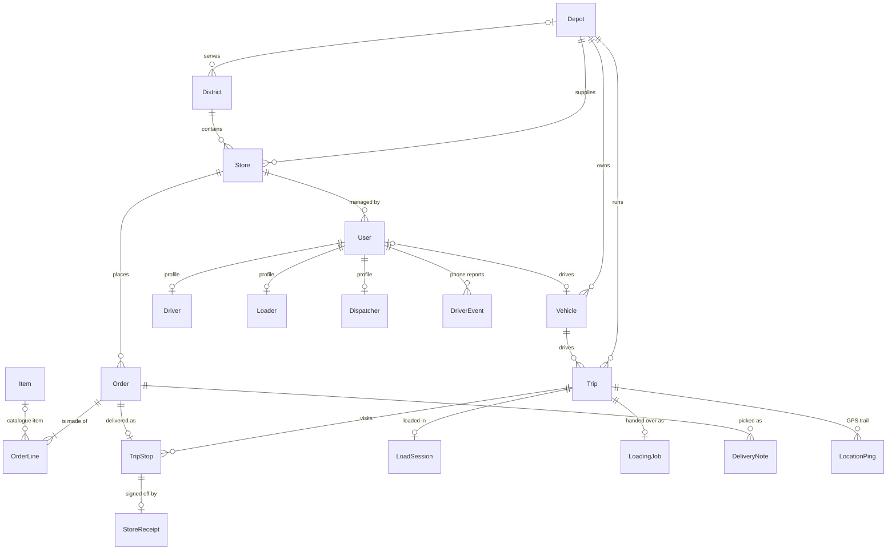

# Data model

## 1. Overview and system scope

### High-level purpose

Waypoint Sync is a delivery planning web app for two depots (Peliyagoda and Kandy) that supply a chain of Fresh, Style and Tech stores. Dispatchers build and publish each day's trips, loaders load the trucks, drivers deliver (often with no signal), and store managers order, track and receive the goods. The database is the single source of truth for all four roles. It holds the reference data the planner needs, every order and trip with its live status, the dock and delivery paperwork, and an audit trail of what each driver's phone reported.

### Database architecture

| | |
| --- | --- |
| Database | **PostgreSQL 16** (Docker image `postgres:16`; a managed Postgres in the Railway deployment) |
| Access layer | **Prisma 5** ORM from the NestJS API. The schema is [`apps/api/prisma/schema.prisma`](../apps/api/prisma/schema.prisma), changed only through migrations in [`apps/api/prisma/migrations`](../apps/api/prisma/migrations) |
| Size of the model | 40 tables + 1 join table, 24 enums, 2 check constraints, 62 foreign keys |
| Files and photos | Not stored in the database. Photos and signatures go to **MinIO** (S3-compatible); rows keep only the object key |
| Time | Timestamps are `TIMESTAMP(3)` in UTC; business dates (`DATE`) are Asia/Colombo days |
| Who connects | Only the API. Browsers and phones never talk to the database directly |

Full column-level detail is also in [database-structure.md](database-structure.md). Draw.io diagrams: [waypoint-schema.drawio](waypoint-schema.drawio), [waypoint-schema1.drawio](waypoint-schema1.drawio).

---

## 2. Conceptual model

### Visual diagram

The core of the model is one chain: **Store → Order → TripStop → Trip → Vehicle**, with the depot owning both ends.

More detailed diagrams of each area are in [database-structure.md](database-structure.md#relationship-diagrams).

### Key entity definitions

| Entity | Business role |
| --- | --- |
| **Depot** | A distribution centre. Owns its vehicles, trips, staff and the stores it supplies. Two exist: `depo1` Peliyagoda, `depo2` Kandy |
| **District** | A delivery area (Colombo, Kandy…), with the travel times the planner uses. Keyed by its name |
| **Store** | A retail **outlet** of one brand, with its delivery window, dock type and location. ("Store" in code, "Outlet" in the team ERD) |
| **Item** | A catalogue product (`F-MILK`…), chilled or ambient, with its pack size |
| **Order** | One store's delivery for one day, with its total weight and volume and its status (waiting → planned → delivered) |
| **OrderLine** | One item and quantity on an order |
| **Vehicle** | A truck or van with weight, volume and fuel limits, its depot and its own driver |
| **Trip** | One vehicle's run on one day (trip 1 or 2) for one brand and district; carries the `planVersion` that changes when a sent plan is edited |
| **TripStop** | One order on a trip, in delivery order, with arrival, store confirmation and driver acknowledgement times |
| **User** | Anyone who signs in, with a role: dispatcher, store, loader or driver. `Driver`, `Loader` and `Dispatcher` add HR details |
| **LoadSession / LoadingJob** | The live dock checklist of a truck, and the dispatcher's handoff of that truck to the loaders |
| **DeliveryNote** | The versioned pick list for an order: which items, from which stock batch, confirmed by which loader |
| **StoreReceipt / FieldFlag** | The store's sign-off of a delivery, and any item it reports missing or damaged |
| **DriverEvent / LocationPing** | Everything a driver's phone synced (arrivals, SOS, fuel, breaks) and its GPS trail |
| **Incident / DriverIncident** | Problems on a trip (breakdown, delay, SOS) and how dispatch handled them |
| **Notification** | An in-app notice for one user |

---

## 3. Physical data schema (tables and attributes)

How to read the tables:

- **Data type** is the PostgreSQL type. Enums are PostgreSQL enum types; their allowed values are shown as `CHECK (enum: …)`.
- **Key type**: `PK` primary key, `FK → Table(column)` foreign key, `UNIQUE`. *Composite* means the key spans several columns (listed under the table).
- **On delete** shows what happens to this row when the referenced row is deleted. `RESTRICT` blocks the delete.
- Examples come from the data dump of 4 Oct 2026. Password, PIN and session values are hidden.

### 3.1 Reference data

#### Table: `Depot`

**Description:** One row per distribution centre (Peliyagoda, Kandy), with contact details and the hashed dock-tablet password.

| Column | Data type | Key type | Constraints / Nullable | Description / Example |
| --- | --- | --- | --- | --- |
| `id` | TEXT | PK | NOT NULL | Unique identifier. e.g. `depo1` |
| `name` | TEXT | — | NOT NULL | Depot name (Peliyagoda, Kandy). e.g. `Peliyagoda` |
| `telephone` | TEXT | — | NULL | Depot phone. e.g. `011 293 9100` |
| `email` | TEXT | — | NULL | Email address. e.g. `peliyagoda@waypoint.lk` |
| `address` | TEXT | — | NULL | Postal address. e.g. `148 Negombo Road, Peliyagoda` |
| `lat` | DOUBLE PRECISION | — | NULL | Latitude. e.g. `6.9678` |
| `lng` | DOUBLE PRECISION | — | NULL | Longitude. e.g. `79.8832` |
| `dockPasswordHash` | TEXT | — | NULL | argon2 hash of the depot's shared dock password (6 digits on the dock keypad). Null until set |

#### Table: `District`

**Description:** Delivery areas and the travel times the planner uses. The district name is the primary key.

| Column | Data type | Key type | Constraints / Nullable | Description / Example |
| --- | --- | --- | --- | --- |
| `name` | TEXT | PK | NOT NULL | District name, also the primary key. e.g. `Kandy` |
| `depotId` | TEXT | FK → Depot(id) | NULL, ON DELETE SET NULL | References Depot(id). e.g. `depo2` |
| `served` | BOOLEAN | — | NOT NULL, DEFAULT true | Whether the depots deliver here. e.g. `true` |
| `roadClass` | TEXT | — | NULL | e.g. `urban` |
| `freeFlowKmh` | DOUBLE PRECISION | — | NULL | e.g. `30` |
| `depotToDistrictKm` | DOUBLE PRECISION | — | NULL | e.g. `8` |
| `depotToDistrictMin` | INTEGER | — | NULL | Minutes from the depot to the district. e.g. `16` |
| `interStopKm` | DOUBLE PRECISION | — | NULL | e.g. `3` |
| `interStopMin` | INTEGER | — | NULL | Minutes between two stops in the district. e.g. `6` |

#### Table: `ServiceAllowance`

**Description:** Unloading minutes for each brand and dock type, looked up by value when timing a trip.

| Column | Data type | Key type | Constraints / Nullable | Description / Example |
| --- | --- | --- | --- | --- |
| `id` | TEXT | PK | NOT NULL, DEFAULT cuid() | Unique identifier (cuid). e.g. `cmuqj60lk0000128gw1yqbr2i` |
| `brand` | "Brand" (enum) | UNIQUE (composite) | NOT NULL, CHECK (enum: Fresh \| Style \| Tech) | Retail brand. e.g. `Fresh` |
| `dockType` | "DockType" (enum) | UNIQUE (composite) | NOT NULL, CHECK (enum: rear_dock \| street \| mall_bay) | e.g. `rear_dock` |
| `minutes` | INTEGER | — | NOT NULL | Unloading minutes for a brand at a dock type. e.g. `15` |

- Unique `(brand, dockType)`

#### Table: `CalendarDay`

**Description:** One row per calendar day: weekday, ISO week, paydays, festivals, holidays, monsoon, and whether deliveries run.

| Column | Data type | Key type | Constraints / Nullable | Description / Example |
| --- | --- | --- | --- | --- |
| `id` | DATE | PK | NOT NULL | The calendar date. e.g. `2024-01-01` |
| `dow` | INTEGER | — | NOT NULL | e.g. `0` |
| `isWeekend` | BOOLEAN | — | NOT NULL | e.g. `false` |
| `isoYear` | INTEGER | — | NOT NULL | e.g. `2024` |
| `isoWeek` | INTEGER | — | NOT NULL | e.g. `1` |
| `isPayday` | BOOLEAN | — | NOT NULL | e.g. `false` |
| `festival` | TEXT | — | NULL | e.g. `thai_pongal` |
| `festivalRamp` | DOUBLE PRECISION | — | NOT NULL, DEFAULT 0 | 0–1 build-up to a festival. e.g. `0` |
| `isHoliday` | BOOLEAN | — | NOT NULL | e.g. `false` |
| `monsoon` | BOOLEAN | — | NOT NULL | e.g. `false` |
| `isOperating` | BOOLEAN | — | NOT NULL | Whether deliveries run that day. e.g. `true` |

#### Table: `TrafficSpeed`

**Description:** Hourly road-speed index per district from the competition CSV. The raw row is kept as JSON.

| Column | Data type | Key type | Constraints / Nullable | Description / Example |
| --- | --- | --- | --- | --- |
| `id` | TEXT | PK | NOT NULL, DEFAULT cuid() | Unique identifier (cuid). e.g. `cmuppysr9007cahsw44d1hxr8` |
| `districtName` | TEXT | — | NOT NULL | District name (text, no FK). e.g. `Colombo` |
| `hour` | INTEGER | — | NULL | e.g. `0` |
| `monsoon` | BOOLEAN | — | NULL | e.g. `false` |
| `speedIndex` | DOUBLE PRECISION | — | NULL | Relative road speed for that hour. e.g. `94` |
| `raw` | JSONB | — | NOT NULL | Original CSV row, kept for audit. e.g. `{"hour": "0", "monsoon": "0", "dist…` |

#### Table: `RoadCondition`

**Description:** Daily road-disruption index per district from the competition CSV. The raw row is kept as JSON.

| Column | Data type | Key type | Constraints / Nullable | Description / Example |
| --- | --- | --- | --- | --- |
| `id` | TEXT | PK | NOT NULL, DEFAULT cuid() | Unique identifier (cuid). e.g. `cmuppysxs00ncahsw2r8bv37d` |
| `date` | DATE | — | NOT NULL | e.g. `2024-01-01` |
| `districtName` | TEXT | — | NOT NULL | District name (text, no FK). e.g. `Colombo` |
| `disruptionIndex` | DOUBLE PRECISION | — | NULL | Road disruption for that day. e.g. `100` |
| `raw` | JSONB | — | NOT NULL | Original CSV row, kept for audit. e.g. `{"date": "2024-01-01", "district": …` |

#### Table: `Item`

**Description:** The product catalogue: code, name, product class, chilled or not, pack size.

| Column | Data type | Key type | Constraints / Nullable | Description / Example |
| --- | --- | --- | --- | --- |
| `id` | TEXT | PK | NOT NULL | Catalogue code (`F-MILK`…). e.g. `T-TV` |
| `itemName` | TEXT | — | NOT NULL | Item name. e.g. `43" television` |
| `type` | "ItemType" (enum) | — | NOT NULL, DEFAULT fresh, CHECK (enum: chilled_food \| fresh \| style \| tech) | Product class. e.g. `tech` |
| `isChilled` | BOOLEAN | — | NOT NULL, DEFAULT false | Needs a chilled vehicle. e.g. `false` |
| `packLabel` | TEXT | — | NULL | Pack size text. e.g. `single box` |
| `packWeightKg` | DOUBLE PRECISION | — | NULL | Weight of one pack. e.g. `11` |

- Index `(type)`

#### Table: `InventoryBatch`

**Description:** Stock batches of an item with dates and quantity, picked first-expiry-first-out.

| Column | Data type | Key type | Constraints / Nullable | Description / Example |
| --- | --- | --- | --- | --- |
| `id` | TEXT | PK | NOT NULL, DEFAULT cuid() | Unique identifier (cuid). e.g. `BATCH-S-HAT` |
| `itemId` | TEXT | FK → Item(id) | NOT NULL, ON DELETE RESTRICT | References Item(id). e.g. `S-HAT` |
| `batchName` | TEXT | — | NULL | Batch label. e.g. `S-HAT-2026-W40` |
| `manufacturingDate` | DATE | — | NULL | Made on. e.g. `2026-09-20` |
| `expiryDate` | DATE | — | NULL | Expires on (FEFO order). e.g. `2027-09-20` |
| `qty` | DOUBLE PRECISION | — | NOT NULL, DEFAULT 0 | Quantity in stock. e.g. `80` |

### 3.2 People and sign-in

#### Table: `User`

**Description:** Every sign-in account: dispatchers, store managers, loaders, drivers and the shared dock tablet.

| Column | Data type | Key type | Constraints / Nullable | Description / Example |
| --- | --- | --- | --- | --- |
| `id` | TEXT | PK | NOT NULL, DEFAULT cuid() | Unique identifier (cuid). e.g. `cmuqqet65009264hi4ijqufty` |
| `loginId` | TEXT | UNIQUE | NOT NULL | Sign-in name (outlet id for store managers, `dock-<depot>` for the dock tablet). e.g. `D020` |
| `role` | "Role" (enum) | — | NOT NULL, CHECK (enum: dispatcher \| store \| loader \| driver) | Picks the home app. e.g. `driver` |
| `name` | TEXT | — | NOT NULL | Display name. e.g. `Udara Weerasinghe` |
| `depotId` | TEXT | FK → Depot(id) | NULL, ON DELETE SET NULL | References Depot(id). e.g. `depo1` |
| `storeId` | TEXT | FK → Store(id) | NULL, ON DELETE SET NULL | Store of an outlet manager. e.g. `OUT001` |
| `passwordHash` | TEXT | — | NULL | argon2 hash (dispatcher, store). e.g. `(hash hidden)` |
| `pinHash` | TEXT | — | NULL | argon2 hash of the PIN (driver, loader). e.g. `(hash hidden)` |
| `notificationPrefs` | JSONB | — | NULL | NotificationPreferences JSON; null means every preference is on. Saved only, not enforced yet. e.g. `{"delayAlerts": true, "planChanges"…` |

#### Table: `Session`

**Description:** Active sign-ins. The id is the `ws_session` cookie. Created at login only.

| Column | Data type | Key type | Constraints / Nullable | Description / Example |
| --- | --- | --- | --- | --- |
| `id` | TEXT | PK | NOT NULL | Random 32-byte token, also the `ws_session` cookie. e.g. `(token hidden)` |
| `userId` | TEXT | FK → User(id) | NOT NULL, ON DELETE CASCADE | References User(id). e.g. `cmuppyuae092pahswvmx7xq1j` |
| `createdAt` | TIMESTAMP(3) | — | NOT NULL, DEFAULT NOW() | When the row was created. e.g. `2026-10-02 08:21:24.119` |
| `expiresAt` | TIMESTAMP(3) | — | NOT NULL | When the session stops working. e.g. `2026-10-02 20:21:24.117` |

#### Table: `Notification`

**Description:** In-app notices for one user, also pushed live while the user is online.

| Column | Data type | Key type | Constraints / Nullable | Description / Example |
| --- | --- | --- | --- | --- |
| `id` | TEXT | PK | NOT NULL, DEFAULT cuid() | Unique identifier (cuid). e.g. `cmuppyuhf0943ahswo9dn7oq7` |
| `userId` | TEXT | FK → User(id) | NOT NULL, ON DELETE CASCADE | References User(id). e.g. `cmuppyuak092rahsw8zmn6kd9` |
| `title` | TEXT | — | NOT NULL | Notice heading. e.g. `Delivery moved to tomorrow` |
| `body` | TEXT | — | NOT NULL | Notice text. e.g. `One order was moved from 2026-10-01…` |
| `link` | TEXT | — | NULL | Page it opens. e.g. `/store/updates` |
| `read` | BOOLEAN | — | NOT NULL, DEFAULT false | Seen by the user. e.g. `false` |
| `createdAt` | TIMESTAMP(3) | — | NOT NULL, DEFAULT NOW() | When the row was created. e.g. `2026-10-01 15:59:10.803` |

#### Table: `Driver`

**Description:** HR profile of a driver user: licence, identity number, dates, address.

| Column | Data type | Key type | Constraints / Nullable | Description / Example |
| --- | --- | --- | --- | --- |
| `id` | TEXT | PK | NOT NULL, DEFAULT cuid() | Unique identifier (cuid). e.g. `cmuqqesy3007064hi57o3t9iq` |
| `userId` | TEXT | FK → User(id), UNIQUE | NOT NULL, ON DELETE CASCADE | References User(id). e.g. `cmuqqesxm006y64hima50g8fv` |
| `licenseNo` | TEXT | UNIQUE | NULL | Driving licence number. e.g. `B2000001` |
| `licenseExpiry` | DATE | — | NULL | Licence expiry date. e.g. `2026-07-02` |
| `idNo` | TEXT | UNIQUE | NULL | National identity card number. e.g. `199000001V` |
| `joinDate` | DATE | — | NULL | Date the person joined. e.g. `2019-01-12` |
| `leavingDate` | DATE | — | NULL | Date the person left. e.g. `2026-03-15` |
| `lastLoginAt` | TIMESTAMP(3) | — | NULL | Last sign-in time. e.g. `2026-10-02 18:52:51.128` |
| `isActive` | BOOLEAN | — | NOT NULL, DEFAULT true | False once the person has left. e.g. `true` |
| `address` | TEXT | — | NULL | Postal address. e.g. `21 Lake Road, Peliyagoda` |

#### Table: `DriverPhone`

**Description:** A driver's phone numbers.

| Column | Data type | Key type | Constraints / Nullable | Description / Example |
| --- | --- | --- | --- | --- |
| `phoneNumber` | TEXT | PK | NOT NULL | Phone number (the row key). e.g. `0772000059` |
| `driverId` | TEXT | FK → Driver(id) | NOT NULL, ON DELETE CASCADE | References Driver(id). e.g. `cmuqqetqr00dg64hivlpjj4wj` |

#### Table: `Loader`

**Description:** HR profile of a loader user: employee number, shift, dates, address.

| Column | Data type | Key type | Constraints / Nullable | Description / Example |
| --- | --- | --- | --- | --- |
| `id` | TEXT | PK | NOT NULL, DEFAULT cuid() | Unique identifier (cuid). e.g. `cmuppyuj60947ahswznphd535` |
| `userId` | TEXT | FK → User(id), UNIQUE | NOT NULL, ON DELETE CASCADE | References User(id). e.g. `cmuppyuam092tahswqfk3w0xp` |
| `employeeNo` | TEXT | UNIQUE | NULL | Employee number. e.g. `LDR-014` |
| `idNo` | TEXT | UNIQUE | NULL | National identity card number. e.g. `199512378V` |
| `shift` | "LoaderShift" (enum) | — | NULL, CHECK (enum: morning \| night) | morning or night. e.g. `morning` |
| `joinDate` | DATE | — | NULL | Date the person joined. e.g. `2023-06-15` |
| `leavingDate` | DATE | — | NULL | Date the person left. e.g. `2026-03-15` |
| `lastLoginAt` | TIMESTAMP(3) | — | NULL | Last sign-in time. e.g. `2026-10-01 15:59:10.865` |
| `isActive` | BOOLEAN | — | NOT NULL, DEFAULT true | False once the person has left. e.g. `true` |
| `address` | TEXT | — | NULL | Postal address. e.g. `8 Dock Lane, Peliyagoda` |

#### Table: `LoaderPhone`

**Description:** A loader's phone numbers.

| Column | Data type | Key type | Constraints / Nullable | Description / Example |
| --- | --- | --- | --- | --- |
| `phoneNumber` | TEXT | PK | NOT NULL | Phone number (the row key). e.g. `0771000000` |
| `loaderId` | TEXT | FK → Loader(id) | NOT NULL, ON DELETE CASCADE | References Loader(id). e.g. `cmuppyuj60947ahswznphd535` |

#### Table: `Dispatcher`

**Description:** HR profile of a dispatcher user.

| Column | Data type | Key type | Constraints / Nullable | Description / Example |
| --- | --- | --- | --- | --- |
| `id` | TEXT | PK | NOT NULL, DEFAULT cuid() | Unique identifier (cuid). e.g. `cmuppyujd0949ahsw6bow5lhr` |
| `userId` | TEXT | FK → User(id), UNIQUE | NOT NULL, ON DELETE CASCADE | References User(id). e.g. `cmuppyuae092pahswvmx7xq1j` |
| `employeeNo` | TEXT | UNIQUE | NULL | Employee number. e.g. `DSP-001` |
| `email` | TEXT | — | NULL | Email address. e.g. `nimal@waypoint.lk` |
| `address` | TEXT | — | NULL | Postal address. e.g. `4 Depot Office, Peliyagoda` |
| `lastLoginAt` | TIMESTAMP(3) | — | NULL | Last sign-in time. e.g. `2026-10-01 15:59:10.873` |
| `isActive` | BOOLEAN | — | NOT NULL, DEFAULT true | False once the person has left. e.g. `true` |

#### Table: `DispatcherPhone`

**Description:** A dispatcher's phone numbers.

| Column | Data type | Key type | Constraints / Nullable | Description / Example |
| --- | --- | --- | --- | --- |
| `phoneNumber` | TEXT | PK | NOT NULL | Phone number (the row key). e.g. `0112000000` |
| `dispatcherId` | TEXT | FK → Dispatcher(id) | NOT NULL, ON DELETE CASCADE | References Dispatcher(id). e.g. `cmuppyujd0949ahsw6bow5lhr` |

### 3.3 Stores and orders

#### Table: `Store`

**Description:** Retail outlets: brand, district, depot, dock and parking, delivery window, location.

| Column | Data type | Key type | Constraints / Nullable | Description / Example |
| --- | --- | --- | --- | --- |
| `id` | TEXT | PK | NOT NULL | Outlet id from outlets.csv (`OUT001`…). e.g. `OUT011` |
| `displayName` | TEXT | — | NULL | e.g. `Green Basket 11` |
| `address` | TEXT | — | NULL | Postal address. e.g. `22 Temple Road, Colombo` |
| `email` | TEXT | — | NULL | Email address. e.g. `out011@shops.waypoint.lk` |
| `brand` | "Brand" (enum) | — | NOT NULL, CHECK (enum: Fresh \| Style \| Tech) | Retail brand. e.g. `Fresh` |
| `districtId` | TEXT | FK → District(name) | NOT NULL, ON DELETE RESTRICT | References District(name). e.g. `Colombo` |
| `depotId` | TEXT | FK → Depot(id) | NOT NULL, ON DELETE RESTRICT | References Depot(id). e.g. `depo1` |
| `dockType` | "DockType" (enum) | — | NOT NULL, CHECK (enum: rear_dock \| street \| mall_bay) | How the truck unloads. e.g. `rear_dock` |
| `parkingConstraint` | "ParkingConstraint" (enum) | — | NOT NULL, DEFAULT normal, CHECK (enum: normal \| van_only \| mall_dock) | Which vehicles can park. e.g. `normal` |
| `mallWindow` | TEXT | — | NULL | Mall delivery slot text. e.g. `09:00-11:00` |
| `windowOpenMin` | INTEGER | — | NOT NULL | Delivery window opens (minutes after midnight). e.g. `480` |
| `windowCloseMin` | INTEGER | — | NOT NULL | Delivery window closes (minutes after midnight). e.g. `1020` |
| `lat` | DOUBLE PRECISION | — | NULL | Latitude. e.g. `6.898` |
| `lng` | DOUBLE PRECISION | — | NULL | Longitude. e.g. `79.922` |
| `daysSinceLastServed` | INTEGER | — | NULL | Days since this outlet last received a delivery. Null when it has never been served. e.g. `1` |

#### Table: `OutletPhone`

**Description:** Shop, manager and warehouse numbers of an outlet. The same number may repeat.

| Column | Data type | Key type | Constraints / Nullable | Description / Example |
| --- | --- | --- | --- | --- |
| `id` | TEXT | PK | NOT NULL, DEFAULT cuid() | Unique identifier (cuid). e.g. `cmuppyujm094aahswv2s7yck7` |
| `storeId` | TEXT | FK → Store(id) | NOT NULL, ON DELETE CASCADE | References Store(id). e.g. `OUT001` |
| `phoneNo` | TEXT | — | NOT NULL | Phone number (not unique). e.g. `0112345678` |
| `label` | "PhoneLabel" (enum) | — | NOT NULL, CHECK (enum: shop \| manager \| warehouse) | shop, manager or warehouse. e.g. `shop` |

#### Table: `StoreSavedItem`

**Description:** Catalogue items a store has starred, shared by every phone of that store.

| Column | Data type | Key type | Constraints / Nullable | Description / Example |
| --- | --- | --- | --- | --- |
| `storeId` | TEXT | PK (composite), FK → Store(id) | NOT NULL, ON DELETE CASCADE | References Store(id). e.g. `OUT001` |
| `itemId` | TEXT | PK (composite), FK → Item(id) | NOT NULL, ON DELETE CASCADE | References Item(id). e.g. `F-BUTTR` |
| `createdAt` | TIMESTAMP(3) | — | NOT NULL, DEFAULT NOW() | When the row was created. e.g. `2026-10-04 00:00:57.622` |

- Primary key `(storeId, itemId)`

#### Table: `Order`

**Description:** One store's delivery for one day: totals, temperature, status, urgency, deferral and cancellation details.

| Column | Data type | Key type | Constraints / Nullable | Description / Example |
| --- | --- | --- | --- | --- |
| `id` | TEXT | PK | NOT NULL, DEFAULT cuid() | Unique identifier (cuid). e.g. `cmuppyugg0937ahswhnuucedx` |
| `storeId` | TEXT | FK → Store(id) | NOT NULL, ON DELETE RESTRICT | References Store(id). e.g. `OUT003` |
| `brand` | "Brand" (enum) | — | NOT NULL, CHECK (enum: Fresh \| Style \| Tech) | Retail brand. e.g. `Fresh` |
| `deliveryDate` | DATE | — | NOT NULL | Day the order is delivered. e.g. `2026-10-01` |
| `temp` | "Temp" (enum) | — | NOT NULL, CHECK (enum: chilled \| ambient) | Chilled or ambient goods. e.g. `chilled` |
| `status` | "OrderStatus" (enum) | — | NOT NULL, DEFAULT waiting, CHECK (enum: waiting \| planned \| deferred \| delivered \| partial \| cancelled) | Current state. e.g. `planned` |
| `units` | INTEGER | — | NOT NULL | Number of units. e.g. `9` |
| `weightKg` | DOUBLE PRECISION | — | NOT NULL | Total weight in kg. e.g. `93` |
| `volumeM3` | DOUBLE PRECISION | — | NOT NULL | Total volume in m³. e.g. `0.15` |
| `urgentNote` | TEXT | — | NULL | Store note on an urgent order |
| `urgent` | BOOLEAN | — | NOT NULL, DEFAULT false | Set by the store at order time; urgent orders head the dispatcher's waiting list. e.g. `false` |
| `stockLevel` | "StockLevel" (enum) | — | NULL, CHECK (enum: out_of_stock \| running_low) |  |
| `movedFromDate` | DATE | — | NULL | Original day before a deferral. e.g. `2026-10-01` |
| `deferReason` | TEXT | — | NULL | Why it was moved. e.g. `Fleet over capacity at Peliyagoda t…` |
| `deferredById` | TEXT | — | NULL | User who moved it (no FK) |
| `deferredYesterday` | BOOLEAN | — | NOT NULL, DEFAULT false | Was already moved yesterday. e.g. `false` |
| `repeatSkip` | BOOLEAN | — | NOT NULL, DEFAULT false | Skipped more than once. e.g. `false` |
| `cancelledAt` | TIMESTAMP(3) | — | NULL | When it was cancelled |
| `cancelledById` | TEXT | — | NULL | User who cancelled (no FK) |
| `createdAt` | TIMESTAMP(3) | — | NOT NULL, DEFAULT NOW() | When the row was created. e.g. `2026-10-01 15:59:10.768` |

- Index `(deliveryDate, status)`

#### Table: `OrderLine`

**Description:** The items and quantities on an order, with a snapshot of each unit's weight and volume.

| Column | Data type | Key type | Constraints / Nullable | Description / Example |
| --- | --- | --- | --- | --- |
| `id` | TEXT | PK | NOT NULL, DEFAULT cuid() | Unique identifier (cuid). e.g. `cmuppyufz0931ahswdhv6zo0f` |
| `orderId` | TEXT | FK → Order(id) | NOT NULL, ON DELETE CASCADE | References Order(id). e.g. `cmuppyufz092zahswmpzgp636` |
| `itemId` | TEXT | FK → Item(id) | NULL, ON DELETE SET NULL | References Item(id). e.g. `F-MILK` |
| `name` | TEXT | — | NOT NULL | Item name at order time. e.g. `Fresh milk 1 L` |
| `qty` | INTEGER | — | NOT NULL | Quantity. e.g. `6` |
| `pack` | TEXT | — | NOT NULL | Pack label. e.g. `crate of 12` |
| `chilled` | BOOLEAN | — | NOT NULL, DEFAULT false | Needs a chilled vehicle. e.g. `true` |
| `unitWeightKg` | DOUBLE PRECISION | — | NOT NULL | Weight of one unit. e.g. `12.6` |
| `unitVolumeM3` | DOUBLE PRECISION | — | NOT NULL | Volume of one unit. e.g. `0.018` |

### 3.4 Fleet and trips

#### Table: `Vehicle`

**Description:** Trucks and vans: capacity, fuel, depot, status and their own driver.

| Column | Data type | Key type | Constraints / Nullable | Description / Example |
| --- | --- | --- | --- | --- |
| `id` | TEXT | PK | NOT NULL | Vehicle id from the CSV. e.g. `VEH007` |
| `numberPlate` | TEXT | UNIQUE | NULL | e.g. `WP LQ-1007` |
| `depotId` | TEXT | FK → Depot(id) | NOT NULL, ON DELETE RESTRICT | References Depot(id). e.g. `depo1` |
| `type` | "VehicleType" (enum) | — | NOT NULL, CHECK (enum: truck \| van) | e.g. `truck` |
| `temp` | "VehicleTemp" (enum) | — | NOT NULL, CHECK (enum: reefer \| ambient) | e.g. `reefer` |
| `weightCapKg` | DOUBLE PRECISION | — | NOT NULL | Weight capacity in kg. e.g. `3610` |
| `volumeCapM3` | DOUBLE PRECISION | — | NOT NULL | Volume capacity in m³. e.g. `19.4` |
| `fuelType` | TEXT | — | NULL | e.g. `diesel` |
| `kmPerL` | DOUBLE PRECISION | — | NULL | Fuel economy. e.g. `6.4` |
| `weeklyFuelQuotaL` | DOUBLE PRECISION | — | NULL | Weekly fuel allowance in litres. e.g. `590` |
| `status` | "VehicleStatus" (enum) | — | NOT NULL, DEFAULT available, CHECK (enum: available \| out_of_service \| on_road) | Current state. e.g. `available` |
| `outOfServiceReason` | TEXT | — | NULL, CHECK (filled in when status = 'out_of_service') | Required when status is out_of_service (database check). Cleared when the vehicle is back. e.g. `Brake service — rear pads` |
| `returnDate` | TIMESTAMP(3) | — | NULL | Optional expected return. Stores the date and the time. Null when no return time is known. e.g. `2026-10-04 09:00:00` |
| `lastServiceAt` | TIMESTAMP(3) | — | NULL | Last time this vehicle was serviced. e.g. `2026-08-26 00:00:00` |
| `driverId` | TEXT | FK → User(id), UNIQUE | NULL, ON DELETE SET NULL | The vehicle's own driver. e.g. `cmuqqet1d007m64hitgopf8l6` |

#### Table: `Trip`

**Description:** One run of one vehicle on one day (trip 1 or 2), for one brand and main district, with its status and plan version.

| Column | Data type | Key type | Constraints / Nullable | Description / Example |
| --- | --- | --- | --- | --- |
| `id` | TEXT | PK | NOT NULL, DEFAULT cuid() | Unique identifier (cuid). e.g. `cmurdd49h001fhcno6lywr2zt` |
| `vehicleId` | TEXT | FK → Vehicle(id) | NOT NULL, ON DELETE RESTRICT | References Vehicle(id). e.g. `VEH039` |
| `assignedDriverId` | TEXT | FK → User(id) | NULL, ON DELETE SET NULL | Driver for this trip. e.g. `cmuppyuaq092vahswi6i7eszo` |
| `depotId` | TEXT | FK → Depot(id) | NOT NULL, ON DELETE RESTRICT | References Depot(id). e.g. `depo2` |
| `brand` | "Brand" (enum) | — | NOT NULL, CHECK (enum: Fresh \| Style \| Tech) | Retail brand. e.g. `Fresh` |
| `districtId` | TEXT | FK → District(name) | NOT NULL, ON DELETE RESTRICT | Main district. e.g. `Kandy` |
| `serviceDate` | DATE | UNIQUE (composite) | NOT NULL | Delivery day. e.g. `2026-10-02` |
| `tripNumber` | INTEGER | UNIQUE (composite) | NOT NULL, CHECK (tripNumber BETWEEN 1 AND 2) | 1 or 2. Database check Trip_tripNumber_max_2. e.g. `1` |
| `csvRouteId` | TEXT | — | NULL | Route id from the CSV. e.g. `DEMO-STATUS-Kandy-completed` |
| `status` | "TripStatus" (enum) | — | NOT NULL, DEFAULT planning, CHECK (enum: planning \| published \| loading \| ready \| on_road \| completed \| breakdown) | Current state. e.g. `completed` |
| `planVersion` | INTEGER | — | NOT NULL, DEFAULT 1 | Bumped on every change to a sent trip. e.g. `1` |
| `plannedMinutes` | INTEGER | — | NULL | Planned duration |
| `plannedLitres` | DOUBLE PRECISION | — | NULL | Planned fuel |
| `fuelLitresAtEnd` | DOUBLE PRECISION | — | NULL | Latest FUEL_READING synced for this trip; once the trip ends it is the end-of-trip fuel |
| `publishedAt` | TIMESTAMP(3) | — | NULL | When the plan was published. e.g. `2026-10-02 02:00:00` |
| `tripStartingDate` | DATE | — | NULL | e.g. `2026-10-01` |
| `tripEndingDate` | DATE | — | NULL |  |
| `startingTime` | TIMESTAMP(3) | — | NULL | e.g. `2026-10-02 02:00:00` |
| `estimatedStartingTime` | TIMESTAMP(3) | — | NULL |  |
| `endingTime` | TIMESTAMP(3) | — | NULL | e.g. `2026-10-02 05:00:00` |

- Unique `(vehicleId, serviceDate, tripNumber)`
- Index `(depotId, serviceDate)`

#### Table: `_TripExtraDistricts`

**Description:** Join table for the extra districts a trip covers besides its main one.

| Column | Data type | Key type | Constraints / Nullable | Description / Example |
| --- | --- | --- | --- | --- |
| `A` | TEXT | PK (composite), FK → District(name) | NOT NULL, ON DELETE CASCADE | The extra district |
| `B` | TEXT | PK (composite), FK → Trip(id) | NOT NULL, ON DELETE CASCADE | The trip |

- Unique `(A, B)`
- Index `(B)`

#### Table: `TripStop`

**Description:** One order on one trip, in delivery order, with planned and actual times.

| Column | Data type | Key type | Constraints / Nullable | Description / Example |
| --- | --- | --- | --- | --- |
| `id` | TEXT | PK | NOT NULL, DEFAULT cuid() | Unique identifier (cuid). e.g. `cmuppyugk093cahsw5xnjkm20` |
| `tripId` | TEXT | FK → Trip(id) | NOT NULL, ON DELETE CASCADE | References Trip(id). e.g. `cmuppyufu092xahswqj3cytia` |
| `orderId` | TEXT | FK → Order(id), UNIQUE | NOT NULL, ON DELETE RESTRICT | References Order(id). e.g. `cmuppyugg0937ahswhnuucedx` |
| `sequence` | INTEGER | UNIQUE (composite) | NOT NULL | Position on the trip (1 = first stop). e.g. `2` |
| `status` | "StopStatus" (enum) | — | NOT NULL, DEFAULT upcoming, CHECK (enum: upcoming \| arrived \| waiting \| confirmed \| delivered \| partial \| deferred \| at_risk) | Current state. e.g. `upcoming` |
| `etaMin` | INTEGER | — | NULL | Planned arrival (minutes after midnight). e.g. `505` |
| `arrivedAt` | TIMESTAMP(3) | — | NULL | Driver arrived. e.g. `2026-10-02 05:36:34.726` |
| `storeConfirmedAt` | TIMESTAMP(3) | — | NULL | Store checked the goods. e.g. `2026-10-02 05:36:34.726` |
| `driverAckAt` | TIMESTAMP(3) | — | NULL | Driver acknowledged the receipt. e.g. `2026-10-04 03:42:33.361` |
| `waitAlertedAt` | TIMESTAMP(3) | — | NULL | Set when dispatch was alerted that the driver waited WAIT_ALERT_MIN at the store; one alert per stop |
| `plannedArrivalTime` | TIMESTAMP(3) | — | NULL |  |
| `leaveOutletTime` | TIMESTAMP(3) | — | NULL |  |
| `serviceMin` | DOUBLE PRECISION | — | NULL |  |
| `unloadingTime` | DOUBLE PRECISION | — | NULL |  |
| `estimatedUnloadingTime` | DOUBLE PRECISION | — | NULL |  |
| `estimatedTripStopTime` | TIMESTAMP(3) | — | NULL |  |
| `tripStopTime` | TIMESTAMP(3) | — | NULL |  |
| `tripStartTime` | TIMESTAMP(3) | — | NULL |  |
| `estimatedTripStartTime` | TIMESTAMP(3) | — | NULL |  |

- Unique `(tripId, sequence)`

#### Table: `RouteLeg`

**Description:** Planned and actual travel between two points of a trip.

| Column | Data type | Key type | Constraints / Nullable | Description / Example |
| --- | --- | --- | --- | --- |
| `id` | TEXT | PK | NOT NULL, DEFAULT cuid() | Unique identifier (cuid). e.g. `cmuppyulo094rahswhwwolxid` |
| `tripId` | TEXT | FK → Trip(id) | NOT NULL, ON DELETE CASCADE | References Trip(id). e.g. `cmuppyugw093mahswbcrogboy` |
| `seq` | INTEGER | UNIQUE (composite) | NOT NULL | Leg number on the trip. e.g. `1` |
| `fromPoint` | TEXT | — | NULL | Start point. e.g. `Peliyagoda depot` |
| `toOutlet` | TEXT | — | NULL | Destination outlet. e.g. `OUT001` |
| `distanceKm` | DOUBLE PRECISION | — | NULL | Leg distance. e.g. `12.4` |
| `plannedDepartTime` | TIMESTAMP(3) | — | NULL |  |
| `plannedTravelMin` | DOUBLE PRECISION | — | NULL | e.g. `28` |
| `actualDepartTime` | TIMESTAMP(3) | — | NULL |  |
| `actualTravelMin` | DOUBLE PRECISION | — | NULL | e.g. `31` |
| `monsoon` | BOOLEAN | — | NULL | e.g. `false` |
| `trafficBand` | TEXT | — | NULL | Traffic band used for the estimate. e.g. `peak` |

- Unique `(tripId, seq)`

#### Table: `LocationPing`

**Description:** A driver phone's GPS trail during a trip.

| Column | Data type | Key type | Constraints / Nullable | Description / Example |
| --- | --- | --- | --- | --- |
| `id` | TEXT | PK | NOT NULL, DEFAULT cuid() | Unique identifier (cuid). e.g. `cmuppyulx094sahswy2i1nkmv` |
| `clientUuid` | TEXT | UNIQUE | NOT NULL | UUID made on the phone; stops a retry being stored twice. e.g. `ping-cmuppyugw093mahswbcrogboy-1` |
| `tripId` | TEXT | FK → Trip(id) | NOT NULL, ON DELETE CASCADE | References Trip(id). e.g. `cmuppyugw093mahswbcrogboy` |
| `driverId` | TEXT | FK → Driver(id) | NOT NULL, ON DELETE RESTRICT | References Driver(id). e.g. `cmuppyuiu0945ahsw76l1sfl2` |
| `lat` | DOUBLE PRECISION | — | NOT NULL | Latitude. e.g. `6.958` |
| `lng` | DOUBLE PRECISION | — | NOT NULL | Longitude. e.g. `79.899` |
| `accuracyM` | DOUBLE PRECISION | — | NULL | GPS accuracy in metres. e.g. `8` |
| `speedKmh` | DOUBLE PRECISION | — | NULL | e.g. `34` |
| `recordedAt` | TIMESTAMP(3) | — | NOT NULL | Time on the phone. e.g. `2026-10-01 15:47:10.964` |
| `receivedAt` | TIMESTAMP(3) | — | NOT NULL, DEFAULT NOW() | Time the server received it. e.g. `2026-10-01 15:59:10.965` |

- Index `(tripId, recordedAt)`

### 3.5 Dock and delivery notes

#### Table: `LoadSession`

**Description:** The live dock checklist of one truck: loaders, times, and what the loader last accepted of the plan.

| Column | Data type | Key type | Constraints / Nullable | Description / Example |
| --- | --- | --- | --- | --- |
| `id` | TEXT | PK | NOT NULL, DEFAULT cuid() | Unique identifier (cuid). e.g. `demo-session-cmurdd49h001fhcno6lywr…` |
| `tripId` | TEXT | FK → Trip(id), UNIQUE | NOT NULL, ON DELETE CASCADE | References Trip(id). e.g. `cmurdd49h001fhcno6lywr2zt` |
| `loaderIds` | TEXT[] | — | NOT NULL | User ids of the loaders on this truck. e.g. `{cmuppyuam092tahswqfk3w0xp}` |
| `startedAt` | TIMESTAMP(3) | — | NULL | Loading started. e.g. `2026-10-03 18:30:58.717` |
| `finishedAt` | TIMESTAMP(3) | — | NULL | e.g. `2026-10-03 18:30:58.717` |
| `departedAt` | TIMESTAMP(3) | — | NULL | Truck left the dock. e.g. `2026-10-03 18:30:58.717` |
| `paused` | BOOLEAN | — | NOT NULL, DEFAULT false | Paused by a plan change. e.g. `false` |
| `ackedPlanVersion` | INTEGER | — | NOT NULL, DEFAULT 0 | Plan version the loader accepted. e.g. `1` |
| `ackedStopIds` | TEXT[] | — | NOT NULL, DEFAULT [] | Order ids on the trip when the loader last acknowledged; diffed against the live trip for the plan-change lock. e.g. `{cmurdd49c001ahcnolglchaek}` |
| `takenOffOrderIds` | TEXT[] | — | NOT NULL, DEFAULT [] | Removed orders the loader has confirmed are off the truck; acknowledging needs all of them. Reset on acknowledge |
| `newOrderIds` | TEXT[] | — | NOT NULL, DEFAULT [] | Orders added by the last acknowledged plan change, shown as NEW on the checklist. Cleared on depart |

#### Table: `LoadFlag`

**Description:** Missing, damaged or wrong-quantity goods flagged on the live dock sheet.

| Column | Data type | Key type | Constraints / Nullable | Description / Example |
| --- | --- | --- | --- | --- |
| `id` | TEXT | PK | NOT NULL, DEFAULT cuid() | Unique identifier (cuid). e.g. `cmuqj610v0074128gxubikgsf` |
| `stopId` | TEXT | FK → TripStop(id) | NOT NULL, ON DELETE CASCADE | References TripStop(id). e.g. `cmuppyuga0935ahswy6dkwz97` |
| `orderLineId` | TEXT | FK → OrderLine(id) | NULL, ON DELETE SET NULL | The flagged line. e.g. `cmuppyufz0931ahswdhv6zo0f` |
| `type` | "FlagType" (enum) | — | NOT NULL, CHECK (enum: missing \| damaged \| wrong_quantity) | missing, damaged or wrong quantity. e.g. `missing` |
| `qty` | INTEGER | — | NULL | Quantity. e.g. `1` |
| `note` | TEXT | — | NULL | Free-text note. e.g. `Demo: one pack short at dock.` |
| `photoKey` | TEXT | — | NULL | MinIO object key of the photo. e.g. `load-flags/demo.png` |
| `createdAt` | TIMESTAMP(3) | — | NOT NULL, DEFAULT NOW() | When the row was created. e.g. `2026-10-02 05:36:34.735` |
| `resolvedAt` | TIMESTAMP(3) | — | NULL | When it was resolved. e.g. `2026-10-04 00:00:57.622` |

#### Table: `LoadingJob`

**Description:** The dispatcher's handoff of a trip to the dock: bay, deadline, status, loaded totals.

| Column | Data type | Key type | Constraints / Nullable | Description / Example |
| --- | --- | --- | --- | --- |
| `id` | TEXT | PK | NOT NULL, DEFAULT cuid() | Unique identifier (cuid). e.g. `cmuppyukk094dahsw0bl0d6do` |
| `tripId` | TEXT | FK → Trip(id), UNIQUE | NOT NULL, ON DELETE CASCADE | References Trip(id). e.g. `cmuppyufu092xahswqj3cytia` |
| `depot` | TEXT | — | NOT NULL | Depot id (text copy, no FK). e.g. `depo1` |
| `assignedById` | TEXT | FK → Dispatcher(id) | NOT NULL, ON DELETE RESTRICT | Dispatcher who handed it over. e.g. `cmuppyujd0949ahsw6bow5lhr` |
| `assignedAt` | TIMESTAMP(3) | — | NOT NULL, DEFAULT NOW() | e.g. `2026-10-01 15:59:10.917` |
| `bay` | TEXT | — | NULL | Loading bay. e.g. `Bay-2` |
| `loadByTime` | TIMESTAMP(3) | — | NULL |  |
| `instructions` | TEXT | — | NULL | e.g. `Chill first. Confirm DN version bef…` |
| `priority` | INTEGER | — | NOT NULL, DEFAULT 0 | Higher loads first. e.g. `1` |
| `status` | "LoadingJobStatus" (enum) | — | NOT NULL, DEFAULT assigned, CHECK (enum: assigned \| picking \| loaded \| handed_over \| cancelled) | Current state. e.g. `assigned` |
| `startedAt` | TIMESTAMP(3) | — | NULL | e.g. `2026-10-03 18:30:58.707` |
| `loadedAt` | TIMESTAMP(3) | — | NULL |  |
| `handedOverAt` | TIMESTAMP(3) | — | NULL | e.g. `2026-10-03 18:30:58.707` |
| `totalWeightKg` | DOUBLE PRECISION | — | NULL | Loaded weight. e.g. `420` |
| `totalVolumeM3` | DOUBLE PRECISION | — | NULL | Loaded volume. e.g. `4.8` |

#### Table: `DeliveryNote`

**Description:** Versioned pick list for an order. Each change adds a version; the current one has `validTo` empty.

| Column | Data type | Key type | Constraints / Nullable | Description / Example |
| --- | --- | --- | --- | --- |
| `dnId` | TEXT | PK (composite) | NOT NULL | Delivery note id (`DN-<orderId>`). e.g. `DN-cmuppyugz093oahsw05yw3ajt` |
| `versionAt` | TIMESTAMP(3) | PK (composite) | NOT NULL | Version timestamp of the delivery note. e.g. `2026-10-01 04:00:00` |
| `orderId` | TEXT | FK → Order(id) | NOT NULL, ON DELETE RESTRICT | References Order(id). e.g. `cmuppyugz093oahsw05yw3ajt` |
| `status` | TEXT | — | NULL | Current state. e.g. `picking` |
| `validTo` | TIMESTAMP(3) | — | NULL | Null on the current version |
| `changedById` | TEXT | FK → Loader(id) | NULL, ON DELETE SET NULL | Loader who made this version. e.g. `cmuppyuj60947ahswznphd535` |
| `changeReason` | TEXT | — | NULL | Why this version was made. e.g. `initial pick list` |

- Primary key `(dnId, versionAt)`
- Index `(dnId)`
- Index `(orderId)`

#### Table: `DeliveryNoteLine`

**Description:** Quantity confirmed per item on one delivery-note version.

| Column | Data type | Key type | Constraints / Nullable | Description / Example |
| --- | --- | --- | --- | --- |
| `id` | TEXT | PK | NOT NULL, DEFAULT cuid() | Unique identifier (cuid). e.g. `cmuppyuks094fahsw8eiot41w` |
| `dnId` | TEXT | FK → DeliveryNote(dnId) | NOT NULL, ON DELETE CASCADE | References DeliveryNote(dnId). e.g. `DN-cmuppyugz093oahsw05yw3ajt` |
| `versionAt` | TIMESTAMP(3) | FK → DeliveryNote(versionAt) | NOT NULL, ON DELETE CASCADE | References DeliveryNote(versionAt). e.g. `2026-10-01 04:00:00` |
| `itemId` | TEXT | FK → Item(id) | NOT NULL, ON DELETE RESTRICT | References Item(id). e.g. `F-CHKN` |
| `qtyConfirmed` | DOUBLE PRECISION | — | NULL | Quantity confirmed on the truck. e.g. `2` |
| `shortageReason` | TEXT | — | NULL | Why less was loaded |

#### Table: `DeliveryNotePick`

**Description:** How much of a delivery-note line came from each stock batch.

| Column | Data type | Key type | Constraints / Nullable | Description / Example |
| --- | --- | --- | --- | --- |
| `id` | TEXT | PK | NOT NULL, DEFAULT cuid() | Unique identifier (cuid). e.g. `cmuppyul5094lahsw2hor7ekl` |
| `dnLineId` | TEXT | FK → DeliveryNoteLine(id) | NOT NULL, ON DELETE CASCADE | The delivery note line. e.g. `cmuppyuks094gahswyqusccgw` |
| `batchId` | TEXT | FK → InventoryBatch(id) | NOT NULL, ON DELETE RESTRICT | Batch the goods came from. e.g. `BATCH-F-MILK` |
| `qty` | DOUBLE PRECISION | — | NOT NULL | Quantity. e.g. `2` |

#### Table: `DeliveryNoteLoader`

**Description:** Which loaders picked or confirmed a delivery-note version.

| Column | Data type | Key type | Constraints / Nullable | Description / Example |
| --- | --- | --- | --- | --- |
| `id` | TEXT | PK | NOT NULL, DEFAULT cuid() | Unique identifier (cuid). e.g. `cmuppyuks094jahsw4w7loie4` |
| `dnId` | TEXT | FK → DeliveryNote(dnId) | NOT NULL, ON DELETE CASCADE | References DeliveryNote(dnId). e.g. `DN-cmuppyugz093oahsw05yw3ajt` |
| `versionAt` | TIMESTAMP(3) | FK → DeliveryNote(versionAt) | NOT NULL, ON DELETE CASCADE | References DeliveryNote(versionAt). e.g. `2026-10-01 04:00:00` |
| `loaderId` | TEXT | FK → Loader(id) | NOT NULL, ON DELETE RESTRICT | References Loader(id). e.g. `cmuppyuj60947ahswznphd535` |
| `role` | "LoaderNoteRole" (enum) | — | NULL, CHECK (enum: picking \| confirming) | picking or confirming. e.g. `picking` |
| `startedAt` | TIMESTAMP(3) | — | NULL | e.g. `2026-10-01 15:59:10.923` |
| `finishedAt` | TIMESTAMP(3) | — | NULL |  |

- Unique `(dnId, versionAt, loaderId)`

#### Table: `LoaderFlag`

**Description:** An issue recorded on a handed-over delivery note, waiting for the dispatcher to approve or reject it.

| Column | Data type | Key type | Constraints / Nullable | Description / Example |
| --- | --- | --- | --- | --- |
| `id` | TEXT | PK | NOT NULL, DEFAULT cuid() | Unique identifier (cuid). e.g. `cmuppyul8094nahswhsx413b7` |
| `raisedAt` | TIMESTAMP(3) | — | NOT NULL, DEFAULT NOW() | When it was raised. e.g. `2026-10-01 15:59:10.941` |
| `loaderId` | TEXT | FK → Loader(id) | NOT NULL, ON DELETE RESTRICT | References Loader(id). e.g. `cmuppyuj60947ahswznphd535` |
| `dnId` | TEXT | FK → DeliveryNote(dnId) | NOT NULL, ON DELETE CASCADE | References DeliveryNote(dnId). e.g. `DN-cmuppyugz093oahsw05yw3ajt` |
| `versionAt` | TIMESTAMP(3) | FK → DeliveryNote(versionAt) | NOT NULL, ON DELETE CASCADE | References DeliveryNote(versionAt). e.g. `2026-10-01 04:00:00` |
| `scope` | "LoaderFlagScope" (enum) | — | NOT NULL, CHECK (enum: item \| dn) | One item, or the whole delivery note. e.g. `item` |
| `itemId` | TEXT | FK → Item(id) | NULL, ON DELETE SET NULL | References Item(id). e.g. `F-MILK` |
| `qtyFlagged` | DOUBLE PRECISION | — | NULL | e.g. `1` |
| `reason` | TEXT | — | NOT NULL | Reason code. e.g. `crate crushed at dock` |
| `reasonDetail` | TEXT | — | NULL | Readable reason. e.g. `Outer crate split; 1 bottle leaking…` |
| `photoKey` | TEXT | — | NULL | MinIO object key of the photo |
| `validationStatus` | "LoaderFlagStatus" (enum) | — | NOT NULL, DEFAULT pending_dispatcher, CHECK (enum: pending_dispatcher \| approved \| rejected) | Dispatcher's review. e.g. `pending_dispatcher` |
| `reviewedById` | TEXT | FK → Dispatcher(id) | NULL, ON DELETE SET NULL | Dispatcher who reviewed |
| `reviewedAt` | TIMESTAMP(3) | — | NULL |  |
| `reviewNote` | TEXT | — | NULL |  |

- Index `(dnId)`

### 3.6 Receipts, driver sync and incidents

#### Table: `StoreReceipt`

**Description:** The store's sign-off of one stop: per-line results, cold-chain check and signature.

| Column | Data type | Key type | Constraints / Nullable | Description / Example |
| --- | --- | --- | --- | --- |
| `id` | TEXT | PK | NOT NULL, DEFAULT cuid() | Unique identifier (cuid). e.g. `cmuqj61100076128glu8kkexy` |
| `stopId` | TEXT | FK → TripStop(id), UNIQUE | NOT NULL, ON DELETE CASCADE | References TripStop(id). e.g. `cmuppyuga0935ahswy6dkwz97` |
| `lineResults` | JSONB | — | NOT NULL | Per line: ordered, received and any issue. e.g. `[{"name": "Fresh milk 1 L", "issue"…` |
| `chilledWasCold` | BOOLEAN | — | NULL | Chilled goods arrived cold. e.g. `true` |
| `signaturePhotoKey` | TEXT | — | NULL | MinIO key of the signature. e.g. `signatures/demo.png` |
| `signedByUserId` | TEXT | FK → User(id) | NULL, ON DELETE SET NULL | Who signed. e.g. `cmuqj60pz000c128ge5cvtrg1` |
| `signedAt` | TIMESTAMP(3) | — | NULL | When it was signed. e.g. `2026-10-02 05:36:34.726` |
| `createdAt` | TIMESTAMP(3) | — | NOT NULL, DEFAULT NOW() | When the row was created. e.g. `2026-10-02 05:36:34.74` |

#### Table: `FieldFlag`

**Description:** An item the store reported missing or damaged after receiving, and the driver's decision on it.

| Column | Data type | Key type | Constraints / Nullable | Description / Example |
| --- | --- | --- | --- | --- |
| `id` | TEXT | PK | NOT NULL, DEFAULT cuid() | Unique identifier (cuid). e.g. `cmuppyulh094pahsw2cl1m2i8` |
| `raisedAt` | TIMESTAMP(3) | — | NOT NULL, DEFAULT NOW() | When it was raised. e.g. `2026-10-01 15:59:10.95` |
| `storeId` | TEXT | FK → Store(id) | NOT NULL, ON DELETE RESTRICT | References Store(id). e.g. `OUT001` |
| `orderId` | TEXT | FK → Order(id) | NOT NULL, ON DELETE RESTRICT | References Order(id). e.g. `cmuppyugz093oahsw05yw3ajt` |
| `tripId` | TEXT | FK → Trip(id) | NULL, ON DELETE SET NULL | References Trip(id). e.g. `cmuppyugw093mahswbcrogboy` |
| `itemId` | TEXT | FK → Item(id) | NULL, ON DELETE SET NULL | References Item(id). e.g. `F-MILK` |
| `qtyFlagged` | DOUBLE PRECISION | — | NULL | Quantity with a problem. e.g. `1` |
| `reason` | TEXT | — | NOT NULL | Reason code. e.g. `damaged` |
| `reasonDetail` | TEXT | — | NULL | Readable reason. e.g. `One milk crate arrived with a split…` |
| `severity` | "FlagSeverity" (enum) | — | NULL, CHECK (enum: low \| medium \| high) | low, medium or high. e.g. `medium` |
| `driverDecision` | "FieldFlagDecision" (enum) | — | NOT NULL, DEFAULT pending, CHECK (enum: pending \| accepted \| rejected) | Driver's answer to the store's flag. e.g. `pending` |
| `driverDecidedAt` | TIMESTAMP(3) | — | NULL |  |
| `driverNote` | TEXT | — | NULL |  |
| `photoKey` | TEXT | — | NULL | MinIO object key of the photo |
| `resolvedAt` | TIMESTAMP(3) | — | NULL | When it was resolved. e.g. `2026-10-04 00:00:57.622` |
| `resolveStatus` | BOOLEAN | — | NOT NULL, DEFAULT false | False until a replacement of this item is ordered, or the flag is marked solved. e.g. `false` |

- Index `(orderId)`

#### Table: `DriverEvent`

**Description:** Audit log of every action synced from a driver's phone (arrived, SOS, fuel, breaks…).

| Column | Data type | Key type | Constraints / Nullable | Description / Example |
| --- | --- | --- | --- | --- |
| `id` | TEXT | PK | NOT NULL, DEFAULT cuid() | Unique identifier (cuid). e.g. `cmuqj61180077128gsb2p9ps2` |
| `clientId` | TEXT | UNIQUE | NOT NULL | UUID made on the phone; stops a retry being stored twice. e.g. `seed-arrived-cmuppyufu092xahswqj3cy…` |
| `driverId` | TEXT | FK → User(id) | NOT NULL, ON DELETE RESTRICT | References User(id). e.g. `cmuppyuaq092vahswi6i7eszo` |
| `tripId` | TEXT | FK → Trip(id) | NULL, ON DELETE SET NULL | References Trip(id). e.g. `cmuppyufu092xahswqj3cytia` |
| `type` | TEXT | — | NOT NULL | Event type (`DRIVER_EVENT_TYPES`). e.g. `ARRIVED` |
| `payload` | JSONB | — | NOT NULL | Event details. e.g. `{"stopId": "cmuppyuga0935ahswy6dkwz…` |
| `createdOnPhoneAt` | TIMESTAMP(3) | — | NOT NULL | Time on the phone. e.g. `2026-10-02 05:16:34.747` |
| `seenPlanVersion` | INTEGER | — | NULL | Plan version the driver saw. e.g. `1` |
| `appliedAt` | TIMESTAMP(3) | — | NOT NULL, DEFAULT NOW() | When the server applied it. e.g. `2026-10-02 05:36:34.749` |

- Index `(driverId, type, appliedAt)`

#### Table: `Incident`

**Description:** A dispatcher incident on a trip (breakdown, delay, quiet driver, wait timeout) with its timeline.

| Column | Data type | Key type | Constraints / Nullable | Description / Example |
| --- | --- | --- | --- | --- |
| `id` | TEXT | PK | NOT NULL, DEFAULT cuid() | Unique identifier (cuid). e.g. `cmuqj611f007a128gjtmjla25` |
| `type` | "IncidentType" (enum) | — | NOT NULL, CHECK (enum: breakdown \| delay \| quiet_driver \| wait_timeout) | breakdown, delay, quiet driver or wait timeout. e.g. `breakdown` |
| `tripId` | TEXT | FK → Trip(id) | NOT NULL, ON DELETE RESTRICT | References Trip(id). e.g. `cmuppyugw093mahswbcrogboy` |
| `status` | TEXT | — | NOT NULL | Current state. e.g. `open` |
| `timeline` | JSONB | — | NOT NULL | Steps taken, as JSON. e.g. `[{"at": "2026-10-02T05:36:34.754Z",…` |
| `createdAt` | TIMESTAMP(3) | — | NOT NULL, DEFAULT NOW() | When the row was created. e.g. `2026-10-02 05:36:34.756` |

#### Table: `DriverIncident`

**Description:** An SOS or on-road incident raised by a driver, and how it was acknowledged and resolved.

| Column | Data type | Key type | Constraints / Nullable | Description / Example |
| --- | --- | --- | --- | --- |
| `id` | TEXT | PK | NOT NULL, DEFAULT cuid() | Unique identifier (cuid). e.g. `cmuppyum3094wahswsooqn6qh` |
| `driverId` | TEXT | FK → Driver(id) | NOT NULL, ON DELETE RESTRICT | References Driver(id). e.g. `cmuppyuiu0945ahsw76l1sfl2` |
| `tripId` | TEXT | FK → Trip(id) | NULL, ON DELETE SET NULL | References Trip(id). e.g. `cmuppyugw093mahswbcrogboy` |
| `vehicleId` | TEXT | FK → Vehicle(id) | NULL, ON DELETE SET NULL | References Vehicle(id). e.g. `VEH009` |
| `incidentType` | TEXT | — | NOT NULL | Kind of incident (text). e.g. `sos` |
| `severity` | "SosSeverity" (enum) | — | NOT NULL, CHECK (enum: low \| high \| critical) | low, high or critical. e.g. `high` |
| `message` | TEXT | — | NULL | Driver's message. e.g. `Breakdown on Baseline Road — reques…` |
| `lat` | DOUBLE PRECISION | — | NULL | Latitude. e.g. `6.941` |
| `lng` | DOUBLE PRECISION | — | NULL | Longitude. e.g. `79.863` |
| `lastStopId` | TEXT | FK → TripStop(id) | NULL, ON DELETE SET NULL | Last stop reached. e.g. `cmuppyuh3093uahsw2fzcy1bt` |
| `raisedAt` | TIMESTAMP(3) | — | NOT NULL, DEFAULT NOW() | When it was raised. e.g. `2026-10-01 15:59:10.971` |
| `acknowledgedAt` | TIMESTAMP(3) | — | NULL |  |
| `acknowledgedBy` | TEXT | — | NULL | User who acknowledged (no FK) |
| `resolvedAt` | TIMESTAMP(3) | — | NULL | When it was resolved |
| `resolution` | TEXT | — | NULL |  |
| `reassignedTripId` | TEXT | FK → Trip(id) | NULL, ON DELETE SET NULL | Trip that took over the stops |

---

## 4. Entity relationships and foreign keys

### Key relationships

- **Depot to Store:** One-to-Many (1 : N). `Depot.id` → `Store.depotId` (RESTRICT on delete).
- **Store to Order:** One-to-Many (1 : N). `Store.id` → `Order.storeId` (RESTRICT).
- **Order to OrderLine:** One-to-Many (1 : N). `Order.id` → `OrderLine.orderId` (CASCADE on delete).
- **Order to TripStop:** One-to-One (1 : 1, optional). `Order.id` → `TripStop.orderId`, unique, so an order is on at most one trip.
- **Trip to TripStop:** One-to-Many (1 : N). `Trip.id` → `TripStop.tripId` (CASCADE), with `(tripId, sequence)` unique.
- **Vehicle to Trip:** One-to-Many (1 : N). `Vehicle.id` → `Trip.vehicleId`, at most trip 1 and trip 2 per day (`(vehicleId, serviceDate, tripNumber)` unique).
- **User to Driver / Loader / Dispatcher:** One-to-One (1 : 1). `User.id` → `Driver.userId` (CASCADE), and the same for `Loader` and `Dispatcher`.
- **User to Vehicle:** One-to-One (1 : 1, optional). `User.id` → `Vehicle.driverId`, unique, so a driver has at most one vehicle.
- **Trip to LoadSession / LoadingJob:** One-to-One (1 : 1). `Trip.id` → `LoadSession.tripId` and `LoadingJob.tripId`, both unique (CASCADE).
- **TripStop to StoreReceipt:** One-to-One (1 : 1). `TripStop.id` → `StoreReceipt.stopId`, unique (CASCADE).
- **DeliveryNote to its lines, loaders and flags:** One-to-Many (1 : N) on the composite key `(dnId, versionAt)` (CASCADE).

### Many-to-many relationships

| Between | Resolved through | Notes |
| --- | --- | --- |
| Trip ↔ District (extra districts) | `_TripExtraDistricts (A = District.name, B = Trip.id)` | Prisma's implicit join table; a trip's main district stays on `Trip.districtId` |
| Store ↔ Item (starred items) | `StoreSavedItem (storeId, itemId)` | Composite primary key; CASCADE from both sides |
| DeliveryNote ↔ Loader | `DeliveryNoteLoader (dnId, versionAt, loaderId)` | Who picked or confirmed each version; unique per loader per version |
| DeliveryNoteLine ↔ InventoryBatch | `DeliveryNotePick (dnLineId, batchId, qty)` | How much of a line came from each stock batch (FEFO) |

### Every foreign key

All 62 foreign keys, generated from the schema.

| Parent → Child | Cardinality | Key | On delete |
| --- | --- | --- | --- |
| DeliveryNote → DeliveryNoteLine | One-to-Many (1 : N) | `DeliveryNote.dnId + DeliveryNote.versionAt` → `DeliveryNoteLine.dnId + DeliveryNoteLine.versionAt` | CASCADE |
| DeliveryNote → DeliveryNoteLoader | One-to-Many (1 : N) | `DeliveryNote.dnId + DeliveryNote.versionAt` → `DeliveryNoteLoader.dnId + DeliveryNoteLoader.versionAt` | CASCADE |
| DeliveryNote → LoaderFlag | One-to-Many (1 : N) | `DeliveryNote.dnId + DeliveryNote.versionAt` → `LoaderFlag.dnId + LoaderFlag.versionAt` | CASCADE |
| DeliveryNoteLine → DeliveryNotePick | One-to-Many (1 : N) | `DeliveryNoteLine.id` → `DeliveryNotePick.dnLineId` | CASCADE |
| Depot → District | One-to-Many (1 : N), optional | `Depot.id` → `District.depotId` | SET NULL |
| Depot → Store | One-to-Many (1 : N) | `Depot.id` → `Store.depotId` | RESTRICT |
| Depot → Trip | One-to-Many (1 : N) | `Depot.id` → `Trip.depotId` | RESTRICT |
| Depot → User | One-to-Many (1 : N), optional | `Depot.id` → `User.depotId` | SET NULL |
| Depot → Vehicle | One-to-Many (1 : N) | `Depot.id` → `Vehicle.depotId` | RESTRICT |
| Dispatcher → DispatcherPhone | One-to-Many (1 : N) | `Dispatcher.id` → `DispatcherPhone.dispatcherId` | CASCADE |
| Dispatcher → LoaderFlag | One-to-Many (1 : N), optional | `Dispatcher.id` → `LoaderFlag.reviewedById` | SET NULL |
| Dispatcher → LoadingJob | One-to-Many (1 : N) | `Dispatcher.id` → `LoadingJob.assignedById` | RESTRICT |
| District → Store | One-to-Many (1 : N) | `District.name` → `Store.districtId` | RESTRICT |
| District → Trip | One-to-Many (1 : N) | `District.name` → `Trip.districtId` | RESTRICT |
| Driver → DriverIncident | One-to-Many (1 : N) | `Driver.id` → `DriverIncident.driverId` | RESTRICT |
| Driver → DriverPhone | One-to-Many (1 : N) | `Driver.id` → `DriverPhone.driverId` | CASCADE |
| Driver → LocationPing | One-to-Many (1 : N) | `Driver.id` → `LocationPing.driverId` | RESTRICT |
| InventoryBatch → DeliveryNotePick | One-to-Many (1 : N) | `InventoryBatch.id` → `DeliveryNotePick.batchId` | RESTRICT |
| Item → DeliveryNoteLine | One-to-Many (1 : N) | `Item.id` → `DeliveryNoteLine.itemId` | RESTRICT |
| Item → FieldFlag | One-to-Many (1 : N), optional | `Item.id` → `FieldFlag.itemId` | SET NULL |
| Item → InventoryBatch | One-to-Many (1 : N) | `Item.id` → `InventoryBatch.itemId` | RESTRICT |
| Item → LoaderFlag | One-to-Many (1 : N), optional | `Item.id` → `LoaderFlag.itemId` | SET NULL |
| Item → OrderLine | One-to-Many (1 : N), optional | `Item.id` → `OrderLine.itemId` | SET NULL |
| Item → StoreSavedItem | One-to-Many (1 : N) | `Item.id` → `StoreSavedItem.itemId` | CASCADE |
| Loader → DeliveryNote | One-to-Many (1 : N), optional | `Loader.id` → `DeliveryNote.changedById` | SET NULL |
| Loader → DeliveryNoteLoader | One-to-Many (1 : N) | `Loader.id` → `DeliveryNoteLoader.loaderId` | RESTRICT |
| Loader → LoaderFlag | One-to-Many (1 : N) | `Loader.id` → `LoaderFlag.loaderId` | RESTRICT |
| Loader → LoaderPhone | One-to-Many (1 : N) | `Loader.id` → `LoaderPhone.loaderId` | CASCADE |
| Order → DeliveryNote | One-to-Many (1 : N) | `Order.id` → `DeliveryNote.orderId` | RESTRICT |
| Order → FieldFlag | One-to-Many (1 : N) | `Order.id` → `FieldFlag.orderId` | RESTRICT |
| Order → OrderLine | One-to-Many (1 : N) | `Order.id` → `OrderLine.orderId` | CASCADE |
| Order → TripStop | One-to-One (1 : 1) | `Order.id` → `TripStop.orderId` | RESTRICT |
| OrderLine → LoadFlag | One-to-Many (1 : N), optional | `OrderLine.id` → `LoadFlag.orderLineId` | SET NULL |
| Store → FieldFlag | One-to-Many (1 : N) | `Store.id` → `FieldFlag.storeId` | RESTRICT |
| Store → Order | One-to-Many (1 : N) | `Store.id` → `Order.storeId` | RESTRICT |
| Store → OutletPhone | One-to-Many (1 : N) | `Store.id` → `OutletPhone.storeId` | CASCADE |
| Store → StoreSavedItem | One-to-Many (1 : N) | `Store.id` → `StoreSavedItem.storeId` | CASCADE |
| Store → User | One-to-Many (1 : N), optional | `Store.id` → `User.storeId` | SET NULL |
| Trip → DriverEvent | One-to-Many (1 : N), optional | `Trip.id` → `DriverEvent.tripId` | SET NULL |
| Trip → DriverIncident | One-to-Many (1 : N), optional | `Trip.id` → `DriverIncident.tripId` | SET NULL |
| Trip → DriverIncident | One-to-Many (1 : N), optional | `Trip.id` → `DriverIncident.reassignedTripId` | SET NULL |
| Trip → FieldFlag | One-to-Many (1 : N), optional | `Trip.id` → `FieldFlag.tripId` | SET NULL |
| Trip → Incident | One-to-Many (1 : N) | `Trip.id` → `Incident.tripId` | RESTRICT |
| Trip → LoadingJob | One-to-One (1 : 1) | `Trip.id` → `LoadingJob.tripId` | CASCADE |
| Trip → LoadSession | One-to-One (1 : 1) | `Trip.id` → `LoadSession.tripId` | CASCADE |
| Trip → LocationPing | One-to-Many (1 : N) | `Trip.id` → `LocationPing.tripId` | CASCADE |
| Trip → RouteLeg | One-to-Many (1 : N) | `Trip.id` → `RouteLeg.tripId` | CASCADE |
| Trip → TripStop | One-to-Many (1 : N) | `Trip.id` → `TripStop.tripId` | CASCADE |
| TripStop → DriverIncident | One-to-Many (1 : N), optional | `TripStop.id` → `DriverIncident.lastStopId` | SET NULL |
| TripStop → LoadFlag | One-to-Many (1 : N) | `TripStop.id` → `LoadFlag.stopId` | CASCADE |
| TripStop → StoreReceipt | One-to-One (1 : 1) | `TripStop.id` → `StoreReceipt.stopId` | CASCADE |
| User → Dispatcher | One-to-One (1 : 1) | `User.id` → `Dispatcher.userId` | CASCADE |
| User → Driver | One-to-One (1 : 1) | `User.id` → `Driver.userId` | CASCADE |
| User → DriverEvent | One-to-Many (1 : N) | `User.id` → `DriverEvent.driverId` | RESTRICT |
| User → Loader | One-to-One (1 : 1) | `User.id` → `Loader.userId` | CASCADE |
| User → Notification | One-to-Many (1 : N) | `User.id` → `Notification.userId` | CASCADE |
| User → Session | One-to-Many (1 : N) | `User.id` → `Session.userId` | CASCADE |
| User → StoreReceipt | One-to-Many (1 : N), optional | `User.id` → `StoreReceipt.signedByUserId` | SET NULL |
| User → Trip | One-to-Many (1 : N), optional | `User.id` → `Trip.assignedDriverId` | SET NULL |
| User → Vehicle | One-to-One (1 : 1), optional | `User.id` → `Vehicle.driverId` | SET NULL |
| Vehicle → DriverIncident | One-to-Many (1 : N), optional | `Vehicle.id` → `DriverIncident.vehicleId` | SET NULL |
| Vehicle → Trip | One-to-Many (1 : N) | `Vehicle.id` → `Trip.vehicleId` | RESTRICT |

### Links without a foreign key (on purpose)

| Column | Points at | Why there is no FK |
| --- | --- | --- |
| `ServiceAllowance (brand, dockType)` | `Store.brand` + `Store.dockType` | A lookup by value, loaded from CSV |
| `TrafficSpeed.districtName`, `RoadCondition.districtName` | `District.name` | Raw CSV rows; must load even if a name is spelled differently |
| `LoadSession.loaderIds` | `User.id` (array) | Small list read with the session |
| `LoadSession.ackedStopIds`, `takenOffOrderIds`, `newOrderIds` | `Order.id` (arrays) | Snapshots for the plan-change lock, not live links |
| `LoadingJob.depot` | `Depot.id` | Text copy for the dock queue |
| `Order.deferredById`, `Order.cancelledById`, `DriverIncident.acknowledgedBy` | `User.id` | Audit fields; the row must outlive the user |

---

## 5. Data seeding and population strategy

### Population method

The database is filled by a TypeScript seed, [`apps/api/prisma/seed/index.ts`](../apps/api/prisma/seed/index.ts), run with `pnpm seed` (and automatically every time the API container starts, after `prisma migrate deploy`). No Faker library and no LLM-generated data are used. Every value is either from the competition CSVs or written by deterministic seed code.

1. **CSV import** (`load-csv.ts`). The organisers' competition files are loaded from `DATA_DIR` (`data/` locally, `/data` in Docker): `outlets.csv` → `Store` (and the two `Depot` rows), `district_travel.csv` → `District`, `vehicles.csv` → `Vehicle`, `service_allowance.csv` → `ServiceAllowance`, `calendar.csv` → `CalendarDay`, `traffic_speed.csv` → `TrafficSpeed`, `road_conditions.csv` → `RoadCondition`. Column names are matched loosely (case and separators ignored). Only `service_allowance.csv` is committed; the other CSVs are kept out of git and supplied separately.
2. **Derived fill-ins.** Planner minutes per district, store map locations, and vehicle number plates are filled from the loaded data.
3. **People.** Demo logins (`nimal` dispatcher, `sunil` store, `sampath` loader, `kasun` driver), one manager login per outlet (`OUT001`… password `waypoint`), fleet drivers with licences and phones, 100 loaders per depot (the last 10 at each depot have left), and a dock tablet password per depot. Passwords and PINs are stored as argon2 hashes.
4. **Team ERD and catalogue** (`team-erd.ts`). Catalogue items and stock batches, outlet phones, profiles, incidents and links from order lines to items.
5. **Demo days** (`dispatch-demo.ts`, `depot-orders.ts`, `depot-trips.ts`, `dock-store-demo.ts`, `spine-demo.ts`). Orders, trips, stops, load sessions, delivery notes, receipts, flags and pings for today and tomorrow, so every screen has something to show.

`pnpm seed:reset` (`SEED_RESET=1`) truncates every table first. A plain `pnpm seed` on a database that already has data only tops up the demo pieces, so it is safe to repeat.

Teammates share a database with [`scripts/db-share`](../scripts/db-share): `export-db.mjs` writes a data-only SQL file (parents first, inside one transaction), `import-db.mjs` loads it, and `fill-demo.mjs` adds the dispatcher walkthrough rows.

### Data volume

Rows per table in the dump of 4 Oct 2026 (`waypoint-20261004-0920.sql`):

In short: 2 depots, 12 districts, 120 stores, 35 catalogue items, 60 vehicles, 394 user accounts (1 dispatcher, 121 store managers, 201 loaders, 71 drivers), 80 orders with 155 lines, 17 trips with 22 stops, and 910 calendar days with 576 traffic and 10,920 road-condition rows.

| Group | Table | Rows |
| --- | --- | --- |
| Reference data | `Depot` | 2 |
| Reference data | `District` | 12 |
| Reference data | `ServiceAllowance` | 9 |
| Reference data | `CalendarDay` | 910 |
| Reference data | `TrafficSpeed` | 576 |
| Reference data | `RoadCondition` | 10,920 |
| Reference data | `Item` | 35 |
| Reference data | `InventoryBatch` | 35 |
| People and sign-in | `User` | 394 |
| People and sign-in | `Session` | 3 |
| People and sign-in | `Notification` | 3 |
| People and sign-in | `Driver` | 71 |
| People and sign-in | `DriverPhone` | 71 |
| People and sign-in | `Loader` | 201 |
| People and sign-in | `LoaderPhone` | 201 |
| People and sign-in | `Dispatcher` | 1 |
| People and sign-in | `DispatcherPhone` | 1 |
| Stores and orders | `Store` | 120 |
| Stores and orders | `OutletPhone` | 242 |
| Stores and orders | `StoreSavedItem` | 24 |
| Stores and orders | `Order` | 80 |
| Stores and orders | `OrderLine` | 155 |
| Fleet and trips | `Vehicle` | 60 |
| Fleet and trips | `Trip` | 17 |
| Fleet and trips | `_TripExtraDistricts` | 0 |
| Fleet and trips | `TripStop` | 22 |
| Fleet and trips | `RouteLeg` | 22 |
| Fleet and trips | `LocationPing` | 21 |
| Dock and delivery notes | `LoadSession` | 8 |
| Dock and delivery notes | `LoadFlag` | 1 |
| Dock and delivery notes | `LoadingJob` | 13 |
| Dock and delivery notes | `DeliveryNote` | 22 |
| Dock and delivery notes | `DeliveryNoteLine` | 47 |
| Dock and delivery notes | `DeliveryNotePick` | 45 |
| Dock and delivery notes | `DeliveryNoteLoader` | 22 |
| Dock and delivery notes | `LoaderFlag` | 2 |
| Receipts, driver sync and incidents | `StoreReceipt` | 4 |
| Receipts, driver sync and incidents | `FieldFlag` | 2 |
| Receipts, driver sync and incidents | `DriverEvent` | 7 |
| Receipts, driver sync and incidents | `Incident` | 5 |
| Receipts, driver sync and incidents | `DriverIncident` | 2 |
| **Total** | | **14,388** |

### Sample data preview

Two rows per table from the same dump. Long values are shortened (…), `NULL` is an empty value, and `—` means the column was added after the dump was taken.

#### 5.1 Reference data

**Depot** (2 rows)

| id | name | telephone | email | address | lat | lng | dockPasswordHash |
| --- | --- | --- | --- | --- | --- | --- | --- |
| depo1 | Peliyagoda | 011 293 9100 | peliyagoda@waypoint.lk | 148 Negombo Road, Peliyagoda | 6.9678 | 79.8832 | — |
| depo2 | Kandy | 081 223 8450 | kandy@waypoint.lk | 27 William Gopallawa Mawath… | 7.2906 | 80.6337 | — |

**District** (12 rows)

| name | depotId | served | roadClass | freeFlowKmh | depotToDistrictKm | depotToDistrictMin | interStopKm | interStopMin |
| --- | --- | --- | --- | --- | --- | --- | --- | --- |
| Kandy | depo2 | true | urban | 30 | 8 | 16 | 3 | 6 |
| Matale | depo2 | true | suburban | 45 | 26 | 35 | 8 | 11 |

**ServiceAllowance** (9 rows)

| id | brand | dockType | minutes |
| --- | --- | --- | --- |
| cmuqj60lk0000128gw1yqbr2i | Fresh | rear_dock | 15 |
| cmuqj60me0001128gu6qpfps3 | Fresh | street | 16 |

**CalendarDay** (910 rows)

| id | dow | isWeekend | isoYear | isoWeek | isPayday | festival | festivalRamp | isHoliday | monsoon | isOperating |
| --- | --- | --- | --- | --- | --- | --- | --- | --- | --- | --- |
| 2024-01-01 | 0 | false | 2024 | 1 | false | NULL | 0 | false | false | true |
| 2024-01-02 | 1 | false | 2024 | 1 | false | NULL | 0 | false | false | true |

**TrafficSpeed** (576 rows)

| id | districtName | hour | monsoon | speedIndex | raw |
| --- | --- | --- | --- | --- | --- |
| cmuppysr9007cahsw44d1hxr8 | Colombo | 0 | false | 94 | {"hour": "0", "monsoon": "0… |
| cmuppysr9007dahswoim9hfa3 | Colombo | 1 | false | 94 | {"hour": "1", "monsoon": "0… |

**RoadCondition** (10,920 rows)

| id | date | districtName | disruptionIndex | raw |
| --- | --- | --- | --- | --- |
| cmuppysxs00ncahsw2r8bv37d | 2024-01-01 | Colombo | 100 | {"date": "2024-01-01", "dis… |
| cmuppysxs00ndahswlwwt58zg | 2024-01-02 | Colombo | 81 | {"date": "2024-01-02", "dis… |

**Item** (35 rows)

| id | itemName | type | isChilled | packLabel | packWeightKg |
| --- | --- | --- | --- | --- | --- |
| T-TV | 43" television | tech | false | single box | 11 |
| T-ACC | Accessories | tech | false | carton | 4 |

**InventoryBatch** (35 rows)

| id | itemId | batchName | manufacturingDate | expiryDate | qty |
| --- | --- | --- | --- | --- | --- |
| BATCH-S-HAT | S-HAT | S-HAT-2026-W40 | 2026-09-20 | 2027-09-20 | 80 |
| BATCH-S-BELT | S-BELT | S-BELT-2026-W40 | 2026-09-20 | 2027-09-20 | 80 |

#### 5.2 People and sign-in

**User** (394 rows)

| id | loginId | role | name | depotId | storeId | passwordHash | pinHash | notificationPrefs |
| --- | --- | --- | --- | --- | --- | --- | --- | --- |
| cmuqqet65009264hi4ijqufty | D020 | driver | Udara Weerasinghe | depo1 | NULL | (hash hidden) | (hash hidden) | {"delayAlerts": true, "plan… |
| cmuqqet6i009664hiby8oceua | D021 | driver | Vijitha Amarasinghe | depo1 | NULL | (hash hidden) | (hash hidden) | {"delayAlerts": true, "plan… |

**Session** (3 rows)

| id | userId | createdAt | expiresAt |
| --- | --- | --- | --- |
| (token hidden) | cmuppyuae092pahswvmx7xq1j | 2026-10-02 08:21:24.119 | 2026-10-02 20:21:24.117 |
| (token hidden) | cmuppyuak092rahsw8zmn6kd9 | 2026-10-02 09:20:04.442 | 2026-10-02 21:20:04.44 |

**Notification** (3 rows)

| id | userId | title | body | link | read | createdAt |
| --- | --- | --- | --- | --- | --- | --- |
| cmuppyuhf0943ahswo9dn7oq7 | cmuppyuak092rahsw8zmn6kd9 | Delivery moved to tomorrow | One order was moved from 20… | /store/updates | false | 2026-10-01 15:59:10.803 |
| demo-note-1 | cmuqqesxm006y64hima50g8fv | Plan ready | Tomorrow has waiting orders… | /dispatch/plan | false | 2026-10-04 00:00:57.622 |

**Driver** (71 rows)

| id | userId | licenseNo | licenseExpiry | idNo | joinDate | leavingDate | lastLoginAt | isActive | address |
| --- | --- | --- | --- | --- | --- | --- | --- | --- | --- |
| cmuqqesy3007064hi57o3t9iq | cmuqqesxm006y64hima50g8fv | B2000001 | 2026-07-02 | 199000001V | 2019-01-12 | NULL | 2026-10-02 18:52:51.128 | true | 21 Lake Road, Peliyagoda |
| cmuqqet0z007k64hia3wvknbb | cmuqqet0w007i64hic5kwayyn | B2000006 | 2026-07-07 | 199000006V | 2019-03-08 | NULL | 2026-10-02 18:52:51.193 | true | 26 Lake Road, Peliyagoda |

**DriverPhone** (71 rows)

| phoneNumber | driverId |
| --- | --- |
| 0772000059 | cmuqqetqr00dg64hivlpjj4wj |
| 0772000018 | cmuqqet5k008w64hirlk5x4fo |

**Loader** (201 rows)

| id | userId | employeeNo | idNo | shift | joinDate | leavingDate | lastLoginAt | isActive | address |
| --- | --- | --- | --- | --- | --- | --- | --- | --- | --- |
| cmuppyuj60947ahswznphd535 | cmuppyuam092tahswqfk3w0xp | LDR-014 | 199512378V | morning | 2023-06-15 | NULL | 2026-10-01 15:59:10.865 | true | 8 Dock Lane, Peliyagoda |
| cmuqqqx5q00h810955lwjrhd5 | cmuqqqx3k00h6109512ssrqxo | LDR-L023 | 198000023V | morning | 2020-06-10 | NULL | 2026-10-02 18:52:52.127 | true | 31 Dock Lane, Peliyagoda |

**LoaderPhone** (201 rows)

| phoneNumber | loaderId |
| --- | --- |
| 0771000000 | cmuppyuj60947ahswznphd535 |
| 0771000001 | cmuqqqwy800es1095o56a0hh1 |

**Dispatcher** (1 rows)

| id | userId | employeeNo | email | address | lastLoginAt | isActive |
| --- | --- | --- | --- | --- | --- | --- |
| cmuppyujd0949ahsw6bow5lhr | cmuppyuae092pahswvmx7xq1j | DSP-001 | nimal@waypoint.lk | 4 Depot Office, Peliyagoda | 2026-10-01 15:59:10.873 | true |

**DispatcherPhone** (1 rows)

| phoneNumber | dispatcherId |
| --- | --- |
| 0112000000 | cmuppyujd0949ahsw6bow5lhr |

#### 5.3 Stores and orders

**Store** (120 rows)

| id | displayName | address | email | brand | districtId | depotId | dockType | parkingConstraint | mallWindow | windowOpenMin | windowCloseMin | lat | lng | daysSinceLastServed |
| --- | --- | --- | --- | --- | --- | --- | --- | --- | --- | --- | --- | --- | --- | --- |
| OUT011 | Green Basket 11 | 22 Temple Road, Colombo | out011@shops.waypoint.lk | Fresh | Colombo | depo1 | rear_dock | normal | NULL | 480 | 1020 | 6.898 | 79.922 | NULL |
| OUT015 | Wardrobe Room 15 | 26 Temple Road, Colombo | out015@shops.waypoint.lk | Style | Colombo | depo1 | mall_bay | mall_dock | 09:00-11:00 | 540 | 660 | 6.883 | 79.878 | NULL |

**OutletPhone** (242 rows)

| id | storeId | phoneNo | label |
| --- | --- | --- | --- |
| cmuppyujm094aahswv2s7yck7 | OUT001 | 0112345678 | shop |
| cmuppyujm094bahswjeq7au52 | OUT001 | 0778765432 | manager |

**StoreSavedItem** (24 rows)

| storeId | itemId | createdAt |
| --- | --- | --- |
| OUT001 | F-BUTTR | 2026-10-04 00:00:57.622 |
| OUT001 | F-CHEE | 2026-10-04 00:00:57.622 |

**Order** (80 rows)

| id | storeId | brand | deliveryDate | temp | status | units | weightKg | volumeM3 | urgentNote | urgent | stockLevel | movedFromDate | deferReason | deferredById | deferredYesterday | repeatSkip | cancelledAt | cancelledById | createdAt |
| --- | --- | --- | --- | --- | --- | --- | --- | --- | --- | --- | --- | --- | --- | --- | --- | --- | --- | --- | --- |
| cmuppyugg0937ahswhnuucedx | OUT003 | Fresh | 2026-10-01 | chilled | planned | 9 | 93 | 0.15 | NULL | false | NULL | NULL | NULL | NULL | false | false | NULL | NULL | 2026-10-01 15:59:10.768 |
| cmuppyugm093eahswuoybokm8 | OUT004 | Fresh | 2026-10-01 | chilled | planned | 8 | 92.4 | 0.252 | NULL | false | NULL | NULL | NULL | NULL | false | false | NULL | NULL | 2026-10-01 15:59:10.775 |

**OrderLine** (155 rows)

| id | orderId | itemId | name | qty | pack | chilled | unitWeightKg | unitVolumeM3 |
| --- | --- | --- | --- | --- | --- | --- | --- | --- |
| cmuppyufz0931ahswdhv6zo0f | cmuppyufz092zahswmpzgp636 | F-MILK | Fresh milk 1 L | 6 | crate of 12 | true | 12.6 | 0.018 |
| cmuppyufz0932ahswu3ys8w6m | cmuppyufz092zahswmpzgp636 | F-BREAD | Sandwich bread | 4 | crate of 20 | false | 9 | 0.06 |

#### 5.4 Fleet and trips

**Vehicle** (60 rows)

| id | numberPlate | depotId | type | temp | weightCapKg | volumeCapM3 | fuelType | kmPerL | weeklyFuelQuotaL | status | outOfServiceReason | returnDate | lastServiceAt | driverId |
| --- | --- | --- | --- | --- | --- | --- | --- | --- | --- | --- | --- | --- | --- | --- |
| VEH007 | WP LQ-1007 | depo1 | truck | reefer | 3610 | 19.4 | diesel | 6.4 | 590 | available | NULL | NULL | 2026-08-26 00:00:00 | cmuqqet1d007m64hitgopf8l6 |
| VEH008 | WP LQ-1008 | depo1 | truck | ambient | 3800 | 22 | diesel | 7.1 | 460 | available | NULL | NULL | 2026-08-25 00:00:00 | cmuqqet1t007q64hi0rb4c8rv |

**Trip** (17 rows)

| id | vehicleId | assignedDriverId | depotId | brand | districtId | serviceDate | tripNumber | csvRouteId | status | planVersion | plannedMinutes | plannedLitres | fuelLitresAtEnd | publishedAt | tripStartingDate | tripEndingDate | startingTime | estimatedStartingTime | endingTime |
| --- | --- | --- | --- | --- | --- | --- | --- | --- | --- | --- | --- | --- | --- | --- | --- | --- | --- | --- | --- |
| cmurdd49h001fhcno6lywr2zt | VEH039 | NULL | depo2 | Fresh | Kandy | 2026-10-02 | 1 | DEMO-STATUS-Kandy-completed | completed | 1 | NULL | NULL | NULL | 2026-10-02 02:00:00 | NULL | NULL | 2026-10-02 02:00:00 | NULL | 2026-10-02 05:00:00 |
| cmurdd45e0006hcnoqbv61d1t | VEH039 | NULL | depo2 | Fresh | Kandy | 2026-10-03 | 1 | DEMO-STATUS-Kandy-planning | planning | 1 | NULL | NULL | NULL | NULL | NULL | NULL | NULL | NULL | NULL |

**_TripExtraDistricts** (0 rows)

_No rows in the dump._

**TripStop** (22 rows)

| id | tripId | orderId | sequence | status | etaMin | arrivedAt | storeConfirmedAt | driverAckAt | waitAlertedAt | plannedArrivalTime | leaveOutletTime | serviceMin | unloadingTime | estimatedUnloadingTime | estimatedTripStopTime | tripStopTime | tripStartTime | estimatedTripStartTime |
| --- | --- | --- | --- | --- | --- | --- | --- | --- | --- | --- | --- | --- | --- | --- | --- | --- | --- | --- |
| cmuppyugk093cahsw5xnjkm20 | cmuppyufu092xahswqj3cytia | cmuppyugg0937ahswhnuucedx | 2 | upcoming | 505 | NULL | NULL | NULL | NULL | NULL | NULL | NULL | NULL | NULL | NULL | NULL | NULL | NULL |
| cmuppyugr093kahsw20cxgj68 | cmuppyufu092xahswqj3cytia | cmuppyugm093eahswuoybokm8 | 3 | upcoming | 530 | NULL | NULL | NULL | NULL | NULL | NULL | NULL | NULL | NULL | NULL | NULL | NULL | NULL |

**RouteLeg** (22 rows)

| id | tripId | seq | fromPoint | toOutlet | distanceKm | plannedDepartTime | plannedTravelMin | actualDepartTime | actualTravelMin | monsoon | trafficBand |
| --- | --- | --- | --- | --- | --- | --- | --- | --- | --- | --- | --- |
| cmuppyulo094rahswhwwolxid | cmuppyugw093mahswbcrogboy | 1 | Peliyagoda depot | OUT001 | 12.4 | NULL | 28 | NULL | 31 | false | peak |
| demo-leg-cmuppyufu092xahswq… | cmuppyufu092xahswqj3cytia | 1 | Peliyagoda depot | Fort Market 2 | 4.8 | NULL | 7 | NULL | NULL | false | free |

**LocationPing** (21 rows)

| id | clientUuid | tripId | driverId | lat | lng | accuracyM | speedKmh | recordedAt | receivedAt |
| --- | --- | --- | --- | --- | --- | --- | --- | --- | --- |
| cmuppyulx094sahswy2i1nkmv | ping-cmuppyugw093mahswbcrog… | cmuppyugw093mahswbcrogboy | cmuppyuiu0945ahsw76l1sfl2 | 6.958 | 79.899 | 8 | 34 | 2026-10-01 15:47:10.964 | 2026-10-01 15:59:10.965 |
| cmuppyulx094tahswhpbseka3 | ping-cmuppyugw093mahswbcrog… | cmuppyugw093mahswbcrogboy | cmuppyuiu0945ahsw76l1sfl2 | 6.941 | 79.863 | 6 | 18 | 2026-10-01 15:55:10.964 | 2026-10-01 15:59:10.965 |

#### 5.5 Dock and delivery notes

**LoadSession** (8 rows)

| id | tripId | loaderIds | startedAt | finishedAt | departedAt | paused | ackedPlanVersion | ackedStopIds | takenOffOrderIds | newOrderIds |
| --- | --- | --- | --- | --- | --- | --- | --- | --- | --- | --- |
| demo-session-cmurdd49h001fh… | cmurdd49h001fhcno6lywr2zt | {cmuppyuam092tahswqfk3w0xp} | 2026-10-03 18:30:58.717 | 2026-10-03 18:30:58.717 | 2026-10-03 18:30:58.717 | false | 1 | {cmurdd49c001ahcnolglchaek} | {} | {} |
| demo-session-cmurdd4l60036h… | cmurdd4l60036hcnosnbi53mf | {cmuppyuam092tahswqfk3w0xp} | 2026-10-03 18:30:58.725 | 2026-10-03 18:30:58.725 | 2026-10-03 18:30:58.725 | false | 1 | {cmurdd4l00031hcno46bo0qlc} | {} | {} |

**LoadFlag** (1 rows)

| id | stopId | orderLineId | type | qty | note | photoKey | createdAt | resolvedAt |
| --- | --- | --- | --- | --- | --- | --- | --- | --- |
| cmuqj610v0074128gxubikgsf | cmuppyuga0935ahswy6dkwz97 | cmuppyufz0931ahswdhv6zo0f | missing | 1 | Demo: one pack short at doc… | load-flags/demo.png | 2026-10-02 05:36:34.735 | 2026-10-04 00:00:57.622 |

**LoadingJob** (13 rows)

| id | tripId | depot | assignedById | assignedAt | bay | loadByTime | instructions | priority | status | startedAt | loadedAt | handedOverAt | totalWeightKg | totalVolumeM3 |
| --- | --- | --- | --- | --- | --- | --- | --- | --- | --- | --- | --- | --- | --- | --- |
| cmuppyukk094dahsw0bl0d6do | cmuppyufu092xahswqj3cytia | depo1 | cmuppyujd0949ahsw6bow5lhr | 2026-10-01 15:59:10.917 | Bay-2 | NULL | Chill first. Confirm DN ver… | 1 | assigned | NULL | NULL | NULL | 420 | 4.8 |
| demo-job-cmuppyugw093mahswb… | cmuppyugw093mahswbcrogboy | depo1 | cmuppyujd0949ahsw6bow5lhr | 2026-10-04 00:00:57.622 | Bay 2 | NULL | Load last shop first. | 0 | handed_over | 2026-10-03 18:30:58.707 | NULL | 2026-10-03 18:30:58.707 | NULL | NULL |

**DeliveryNote** (22 rows)

| dnId | versionAt | orderId | status | validTo | changedById | changeReason |
| --- | --- | --- | --- | --- | --- | --- |
| DN-cmuppyugz093oahsw05yw3ajt | 2026-10-01 04:00:00 | cmuppyugz093oahsw05yw3ajt | picking | NULL | cmuppyuj60947ahswznphd535 | initial pick list |
| dn-cmuppyugg0937ahswhnuucedx | 2026-10-03 18:30:58.832 | cmuppyugg0937ahswhnuucedx | picking | NULL | cmuppyuj60947ahswznphd535 | demo pick list |

**DeliveryNoteLine** (47 rows)

| id | dnId | versionAt | itemId | qtyConfirmed | shortageReason |
| --- | --- | --- | --- | --- | --- |
| cmuppyuks094fahsw8eiot41w | DN-cmuppyugz093oahsw05yw3ajt | 2026-10-01 04:00:00 | F-CHKN | 2 | NULL |
| cmuppyuks094gahswyqusccgw | DN-cmuppyugz093oahsw05yw3ajt | 2026-10-01 04:00:00 | F-MILK | 4 | NULL |

**DeliveryNotePick** (45 rows)

| id | dnLineId | batchId | qty |
| --- | --- | --- | --- |
| cmuppyul5094lahsw2hor7ekl | cmuppyuks094gahswyqusccgw | BATCH-F-MILK | 2 |
| pick-dnl-line-cmuppyugg0937… | dnl-line-cmuppyugg0937ahswh… | BATCH-F-YOG | 5 |

**DeliveryNoteLoader** (22 rows)

| id | dnId | versionAt | loaderId | role | startedAt | finishedAt |
| --- | --- | --- | --- | --- | --- | --- |
| cmuppyuks094jahsw4w7loie4 | DN-cmuppyugz093oahsw05yw3ajt | 2026-10-01 04:00:00 | cmuppyuj60947ahswznphd535 | picking | 2026-10-01 15:59:10.923 | NULL |
| dnl-cmuppyugg0937ahswhnuuce… | dn-cmuppyugg0937ahswhnuucedx | 2026-10-03 18:30:58.832 | cmuppyuj60947ahswznphd535 | picking | 2026-10-03 18:30:58.832 | NULL |

**LoaderFlag** (2 rows)

| id | raisedAt | loaderId | dnId | versionAt | scope | itemId | qtyFlagged | reason | reasonDetail | photoKey | validationStatus | reviewedById | reviewedAt | reviewNote |
| --- | --- | --- | --- | --- | --- | --- | --- | --- | --- | --- | --- | --- | --- | --- |
| cmuppyul8094nahswhsx413b7 | 2026-10-01 15:59:10.941 | cmuppyuj60947ahswznphd535 | DN-cmuppyugz093oahsw05yw3ajt | 2026-10-01 04:00:00 | item | F-MILK | 1 | crate crushed at dock | Outer crate split; 1 bottle… | NULL | pending_dispatcher | NULL | NULL | NULL |
| demo-loader-flag | 2026-10-04 00:00:57.622 | cmuppyuj60947ahswznphd535 | dn-cmuppyugg0937ahswhnuucedx | 2026-10-03 18:30:58.832 | item | F-BREAD | 1 | crate crushed | Demo dock flag | NULL | pending_dispatcher | NULL | NULL | NULL |

#### 5.6 Receipts, driver sync and incidents

**StoreReceipt** (4 rows)

| id | stopId | lineResults | chilledWasCold | signaturePhotoKey | signedByUserId | signedAt | createdAt |
| --- | --- | --- | --- | --- | --- | --- | --- |
| cmuqj61100076128glu8kkexy | cmuppyuga0935ahswy6dkwz97 | [{"name": "Fresh milk 1 L",… | true | signatures/demo.png | cmuqj60pz000c128ge5cvtrg1 | 2026-10-02 05:36:34.726 | 2026-10-02 05:36:34.74 |
| rcpt-cmurdd49n001hhcnoc6n9d… | cmurdd49n001hhcnoc6n9d4lc | [{"name": "Samba rice 5 kg"… | true | receipts/cmurdd49n001hhcnoc… | cmuqj60tv004q128gbxiypnf0 | 2026-10-04 00:00:57.622 | 2026-10-04 00:00:57.622 |

**FieldFlag** (2 rows)

| id | raisedAt | storeId | orderId | tripId | itemId | qtyFlagged | reason | reasonDetail | severity | driverDecision | driverDecidedAt | driverNote | photoKey | resolvedAt | resolveStatus |
| --- | --- | --- | --- | --- | --- | --- | --- | --- | --- | --- | --- | --- | --- | --- | --- |
| cmuppyulh094pahsw2cl1m2i8 | 2026-10-01 15:59:10.95 | OUT001 | cmuppyugz093oahsw05yw3ajt | cmuppyugw093mahswbcrogboy | F-MILK | 1 | damaged | One milk crate arrived with… | medium | pending | NULL | NULL | NULL | NULL | false |
| demo-flag-solved | 2026-10-04 00:00:57.622 | OUT002 | cmuppyufz092zahswmpzgp636 | cmuppyufu092xahswqj3cytia | F-MILK | 1 | damaged | Demo: one pack damaged, rep… | medium | accepted | NULL | NULL | NULL | 2026-10-04 00:00:57.622 | true |

**DriverEvent** (7 rows)

| id | clientId | driverId | tripId | type | payload | createdOnPhoneAt | seenPlanVersion | appliedAt |
| --- | --- | --- | --- | --- | --- | --- | --- | --- |
| cmuqj61180077128gsb2p9ps2 | seed-arrived-cmuppyufu092xa… | cmuppyuaq092vahswi6i7eszo | cmuppyufu092xahswqj3cytia | ARRIVED | {"stopId": "cmuppyuga0935ah… | 2026-10-02 05:16:34.747 | 1 | 2026-10-02 05:36:34.749 |
| cmuqj61180078128gr6a2maeb | seed-ack-cmuppyufu092xahswq… | cmuppyuaq092vahswi6i7eszo | cmuppyufu092xahswqj3cytia | ACKNOWLEDGEMENT | {"stopId": "cmuppyuga0935ah… | 2026-10-02 05:31:34.747 | 1 | 2026-10-02 05:36:34.749 |

**Incident** (5 rows)

| id | type | tripId | status | timeline | createdAt |
| --- | --- | --- | --- | --- | --- |
| cmuqj611f007a128gjtmjla25 | breakdown | cmuppyugw093mahswbcrogboy | open | [{"at": "2026-10-02T05:36:3… | 2026-10-02 05:36:34.756 |
| inc-delay | delay | cmurbm3c6017s5qef0doy1efh | open | [{"at": "2026-10-02T19:29:5… | 2026-10-03 00:59:59.388 |

**DriverIncident** (2 rows)

| id | driverId | tripId | vehicleId | incidentType | severity | message | lat | lng | lastStopId | raisedAt | acknowledgedAt | acknowledgedBy | resolvedAt | resolution | reassignedTripId |
| --- | --- | --- | --- | --- | --- | --- | --- | --- | --- | --- | --- | --- | --- | --- | --- |
| cmuppyum3094wahswsooqn6qh | cmuppyuiu0945ahsw76l1sfl2 | cmuppyugw093mahswbcrogboy | VEH009 | sos | high | Breakdown on Baseline Road … | 6.941 | 79.863 | cmuppyuh3093uahsw2fzcy1bt | 2026-10-01 15:59:10.971 | NULL | NULL | NULL | NULL | NULL |
| demo-drv-inc-1 | cmuppyuiu0945ahsw76l1sfl2 | cmurbm3c6017s5qef0doy1efh | VEH001 | delay | low | Held in traffic near the fi… | 6.94 | 79.86 | NULL | 2026-10-04 00:00:57.622 | NULL | NULL | NULL | NULL | NULL |

---

## 6. Design justifications and trade-offs

### Performance and indexing

Besides every primary key and unique constraint (each backed by an index):

| Index | Query it serves |
| --- | --- |
| `Order (deliveryDate, status)` | The plan board's list of waiting orders for one day, loaded on every refresh |
| `Trip (depotId, serviceDate)` | A depot's trips for one day: plan board, dock queue, live dispatch |
| `DriverEvent (driverId, type, appliedAt)` | A driver's latest event of one type (fuel reading, open SOS) |
| `LocationPing (tripId, recordedAt)` | A trip's GPS trail in time order and its latest position, polled every second by the live map |
| `DeliveryNote (dnId)`, `(orderId)` | All versions of a note; the notes of an order |
| `FieldFlag (orderId)`, `LoaderFlag (dnId)` | Flags shown with an order or a delivery note |
| `Item (type)` | The catalogue grouped by product class |

Uniqueness also does correctness work, so concurrent requests need no locks. `DriverEvent.clientId` and `LocationPing.clientUuid` make phone retries safe. `TripStop.orderId` stops one order going on two trips. Conditional updates (for example "confirm only while the stop is `arrived` or `waiting`") stop double receipts and double alerts.

### Normalisation vs. denormalisation

The model is normalised (roughly third normal form) around the order → stop → trip chain, with a few deliberate exceptions for speed and simplicity during the hackathon:

| Choice | Why |
| --- | --- |
| **Natural keys** for CSV data (`Store.id` = `OUT001`, `Item.id` = `F-MILK`, `District.name`, `CalendarDay` date) | Matches the competition files, makes seed and debugging simple, and avoids lookup joins when importing |
| **`Order.brand` copies `Store.brand`; `Trip.depotId` copies the vehicle's depot** | The plan board filters by brand and depot constantly; the copy avoids a join, and both are set once and never change |
| **`OrderLine` keeps `name`, `pack`, `unitWeightKg`, `unitVolumeM3`** | A snapshot at order time, so later catalogue edits do not change past orders or loads |
| **Cached results**: `Trip.plannedMinutes`, `plannedLitres`, `fuelLitresAtEnd`, `Store.daysSinceLastServed` | Computed by the domain rules or the latest sync and stored, so lists do not recompute them |
| **JSONB** for `StoreReceipt.lineResults`, `Incident.timeline`, `DriverEvent.payload`, `User.notificationPrefs`, CSV `raw` | Variable-shape data that is always read whole; no need for extra tables |
| **Text arrays** in `LoadSession` (`loaderIds`, `ackedStopIds`…) | Small sets read together for the plan-change lock; a join table would add writes for no benefit |
| **Versioned `DeliveryNote`** (composite key `dnId` + `versionAt`, current = `validTo IS NULL`) | Keeps the full history of what was picked and loaded, instead of overwriting it |
| **Three flag tables** (`LoadFlag`, `LoaderFlag`, `FieldFlag`) | They belong to three different moments (live dock sheet, handed-over note reviewed by dispatch, store's report after delivery) with different owners and life cycles |
| **One `User` table + 1 : 1 profiles** | One login and session model for all four roles; HR details live only where they apply |
| **Phone tables** keyed by the number (`DriverPhone`…) and `OutletPhone` | A person or outlet can have several numbers; staff numbers cannot repeat, outlet numbers can |
| **Two check constraints** (`Trip_tripNumber_max_2`, `Vehicle_out_of_service_needs_reason`) | Rules the database must refuse even if a bug in the app tries; added by hand in migration SQL because Prisma cannot express them |
| **Photos in MinIO, not `BYTEA`** | Keeps the database small and backups fast; rows store only the object key |

Trade-offs accepted: the copied and cached columns must be kept in step by the API, and the columns without a foreign key (section 4) depend on the app for integrity.

---

## Appendix: who writes what

### Dock

Live state stays in `LoadSession` and `LoadFlag` so the plan-change lock can diff them.

- **Sign in to the dock:** the tablet signs in with the depot and its 6-digit dock password (`Depot.dockPasswordHash`, argon2) as one shared `User` per depot (`loginId` = `dock-<depotId>`, `role` = loader), created on first sign-in.
- **Start loading** (`POST /loads/:tripId/start`, body `{ loaderId, pin }`): the loader's own ID and PIN are checked against their `User` row. The first confirmed loader creates the `LoadSession` (`loaderIds` = that loader, `ackedPlanVersion` and `ackedStopIds` from the live trip) and moves the trip `published` → `loading`; each later loader is added to `loaderIds`. `LoadingJob` → `picking`. Each order gets a `DeliveryNote` (`DN-<orderId>`) version `status: picking`, its lines (one per order line with an `itemId`), and a `DeliveryNoteLoader` row for the confirmed loader, not for the shared tablet account.
- **Confirm departure** (`POST /loads/:tripId/depart`): current note `validTo` is set; a `loaded` version is added. `qtyConfirmed` is ordered qty minus missing / wrong-quantity flags. Each dock flag becomes a `LoaderFlag` (`pending_dispatcher`). `LoadingJob` → `handed_over` with loaded weight and volume. `LoadSession.finishedAt` and `departedAt` are set and the trip moves `loading` → `ready`: loaded and waiting for the driver to leave.

### Store

- **Place order:** every `OrderLine` should carry catalogue `itemId`.
- **Confirm receipt** (`POST /store/deliveries/:stopId/receipt`): one `StoreReceipt`; stop → `confirmed`. Each problem line becomes a `FieldFlag` with `driverDecision: pending`. Order → `delivered` or `partial`.

### Driver (phone → `POST /sync`)

Each event is stored as `DriverEvent` (`clientId` unique). Then:

| Event | Also writes |
| --- | --- |
| `START_TRIP` | Trip `ready` → `on_road`, `Trip.startingTime` (refused unless the trip is `ready` or already `on_road`) |
| `ARRIVED` | `TripStop.status` waiting, `arrivedAt` |
| `ACKNOWLEDGEMENT` | `driverAckAt` (only if `storeConfirmedAt` is set) |
| `END_TRIP` | Trip `on_road` → `completed`, `Trip.endingTime` (refused while any stop is not done) |
| `FUEL_READING` | `Trip.fuelLitresAtEnd` if newest |
| `SOS_ALERT` | `DriverIncident` (severity, location, last stop) |
| `SOS_CLEARED` | Open SOS `DriverIncident` gets `resolvedAt` ("I'm safe") |
| `ROAD_ISSUE` | Notifies the depot's dispatchers |
| `BREAK_START`, `BREAK_END` | Only the `DriverEvent`; break time is worked out from these rows |
| `LOCATION_PING` | `LocationPing` (`clientUuid` unique), about every second while on the road |

The phone `outbox` / `cache_*` tables in the draw.io swimlane are **IndexedDB only**. They are not Prisma models.

---
