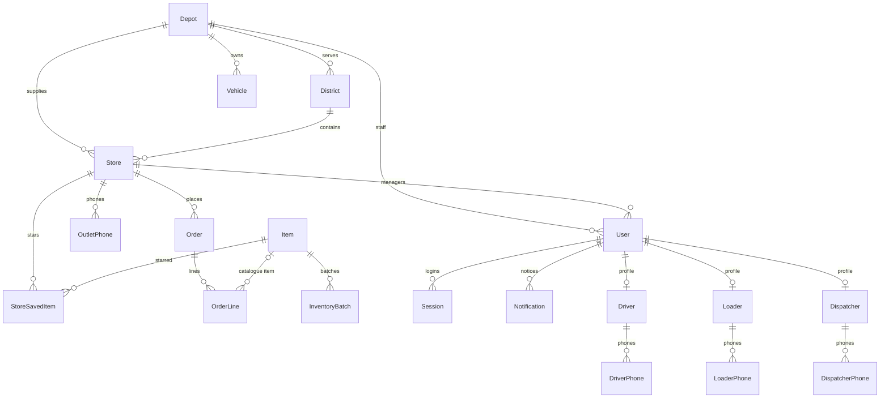
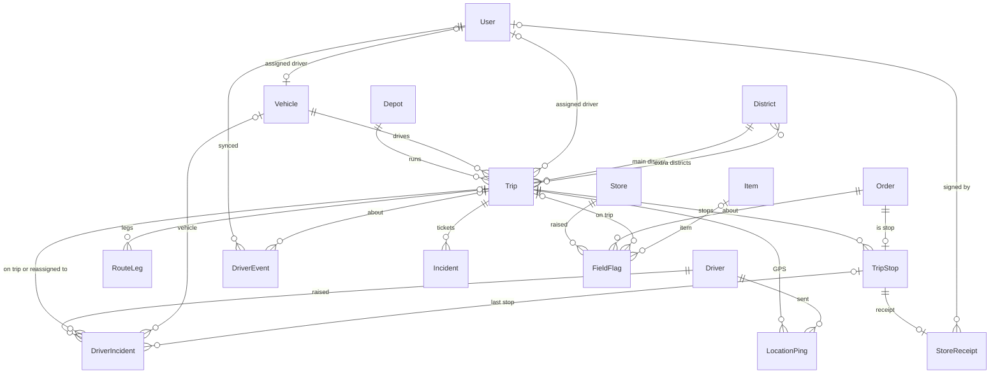
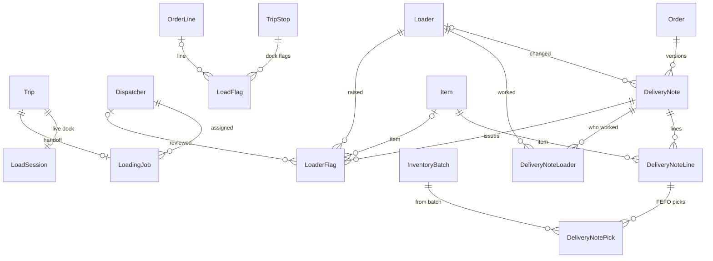

# Database structure

The full structure of the Waypoint Sync PostgreSQL database: every table, column, key, relation and constraint.

- **Source of truth:** [apps/api/prisma/schema.prisma](../apps/api/prisma/schema.prisma) and the migrations in [apps/api/prisma/migrations](../apps/api/prisma/migrations). If this page and the schema disagree, the schema wins.
- **Diagrams:** [waypoint-schema.drawio](waypoint-schema.drawio) and [waypoint-schema1.drawio](waypoint-schema1.drawio) (open in Draw.io).
- **Why the tables exist and who writes them:** [data-model.md](data-model.md).
- **Row counts** come from the data dump `waypoint-20261004-0920.sql` (4 Oct 2026). They show the size of the demo data, not a limit.

## At a glance

| | |
| --- | --- |
| Database | PostgreSQL 16 (Docker), managed by Prisma 5 |
| Tables | 40 Prisma models + 1 hidden join table (`_TripExtraDistricts`) |
| Enums | 24 |
| Check constraints | 2 (`Trip_tripNumber_max_2`, `Vehicle_out_of_service_needs_reason`) |
| Time zone | Timestamps are stored in UTC (`timestamp(3)`, no zone). The app reads and writes business dates in Asia/Colombo. |

### Conventions

- **Table and column names** are the Prisma names, in double quotes in SQL: `"TripStop"."orderId"`.
- **IDs:** most tables use a generated `cuid()` text id. Tables loaded from the competition CSVs keep their natural key instead: `Depot.id`, `Store.id` (`OUT001`…), `Vehicle.id`, `Item.id` (`F-MILK`…), `District.name`, `CalendarDay.id` (the date).
- **Type mapping:** `String` → `text`, `Int` → `integer`, `Float` → `double precision`, `Boolean` → `boolean`, `DateTime` → `timestamp(3)`, `DateTime @db.Date` → `date`, `Json` → `jsonb`, `String[]` → `text[]`.
- **Photos are not stored in the database.** Columns ending in `photoKey` hold a MinIO object name.
- **`Store` means outlet.** The app calls an outlet a store; the team ERD calls it Outlet.

## Table groups

| Group | Tables |
| --- | --- |
| [Reference data](#reference-data) | `Depot`, `District`, `ServiceAllowance`, `CalendarDay`, `TrafficSpeed`, `RoadCondition`, `Item`, `InventoryBatch` |
| [People and login](#people-and-login) | `User`, `Session`, `Notification`, `Driver`, `DriverPhone`, `Loader`, `LoaderPhone`, `Dispatcher`, `DispatcherPhone` |
| [Outlets and orders](#outlets-and-orders) | `Store`, `OutletPhone`, `StoreSavedItem`, `Order`, `OrderLine` |
| [Fleet and trips](#fleet-and-trips) | `Vehicle`, `Trip`, `_TripExtraDistricts`, `TripStop`, `RouteLeg`, `LocationPing` |
| [Dock and delivery notes](#dock-and-delivery-notes) | `LoadSession`, `LoadFlag`, `LoadingJob`, `DeliveryNote`, `DeliveryNoteLine`, `DeliveryNotePick`, `DeliveryNoteLoader`, `LoaderFlag` |
| [Receipts, sync and incidents](#receipts-sync-and-incidents) | `StoreReceipt`, `FieldFlag`, `DriverEvent`, `Incident`, `DriverIncident` |

## Relationship diagrams

Split into three pictures so each stays readable. `||--o{` is one-to-many, `||--o|` is one-to-zero-or-one, `|o--o{` has an optional parent, `}o--o{` is many-to-many.

### Places, people and orders

### Trips, delivery and the driver

### Dock and delivery notes

## Enums

| Enum | Values | Used by |
| --- | --- | --- |
| `Role` | `dispatcher`, `store`, `loader`, `driver` | `User.role` |
| `Brand` | `Fresh`, `Style`, `Tech` | `Store`, `Order`, `Trip`, `ServiceAllowance` |
| `ItemType` | `chilled_food`, `fresh`, `style`, `tech` | `Item.type` |
| `Temp` | `chilled`, `ambient` | `Order.temp` |
| `VehicleType` | `truck`, `van` | `Vehicle.type` |
| `VehicleTemp` | `reefer`, `ambient` | `Vehicle.temp` |
| `VehicleStatus` | `available`, `out_of_service`, `on_road` | `Vehicle.status` |
| `DockType` | `rear_dock`, `street`, `mall_bay` | `Store.dockType`, `ServiceAllowance.dockType` |
| `ParkingConstraint` | `normal`, `van_only`, `mall_dock` | `Store.parkingConstraint` |
| `OrderStatus` | `waiting`, `planned`, `deferred`, `delivered`, `partial`, `cancelled` | `Order.status` |
| `StockLevel` | `out_of_stock`, `running_low` | `Order.stockLevel` |
| `TripStatus` | `planning`, `published`, `loading`, `ready`, `on_road`, `completed`, `breakdown` | `Trip.status` |
| `StopStatus` | `upcoming`, `arrived`, `waiting`, `confirmed`, `delivered`, `partial`, `deferred`, `at_risk` | `TripStop.status` |
| `FlagType` | `missing`, `damaged`, `wrong_quantity` | `LoadFlag.type` |
| `IncidentType` | `breakdown`, `delay`, `quiet_driver`, `wait_timeout` | `Incident.type` |
| `PhoneLabel` | `shop`, `manager`, `warehouse` | `OutletPhone.label` |
| `LoaderShift` | `morning`, `night` | `Loader.shift` |
| `LoaderNoteRole` | `picking`, `confirming` | `DeliveryNoteLoader.role` |
| `FieldFlagDecision` | `pending`, `accepted`, `rejected` | `FieldFlag.driverDecision` |
| `LoaderFlagScope` | `item`, `dn` | `LoaderFlag.scope` |
| `LoaderFlagStatus` | `pending_dispatcher`, `approved`, `rejected` | `LoaderFlag.validationStatus` |
| `LoadingJobStatus` | `assigned`, `picking`, `loaded`, `handed_over`, `cancelled` | `LoadingJob.status` |
| `FlagSeverity` | `low`, `medium`, `high` | `FieldFlag.severity` |
| `SosSeverity` | `low`, `high`, `critical` | `DriverIncident.severity` |

Some status-like columns are plain text, not enums: `DriverEvent.type` (`SOS_ALERT`, `ARRIVED`, `ACKNOWLEDGEMENT`, `ROAD_ISSUE`, `FUEL_READING`, checked by the API), `Incident.status`, `DeliveryNote.status` and `DriverIncident.incidentType`.

## Tables

In the column tables, **→ Table.column** marks a foreign key. When no delete rule is shown, the Prisma default applies: a required parent cannot be deleted while child rows point at it, and an optional link is set to null.

### Reference data

Lookups loaded from the competition CSVs, and the catalogue.

#### Depot

Rows in the 4 Oct dump: **2**

| Column | Type | Null | Keys and notes |
| --- | --- | --- | --- |
| `id` | text | no | **PK** |
| `name` | text | no |  |
| `telephone` | text | yes |  |
| `email` | text | yes |  |
| `address` | text | yes |  |
| `lat` | double precision | yes |  |
| `lng` | double precision | yes |  |
| `dockPasswordHash` | text | yes | argon2 hash of the depot's shared dock password (6 digits on the dock keypad). Null until set. |

#### District

Rows in the 4 Oct dump: **12**

| Column | Type | Null | Keys and notes |
| --- | --- | --- | --- |
| `name` | text | no | **PK** |
| `depotId` | text | yes | → Depot.id |
| `served` | boolean | no | default `true` |
| `roadClass` | text | yes |  |
| `freeFlowKmh` | double precision | yes |  |
| `depotToDistrictKm` | double precision | yes |  |
| `depotToDistrictMin` | integer | yes |  |
| `interStopKm` | double precision | yes |  |
| `interStopMin` | integer | yes |  |

#### ServiceAllowance

Rows in the 4 Oct dump: **9**

| Column | Type | Null | Keys and notes |
| --- | --- | --- | --- |
| `id` | text | no | **PK**; default `cuid()` |
| `brand` | Brand (enum) | no |  |
| `dockType` | DockType (enum) | no |  |
| `minutes` | integer | no |  |

- Unique: `(brand, dockType)`

#### CalendarDay

Rows in the 4 Oct dump: **910**

| Column | Type | Null | Keys and notes |
| --- | --- | --- | --- |
| `id` | date | no | **PK** |
| `dow` | integer | no |  |
| `isWeekend` | boolean | no |  |
| `isoYear` | integer | no |  |
| `isoWeek` | integer | no |  |
| `isPayday` | boolean | no |  |
| `festival` | text | yes |  |
| `festivalRamp` | double precision | no | default `0` |
| `isHoliday` | boolean | no |  |
| `monsoon` | boolean | no |  |
| `isOperating` | boolean | no |  |

#### TrafficSpeed

Rows in the 4 Oct dump: **576**

| Column | Type | Null | Keys and notes |
| --- | --- | --- | --- |
| `id` | text | no | **PK**; default `cuid()` |
| `districtName` | text | no |  |
| `hour` | integer | yes |  |
| `monsoon` | boolean | yes |  |
| `speedIndex` | double precision | yes |  |
| `raw` | jsonb | no |  |

#### RoadCondition

Rows in the 4 Oct dump: **10920**

| Column | Type | Null | Keys and notes |
| --- | --- | --- | --- |
| `id` | text | no | **PK**; default `cuid()` |
| `date` | date | no |  |
| `districtName` | text | no |  |
| `disruptionIndex` | double precision | yes |  |
| `raw` | jsonb | no |  |

#### Item

Rows in the 4 Oct dump: **35**

| Column | Type | Null | Keys and notes |
| --- | --- | --- | --- |
| `id` | text | no | **PK** |
| `itemName` | text | no |  |
| `type` | ItemType (enum) | no | default `fresh` |
| `isChilled` | boolean | no | default `false` |
| `packLabel` | text | yes |  |
| `packWeightKg` | double precision | yes |  |

- Index: `(type)`

#### InventoryBatch

Rows in the 4 Oct dump: **35**

| Column | Type | Null | Keys and notes |
| --- | --- | --- | --- |
| `id` | text | no | **PK**; default `cuid()` |
| `itemId` | text | no | → Item.id |
| `batchName` | text | yes |  |
| `manufacturingDate` | date | yes |  |
| `expiryDate` | date | yes |  |
| `qty` | double precision | no | default `0` |

### People and login

Every person signs in as a `User`. Drivers, loaders and dispatchers also have a one-to-one profile row. A store manager is a `User` with `role = store` and a `storeId`.

#### User

Rows in the 4 Oct dump: **394**

| Column | Type | Null | Keys and notes |
| --- | --- | --- | --- |
| `id` | text | no | **PK**; default `cuid()` |
| `loginId` | text | no | unique |
| `role` | Role (enum) | no |  |
| `name` | text | no |  |
| `depotId` | text | yes | → Depot.id |
| `storeId` | text | yes | → Store.id |
| `passwordHash` | text | yes |  |
| `pinHash` | text | yes |  |
| `notificationPrefs` | jsonb | yes | NotificationPreferences JSON; null means every preference is on. Saved only, not enforced yet. |

#### Session

Rows in the 4 Oct dump: **3**

| Column | Type | Null | Keys and notes |
| --- | --- | --- | --- |
| `id` | text | no | **PK** |
| `userId` | text | no | → User.id (on delete Cascade) |
| `createdAt` | timestamp(3) | no | default `now()` |
| `expiresAt` | timestamp(3) | no |  |

#### Notification

Rows in the 4 Oct dump: **3**

| Column | Type | Null | Keys and notes |
| --- | --- | --- | --- |
| `id` | text | no | **PK**; default `cuid()` |
| `userId` | text | no | → User.id (on delete Cascade) |
| `title` | text | no |  |
| `body` | text | no |  |
| `link` | text | yes |  |
| `read` | boolean | no | default `false` |
| `createdAt` | timestamp(3) | no | default `now()` |

#### Driver

Rows in the 4 Oct dump: **71**

| Column | Type | Null | Keys and notes |
| --- | --- | --- | --- |
| `id` | text | no | **PK**; default `cuid()` |
| `userId` | text | no | unique; → User.id (on delete Cascade) |
| `licenseNo` | text | yes | unique |
| `licenseExpiry` | date | yes |  |
| `idNo` | text | yes | unique |
| `joinDate` | date | yes |  |
| `leavingDate` | date | yes |  |
| `lastLoginAt` | timestamp(3) | yes |  |
| `isActive` | boolean | no | default `true` |
| `address` | text | yes |  |

#### DriverPhone

Rows in the 4 Oct dump: **71**

| Column | Type | Null | Keys and notes |
| --- | --- | --- | --- |
| `phoneNumber` | text | no | **PK** |
| `driverId` | text | no | → Driver.id (on delete Cascade) |

#### Loader

Rows in the 4 Oct dump: **201**

| Column | Type | Null | Keys and notes |
| --- | --- | --- | --- |
| `id` | text | no | **PK**; default `cuid()` |
| `userId` | text | no | unique; → User.id (on delete Cascade) |
| `employeeNo` | text | yes | unique |
| `idNo` | text | yes | unique |
| `shift` | LoaderShift (enum) | yes |  |
| `joinDate` | date | yes |  |
| `leavingDate` | date | yes |  |
| `lastLoginAt` | timestamp(3) | yes |  |
| `isActive` | boolean | no | default `true` |
| `address` | text | yes |  |

#### LoaderPhone

Rows in the 4 Oct dump: **201**

| Column | Type | Null | Keys and notes |
| --- | --- | --- | --- |
| `phoneNumber` | text | no | **PK** |
| `loaderId` | text | no | → Loader.id (on delete Cascade) |

#### Dispatcher

Rows in the 4 Oct dump: **1**

| Column | Type | Null | Keys and notes |
| --- | --- | --- | --- |
| `id` | text | no | **PK**; default `cuid()` |
| `userId` | text | no | unique; → User.id (on delete Cascade) |
| `employeeNo` | text | yes | unique |
| `email` | text | yes |  |
| `address` | text | yes |  |
| `lastLoginAt` | timestamp(3) | yes |  |
| `isActive` | boolean | no | default `true` |

#### DispatcherPhone

Rows in the 4 Oct dump: **1**

| Column | Type | Null | Keys and notes |
| --- | --- | --- | --- |
| `phoneNumber` | text | no | **PK** |
| `dispatcherId` | text | no | → Dispatcher.id (on delete Cascade) |

### Outlets and orders

#### Store

Rows in the 4 Oct dump: **120**

| Column | Type | Null | Keys and notes |
| --- | --- | --- | --- |
| `id` | text | no | **PK** |
| `displayName` | text | yes |  |
| `address` | text | yes |  |
| `email` | text | yes |  |
| `brand` | Brand (enum) | no |  |
| `districtId` | text | no | → District.name |
| `depotId` | text | no | → Depot.id |
| `dockType` | DockType (enum) | no |  |
| `parkingConstraint` | ParkingConstraint (enum) | no | default `normal` |
| `mallWindow` | text | yes |  |
| `windowOpenMin` | integer | no |  |
| `windowCloseMin` | integer | no |  |
| `lat` | double precision | yes |  |
| `lng` | double precision | yes |  |
| `daysSinceLastServed` | integer | yes | Days since this outlet last received a delivery. Null when it has never been served. |

#### OutletPhone

Rows in the 4 Oct dump: **242**

| Column | Type | Null | Keys and notes |
| --- | --- | --- | --- |
| `id` | text | no | **PK**; default `cuid()` |
| `storeId` | text | no | → Store.id (on delete Cascade) |
| `phoneNo` | text | no |  |
| `label` | PhoneLabel (enum) | no |  |

#### StoreSavedItem

Rows in the 4 Oct dump: **24**

| Column | Type | Null | Keys and notes |
| --- | --- | --- | --- |
| `storeId` | text | no | → Store.id (on delete Cascade) |
| `itemId` | text | no | → Item.id (on delete Cascade) |
| `createdAt` | timestamp(3) | no | default `now()` |

- Primary key: `(storeId, itemId)`

#### Order

Rows in the 4 Oct dump: **80**

| Column | Type | Null | Keys and notes |
| --- | --- | --- | --- |
| `id` | text | no | **PK**; default `cuid()` |
| `storeId` | text | no | → Store.id |
| `brand` | Brand (enum) | no |  |
| `deliveryDate` | date | no |  |
| `temp` | Temp (enum) | no |  |
| `status` | OrderStatus (enum) | no | default `waiting` |
| `units` | integer | no |  |
| `weightKg` | double precision | no |  |
| `volumeM3` | double precision | no |  |
| `urgentNote` | text | yes |  |
| `urgent` | boolean | no | default `false`; Set by the store at order time; urgent orders head the dispatcher's waiting list. |
| `stockLevel` | StockLevel (enum) | yes |  |
| `movedFromDate` | date | yes |  |
| `deferReason` | text | yes |  |
| `deferredById` | text | yes |  |
| `deferredYesterday` | boolean | no | default `false` |
| `repeatSkip` | boolean | no | default `false` |
| `cancelledAt` | timestamp(3) | yes |  |
| `cancelledById` | text | yes |  |
| `createdAt` | timestamp(3) | no | default `now()` |

- Index: `(deliveryDate, status)`

#### OrderLine

Rows in the 4 Oct dump: **155**

| Column | Type | Null | Keys and notes |
| --- | --- | --- | --- |
| `id` | text | no | **PK**; default `cuid()` |
| `orderId` | text | no | → Order.id (on delete Cascade) |
| `itemId` | text | yes | → Item.id |
| `name` | text | no |  |
| `qty` | integer | no |  |
| `pack` | text | no |  |
| `chilled` | boolean | no | default `false` |
| `unitWeightKg` | double precision | no |  |
| `unitVolumeM3` | double precision | no |  |

### Fleet and trips

#### Vehicle

Rows in the 4 Oct dump: **60**

| Column | Type | Null | Keys and notes |
| --- | --- | --- | --- |
| `id` | text | no | **PK** |
| `numberPlate` | text | yes | unique |
| `depotId` | text | no | → Depot.id |
| `type` | VehicleType (enum) | no |  |
| `temp` | VehicleTemp (enum) | no |  |
| `weightCapKg` | double precision | no |  |
| `volumeCapM3` | double precision | no |  |
| `fuelType` | text | yes |  |
| `kmPerL` | double precision | yes |  |
| `weeklyFuelQuotaL` | double precision | yes |  |
| `status` | VehicleStatus (enum) | no | default `available` |
| `outOfServiceReason` | text | yes | Required when status is out_of_service (database check). Cleared when the vehicle is back. |
| `returnDate` | timestamp(3) | yes | Optional expected return. Stores the date and the time. Null when no return time is known. |
| `lastServiceAt` | timestamp(3) | yes | Last time this vehicle was serviced. |
| `driverId` | text | yes | unique; → User.id |

#### Trip

Rows in the 4 Oct dump: **17**

| Column | Type | Null | Keys and notes |
| --- | --- | --- | --- |
| `id` | text | no | **PK**; default `cuid()` |
| `vehicleId` | text | no | → Vehicle.id |
| `assignedDriverId` | text | yes | → User.id |
| `depotId` | text | no | → Depot.id |
| `brand` | Brand (enum) | no |  |
| `districtId` | text | no | → District.name |
| `serviceDate` | date | no |  |
| `tripNumber` | integer | no | 1 or 2. Database check Trip_tripNumber_max_2. |
| `csvRouteId` | text | yes |  |
| `status` | TripStatus (enum) | no | default `planning` |
| `planVersion` | integer | no | default `1` |
| `plannedMinutes` | integer | yes |  |
| `plannedLitres` | double precision | yes |  |
| `fuelLitresAtEnd` | double precision | yes | Latest FUEL_READING synced for this trip; once the trip ends it is the end-of-trip fuel. |
| `publishedAt` | timestamp(3) | yes |  |
| `tripStartingDate` | date | yes |  |
| `tripEndingDate` | date | yes |  |
| `startingTime` | timestamp(3) | yes |  |
| `estimatedStartingTime` | timestamp(3) | yes |  |
| `endingTime` | timestamp(3) | yes |  |

- Unique: `(vehicleId, serviceDate, tripNumber)`
- Index: `(depotId, serviceDate)`

#### _TripExtraDistricts

Rows in the 4 Oct dump: **0**

Hidden join table Prisma creates for the many-to-many `Trip.extraDistricts` ↔ `District.coveredBy`. It holds the districts a trip covers besides its main one.

| Column | Type | Null | Keys and notes |
| --- | --- | --- | --- |
| `A` | text | no | → District.name (on delete Cascade) |
| `B` | text | no | → Trip.id (on delete Cascade) |

- Unique: `(A, B)`
- Index: `(B)`

#### TripStop

Rows in the 4 Oct dump: **22**

| Column | Type | Null | Keys and notes |
| --- | --- | --- | --- |
| `id` | text | no | **PK**; default `cuid()` |
| `tripId` | text | no | → Trip.id (on delete Cascade) |
| `orderId` | text | no | unique; → Order.id |
| `sequence` | integer | no |  |
| `status` | StopStatus (enum) | no | default `upcoming` |
| `etaMin` | integer | yes |  |
| `arrivedAt` | timestamp(3) | yes |  |
| `storeConfirmedAt` | timestamp(3) | yes |  |
| `driverAckAt` | timestamp(3) | yes |  |
| `waitAlertedAt` | timestamp(3) | yes | Set when dispatch was alerted that the driver waited WAIT_ALERT_MIN at the store; one alert per stop. |
| `plannedArrivalTime` | timestamp(3) | yes |  |
| `leaveOutletTime` | timestamp(3) | yes |  |
| `serviceMin` | double precision | yes |  |
| `unloadingTime` | double precision | yes |  |
| `estimatedUnloadingTime` | double precision | yes |  |
| `estimatedTripStopTime` | timestamp(3) | yes |  |
| `tripStopTime` | timestamp(3) | yes |  |
| `tripStartTime` | timestamp(3) | yes |  |
| `estimatedTripStartTime` | timestamp(3) | yes |  |

- Unique: `(tripId, sequence)`

#### RouteLeg

Rows in the 4 Oct dump: **22**

| Column | Type | Null | Keys and notes |
| --- | --- | --- | --- |
| `id` | text | no | **PK**; default `cuid()` |
| `tripId` | text | no | → Trip.id (on delete Cascade) |
| `seq` | integer | no |  |
| `fromPoint` | text | yes |  |
| `toOutlet` | text | yes |  |
| `distanceKm` | double precision | yes |  |
| `plannedDepartTime` | timestamp(3) | yes |  |
| `plannedTravelMin` | double precision | yes |  |
| `actualDepartTime` | timestamp(3) | yes |  |
| `actualTravelMin` | double precision | yes |  |
| `monsoon` | boolean | yes |  |
| `trafficBand` | text | yes |  |

- Unique: `(tripId, seq)`

#### LocationPing

Rows in the 4 Oct dump: **21**

| Column | Type | Null | Keys and notes |
| --- | --- | --- | --- |
| `id` | text | no | **PK**; default `cuid()` |
| `clientUuid` | text | no | unique |
| `tripId` | text | no | → Trip.id (on delete Cascade) |
| `driverId` | text | no | → Driver.id |
| `lat` | double precision | no |  |
| `lng` | double precision | no |  |
| `accuracyM` | double precision | yes |  |
| `speedKmh` | double precision | yes |  |
| `recordedAt` | timestamp(3) | no |  |
| `receivedAt` | timestamp(3) | no | default `now()` |

- Index: `(tripId, recordedAt)`

### Dock and delivery notes

`LoadSession` and `LoadFlag` are the live dock sheet. `LoadingJob` is the dispatcher-to-loader handoff. Delivery notes are versioned: each change adds a row with a new `versionAt`, and the current version has `validTo` null.

#### LoadSession

Rows in the 4 Oct dump: **8**

| Column | Type | Null | Keys and notes |
| --- | --- | --- | --- |
| `id` | text | no | **PK**; default `cuid()` |
| `tripId` | text | no | unique; → Trip.id (on delete Cascade) |
| `loaderIds` | text[] | no |  |
| `startedAt` | timestamp(3) | yes |  |
| `finishedAt` | timestamp(3) | yes |  |
| `departedAt` | timestamp(3) | yes |  |
| `paused` | boolean | no | default `false` |
| `ackedPlanVersion` | integer | no | default `0` |
| `ackedStopIds` | text[] | no | default `[]`; Order ids on the trip when the loader last acknowledged; diffed against the live trip for the plan-change lock. |
| `takenOffOrderIds` | text[] | no | default `[]`; Removed orders the loader has confirmed are off the truck; acknowledging needs all of them. Reset on acknowledge. |
| `newOrderIds` | text[] | no | default `[]`; Orders added by the last acknowledged plan change, shown as NEW on the checklist. Cleared on depart. |

#### LoadFlag

Rows in the 4 Oct dump: **1**

| Column | Type | Null | Keys and notes |
| --- | --- | --- | --- |
| `id` | text | no | **PK**; default `cuid()` |
| `stopId` | text | no | → TripStop.id (on delete Cascade) |
| `orderLineId` | text | yes | → OrderLine.id |
| `type` | FlagType (enum) | no |  |
| `qty` | integer | yes |  |
| `note` | text | yes |  |
| `photoKey` | text | yes |  |
| `createdAt` | timestamp(3) | no | default `now()` |
| `resolvedAt` | timestamp(3) | yes |  |

#### LoadingJob

Rows in the 4 Oct dump: **13**

| Column | Type | Null | Keys and notes |
| --- | --- | --- | --- |
| `id` | text | no | **PK**; default `cuid()` |
| `tripId` | text | no | unique; → Trip.id (on delete Cascade) |
| `depot` | text | no |  |
| `assignedById` | text | no | → Dispatcher.id |
| `assignedAt` | timestamp(3) | no | default `now()` |
| `bay` | text | yes |  |
| `loadByTime` | timestamp(3) | yes |  |
| `instructions` | text | yes |  |
| `priority` | integer | no | default `0` |
| `status` | LoadingJobStatus (enum) | no | default `assigned` |
| `startedAt` | timestamp(3) | yes |  |
| `loadedAt` | timestamp(3) | yes |  |
| `handedOverAt` | timestamp(3) | yes |  |
| `totalWeightKg` | double precision | yes |  |
| `totalVolumeM3` | double precision | yes |  |

#### DeliveryNote

Rows in the 4 Oct dump: **22**

| Column | Type | Null | Keys and notes |
| --- | --- | --- | --- |
| `dnId` | text | no |  |
| `versionAt` | timestamp(3) | no |  |
| `orderId` | text | no | → Order.id |
| `status` | text | yes |  |
| `validTo` | timestamp(3) | yes |  |
| `changedById` | text | yes | → Loader.id |
| `changeReason` | text | yes |  |

- Primary key: `(dnId, versionAt)`
- Index: `(dnId)`
- Index: `(orderId)`

#### DeliveryNoteLine

Rows in the 4 Oct dump: **47**

| Column | Type | Null | Keys and notes |
| --- | --- | --- | --- |
| `id` | text | no | **PK**; default `cuid()` |
| `dnId` | text | no | → DeliveryNote.dnId (on delete Cascade) |
| `versionAt` | timestamp(3) | no | → DeliveryNote.versionAt (on delete Cascade) |
| `itemId` | text | no | → Item.id |
| `qtyConfirmed` | double precision | yes |  |
| `shortageReason` | text | yes |  |

#### DeliveryNotePick

Rows in the 4 Oct dump: **45**

| Column | Type | Null | Keys and notes |
| --- | --- | --- | --- |
| `id` | text | no | **PK**; default `cuid()` |
| `dnLineId` | text | no | → DeliveryNoteLine.id (on delete Cascade) |
| `batchId` | text | no | → InventoryBatch.id |
| `qty` | double precision | no |  |

#### DeliveryNoteLoader

Rows in the 4 Oct dump: **22**

| Column | Type | Null | Keys and notes |
| --- | --- | --- | --- |
| `id` | text | no | **PK**; default `cuid()` |
| `dnId` | text | no | → DeliveryNote.dnId (on delete Cascade) |
| `versionAt` | timestamp(3) | no | → DeliveryNote.versionAt (on delete Cascade) |
| `loaderId` | text | no | → Loader.id |
| `role` | LoaderNoteRole (enum) | yes |  |
| `startedAt` | timestamp(3) | yes |  |
| `finishedAt` | timestamp(3) | yes |  |

- Unique: `(dnId, versionAt, loaderId)`

#### LoaderFlag

Rows in the 4 Oct dump: **2**

| Column | Type | Null | Keys and notes |
| --- | --- | --- | --- |
| `id` | text | no | **PK**; default `cuid()` |
| `raisedAt` | timestamp(3) | no | default `now()` |
| `loaderId` | text | no | → Loader.id |
| `dnId` | text | no | → DeliveryNote.dnId (on delete Cascade) |
| `versionAt` | timestamp(3) | no | → DeliveryNote.versionAt (on delete Cascade) |
| `scope` | LoaderFlagScope (enum) | no |  |
| `itemId` | text | yes | → Item.id |
| `qtyFlagged` | double precision | yes |  |
| `reason` | text | no |  |
| `reasonDetail` | text | yes |  |
| `photoKey` | text | yes |  |
| `validationStatus` | LoaderFlagStatus (enum) | no | default `pending_dispatcher` |
| `reviewedById` | text | yes | → Dispatcher.id |
| `reviewedAt` | timestamp(3) | yes |  |
| `reviewNote` | text | yes |  |

- Index: `(dnId)`

### Receipts, sync and incidents

#### StoreReceipt

Rows in the 4 Oct dump: **4**

| Column | Type | Null | Keys and notes |
| --- | --- | --- | --- |
| `id` | text | no | **PK**; default `cuid()` |
| `stopId` | text | no | unique; → TripStop.id (on delete Cascade) |
| `lineResults` | jsonb | no |  |
| `chilledWasCold` | boolean | yes |  |
| `signaturePhotoKey` | text | yes |  |
| `signedByUserId` | text | yes | → User.id (on delete SetNull) |
| `signedAt` | timestamp(3) | yes |  |
| `createdAt` | timestamp(3) | no | default `now()` |

#### FieldFlag

Rows in the 4 Oct dump: **2**

| Column | Type | Null | Keys and notes |
| --- | --- | --- | --- |
| `id` | text | no | **PK**; default `cuid()` |
| `raisedAt` | timestamp(3) | no | default `now()` |
| `storeId` | text | no | → Store.id |
| `orderId` | text | no | → Order.id |
| `tripId` | text | yes | → Trip.id |
| `itemId` | text | yes | → Item.id |
| `qtyFlagged` | double precision | yes |  |
| `reason` | text | no |  |
| `reasonDetail` | text | yes |  |
| `severity` | FlagSeverity (enum) | yes |  |
| `driverDecision` | FieldFlagDecision (enum) | no | default `pending` |
| `driverDecidedAt` | timestamp(3) | yes |  |
| `driverNote` | text | yes |  |
| `photoKey` | text | yes |  |
| `resolvedAt` | timestamp(3) | yes |  |
| `resolveStatus` | boolean | no | default `false`; False until a replacement of this item is ordered, or the flag is marked solved. |

- Index: `(orderId)`

#### DriverEvent

Rows in the 4 Oct dump: **7**

| Column | Type | Null | Keys and notes |
| --- | --- | --- | --- |
| `id` | text | no | **PK**; default `cuid()` |
| `clientId` | text | no | unique |
| `driverId` | text | no | → User.id |
| `tripId` | text | yes | → Trip.id |
| `type` | text | no |  |
| `payload` | jsonb | no |  |
| `createdOnPhoneAt` | timestamp(3) | no |  |
| `seenPlanVersion` | integer | yes |  |
| `appliedAt` | timestamp(3) | no | default `now()` |

- Index: `(driverId, type, appliedAt)`

#### Incident

Rows in the 4 Oct dump: **5**

| Column | Type | Null | Keys and notes |
| --- | --- | --- | --- |
| `id` | text | no | **PK**; default `cuid()` |
| `type` | IncidentType (enum) | no |  |
| `tripId` | text | no | → Trip.id |
| `status` | text | no |  |
| `timeline` | jsonb | no |  |
| `createdAt` | timestamp(3) | no | default `now()` |

#### DriverIncident

Rows in the 4 Oct dump: **2**

| Column | Type | Null | Keys and notes |
| --- | --- | --- | --- |
| `id` | text | no | **PK**; default `cuid()` |
| `driverId` | text | no | → Driver.id |
| `tripId` | text | yes | → Trip.id |
| `vehicleId` | text | yes | → Vehicle.id |
| `incidentType` | text | no |  |
| `severity` | SosSeverity (enum) | no |  |
| `message` | text | yes |  |
| `lat` | double precision | yes |  |
| `lng` | double precision | yes |  |
| `lastStopId` | text | yes | → TripStop.id |
| `raisedAt` | timestamp(3) | no | default `now()` |
| `acknowledgedAt` | timestamp(3) | yes |  |
| `acknowledgedBy` | text | yes |  |
| `resolvedAt` | timestamp(3) | yes |  |
| `resolution` | text | yes |  |
| `reassignedTripId` | text | yes | → Trip.id |

## Constraints summary

### Check constraints (added in migrations)

| Name | Table | Rule |
| --- | --- | --- |
| `Trip_tripNumber_max_2` | `Trip` | `tripNumber` is 1 (morning) or 2 (afternoon). |
| `Vehicle_out_of_service_needs_reason` | `Vehicle` | When `status = 'out_of_service'`, `outOfServiceReason` must be filled in and not blank. |

### Unique rules that carry business meaning

| Rule | Constraint |
| --- | --- |
| A vehicle runs at most one Trip 1 and one Trip 2 per day | `Trip (vehicleId, serviceDate, tripNumber)` |
| An order is on at most one trip | `TripStop.orderId` |
| Two stops on a trip cannot share a position | `TripStop (tripId, sequence)` |
| A driver has at most one vehicle | `Vehicle.driverId` |
| One live dock sheet and one loading job per trip | `LoadSession.tripId`, `LoadingJob.tripId` |
| One receipt per stop | `StoreReceipt.stopId` |
| Phone retries never insert twice | `DriverEvent.clientId`, `LocationPing.clientUuid` |
| One login per login id | `User.loginId` |
| One profile per user | `Driver.userId`, `Loader.userId`, `Dispatcher.userId` |
| Identity numbers do not repeat | `Driver.licenseNo`, `Driver.idNo`, `Loader.employeeNo`, `Loader.idNo`, `Dispatcher.employeeNo`, `Vehicle.numberPlate` (when filled in) |
| One service time per brand and dock | `ServiceAllowance (brand, dockType)` |
| One loader row per delivery-note version | `DeliveryNoteLoader (dnId, versionAt, loaderId)` |
| One route leg per position | `RouteLeg (tripId, seq)` |
| One star per store and item | `StoreSavedItem (storeId, itemId)` (primary key) |

### What a delete takes with it

| Deleting | Also deletes | Sets to null |
| --- | --- | --- |
| `User` | `Session`, `Notification`, the `Driver` / `Loader` / `Dispatcher` profile and its phone rows | `StoreReceipt.signedByUserId` |
| `Store` | `OutletPhone`, `StoreSavedItem` | |
| `Item` | `StoreSavedItem` | |
| `Order` | `OrderLine` | |
| `Trip` | `TripStop`, `LoadSession`, `LoadingJob`, `RouteLeg`, `LocationPing`, `_TripExtraDistricts` links | |
| `TripStop` | `LoadFlag`, `StoreReceipt` | |
| `DeliveryNote` version | `DeliveryNoteLine` (and their `DeliveryNotePick` rows), `DeliveryNoteLoader`, `LoaderFlag` | |

Any other foreign key blocks the delete while child rows exist.

### Columns with no foreign key on purpose

| Column | Matches |
| --- | --- |
| `ServiceAllowance (brand, dockType)` | `Store.brand` + `Store.dockType` |
| `TrafficSpeed.districtName`, `RoadCondition.districtName` | `District.name` (text match on CSV data) |
| `LoadingJob.depot` | `Depot.id` (text copy) |
| `LoadSession.loaderIds` | `User.id` values (array) |
| `LoadSession.ackedStopIds`, `takenOffOrderIds`, `newOrderIds` | `Order.id` values (arrays) |
| `Order.deferredById`, `Order.cancelledById` | `User.id` |
| `DriverIncident.acknowledgedBy` | `User.id` |

## Indexes

Besides primary keys and unique constraints:

| Table | Index | Used for |
| --- | --- | --- |
| `Order` | `(deliveryDate, status)` | The plan board's waiting list for a day |
| `Trip` | `(depotId, serviceDate)` | A depot's trips for a day |
| `DriverEvent` | `(driverId, type, appliedAt)` | A driver's latest event of one type (fuel, SOS) |
| `LocationPing` | `(tripId, recordedAt)` | A trip's GPS trail in time order |
| `Item` | `(type)` | Catalogue by product class |
| `DeliveryNote` | `(dnId)`, `(orderId)` | Versions of one note; notes of one order |
| `FieldFlag` | `(orderId)` | Flags on an order |
| `LoaderFlag` | `(dnId)` | Flags on a delivery note |

## Changing the structure

1. Edit `apps/api/prisma/schema.prisma`.
2. Run `pnpm --filter @waypoint/api run db:migrate` (Prisma `migrate dev`) and give the migration a clear name. Hand-written SQL such as a `CHECK` goes into the generated `migration.sql`.
3. Commit the schema and the new folder under `prisma/migrations`.
4. Update this page, [data-model.md](data-model.md) and the drawio diagrams.
